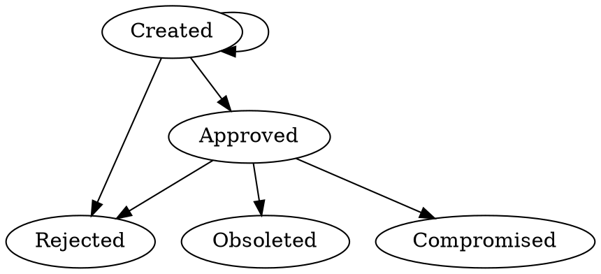
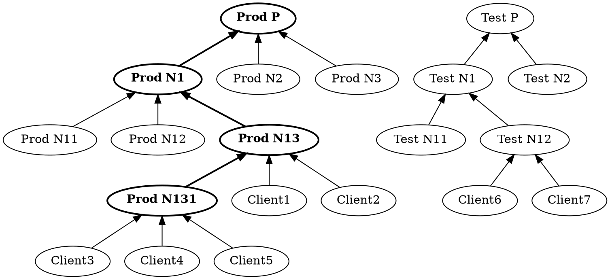

Title: Legal Identities
Description: Legal Identities page of neuro-foundation.io
Date: 2024-08-06
Author: Peter Waher
Master: Master.md

=============================================

Legal Identities
=====================

It is possible to assign a legal identity to an account. By assigning a legal identity to the account, it becomes possible for the account 
to sign legal contracts. Such contracts can be used by owners to regulate conditions for accessing their things, allowing for automation of 
decision support and provisioning.

| Legal Identities                                                      ||
| ------------|----------------------------------------------------------|
| Namespace:  | `urn:nfi:iot:leg:id:1.0`                                 |
| Schema:     | [LegalIdentities.xsd](Schemas/LegalIdentities.xsd)       |


Motivation and design goal
----------------------------

The method of managing legal identities described here, is designed with the following goals in mind:

* Legal Identities are protected using public key cryptography, where the client retains a private key that it does not share with anyone,
and registers the identity with a public key, that everyone with access to the identity receives. The private key is used by the client to
sign its legal identity application. The public key is used to validate the signature.

* Legal Identities are only available to their corresponding owners, parts in smart contracts, and operator (Trust Provider) staff,
acting as electronic notaries attesting to the validity of the legal identities.

* Other entities can make petitions to access the personal information available in legal identities. Owners of the identities must 
first consent before access can be granted.

* The broker (Trust Provider) maintains its own public and private key. Everyone has access to the public key. The private key is used by
the broker to sign that it attests to the validity of a claim, such as the integrity of a legal identity.

* Legal Identities can have a variable number of signed attachments associated with it.


Requirements
---------------


Getting Server Public Key
------------------------------

To get the public key of the server, the `<getPublicKey/>` element is sent in an `<iq type='get'/>` stanza to the corresponding component.

Example:

```xml
<iq type='get' id='3' to='legal.example.org'>
   <getPublicKey xmlns="urn:nfi:iot:leg:id:1.0"/>
</iq>
```

An historic public key is requested, by including a `ts` attribute with a timestamp in the
`<getPublicKey/>` element. The timestamp must be in UTC, and represents a point in time when
the key was used.

Example:

```xml
<iq type='get' id='3' to='legal.example.org'>
   <getPublicKey ts='2024-08-06T12:00:00Z' xmlns="urn:nfi:iot:leg:id:1.0"/>
</iq>
```

The response contains the public key in a `<publicKey/>` element, if successful. Public keys 
are encoded using the [End-to-End Encryption](E2E.md) namespace and elements.

Example:

```xml
<iq id='3' type='result' to='client@example.org/e36120d6a04244576b22c2f7b2c8bc5c' from='legal.example.org'>
   <publicKey xmlns='urn:nfi:iot:leg:id:1.0'>
      <ed448 pub='24XPfS5oQ2nljCLpJGHn9O9sSiJ0K5/yymfiHssXGizeV+TS9dLWxQHKXXRYHjKptWieSD+OZdeA' xmlns='urn:nfi:iot:e2e:1.0'/>
   </publicKey>
</iq>
```

If no public key was found for a requested timestamp, an `item-not-found` error must be
returned.

Getting Identity Application Attributes
------------------------------------------

Before sending an identity application, a client may request information about what 
attributes and properties are expected from the application by the Broker, especially if 
the goal is to validate the application via a peer review process. This is done by sending 
an empty `<applicationAttributes>` element in an `<iq type="get">` stanza to the Legal 
Component of the Broker. The Broker responds with an `<idApplicationAttributes>` element 
containing relevant attributes and required properties for peer review. The
`reuqired` attribute of the `<idApplicationAttributes>` element lets the client know if the
Broker accepts peer-review as a valid method of validation of the applcation. If so, the
`nrReviewers` attribute specifies the number of reviewers that must validate the contents of
the application before the Broker validates the application. The `nrPhotos` attribute tells
the client the minimum number of photos that need to be provided in the application for it
to participate in peer review. The `iso3166` attribute informs the client is all country
code reference must adhere to ISO-3166. The `reviewTimeout` attribute specifies the time the
client has from receiving an identity review document, to sign and add it as an attachment to
the recently approved application. The `<idApplicationAttributes>` element
may also contain a sequence of `<required/>` elements, that list the names of required 
properties that must be included in the identity application, for it to be considered for
peer-review. The list of required properties for peer review may be followed by a sequence
of `<authenticator>` elements listing available identity authenticator services and their
requirements, followed by a sequence of `<peerReviewService>` elements listing available
peer review services and their requirements. The client may use this information to decide 
which properties to include in the application.

Example:

```xml
<iq type='get' id='5' to='legal.example.org'>
   <applicationAttributes xmlns="urn:nfi:iot:leg:id:1.0"/>
</iq>
```

Example response:

```xml
<iq id='5' type='result' to='client@example.org/e36120d6a04244576b22c2f7b2c8bc5c' from='legal.example.org'>
   <idApplicationAttributes xmlns='urn:nfi:iot:leg:id:1.0'
                            peerReview='true' nrReviewers='2' nrPhotos='1' 
                            iso3166='true' reviewTimeout='3600'>
      <required>FIRST</required>
      <required>LAST</required>
      <required>PNR</required>
      <required>REGION</required>
      <required>COUNTRY</required>
      <authenticator id='AgeAuthenticator' name='Age Authenticator' 
                     fqn='NAMESPACE.AgeAuthenticator'>
         <properties>
            <required>BYEAR</required>
            <required>BMONTH</required>
            <required>BDAY</required>
            <required>AGEABOVE</required>
         </properties>
         <attachments></attachments>
      </authenticator>
      <authenticator id='PreviewAuthenticator' name='Preview Authenticator' 
                     fqn='NAMESPACE.PreviewAuthenticator'>
         <properties>
            <required>PREVIEW</required>
         </properties>
         <attachments>
            <required>ProfilePhoto</required>
         </attachments>
      </authenticator>
   </idApplicationAttributes>
</iq>
```

### Special considerations

Most property names listed in the response are interpreted literally. A few property names
have special meaning:

* If `FULLNAME` is listed, it means the service only processes the full name of the identity,
not its individual parts. The application can use the `FIRST`, `MIDDLE`, and/or `LAST`
properties instead, and they will be concatenated to form the `FULLNAME` property before
being processed.

* If `FIRST`, `MIDDLE` and/or `LAST` is listed, it means the service processes the indivudual
parts during review or validation. The application can use `FULLNAME` instead, and the service
will extract the individual parts before processing.

* If `PREVIEW` is listed, it means the identity application must be a preview application
itself, or refer to a preview application using the `PREVIEW` property.

Applying for Legal Identity registration
------------------------------------------

Legal identities are validated and attested by the broker out-of-band. To start the process, the client sends an application for a
legal identity to be registered by sending the `<apply/>` element in an `<iq type='set'/>` stanza to the legal component of the server. 
The `<apply/>` element may include a `days` attribute that specifies the number of days the legal
identity is valid. The Broker may honor this request, or specify its own value, depending in
internal rules and configurations. After the application has been received, the operator is 
notified, and validation can be performed, either manually, or automatically, depending on the 
context. How this process is done lies outside the scope of this specification.

The `<apply/>` element must contain the information about the legal identity, encoded in an `<identity/>` element. This element must not contain
an `id` attribute, or attachments or attachment references. Such requests must be rejected. 
The `id` attribute is added by the broker, after validating the request. Attachments can be
added once the identity object has been created. Attachment references are added by the
broker to provide short-lived URIs to uploaded attachments. The `<identity/>`
element contains a sequence of child elements, however. The first is a `<clientPublicKey/>` element, which contains the public key of the client 
making the request. The corresponding private key will be used to sign the request later. Then comes a sequence of `<property/>` elements. Each 
one encodes a `name`/`value` attribute pair. It is up to the client to decide the number of properties included, and which ones. Any names can be used.
Some names are predefined however, as described in the following table:

| Property      | Description                                                           |
|:--------------|:----------------------------------------------------------------------|
| `FIRST`       | First name                                                            |
| `MIDDLE`      | Middle name                                                           |
| `LAST`        | Last name                                                             |
| `FULLNAME`    | Full name. Can be used instead of `FIRST`, `MIDDLE` and `LAST`.       |
| `PNR`         | Personal number, as defined in `COUNTRY`                              |
| `ADDR`        | Address                                                               |
| `ADDR2`       | Address, second line                                                  |
| `ZIP`         | Zip or postal code                                                    |
| `AREA`        | Area                                                                  |
| `CITY`        | City                                                                  |
| `REGION`      | Region, state                                                         |
| `COUNTRY`     | Country                                                               |
| `NATIONALITY` | Nationality                                                           |
| `BDAY`        | Birth Day                                                             |
| `BMONTH`      | Borth Month                                                           |
| `BYEAR`       | Birth Year                                                            |
| `AGEABOVE`    | Having an age above the stated number of years                        |
| `GENDER`      | Gender (`M` or `F`)                                                   |
| `PHONE`       | Validated phone number, using the international phone number format.  |
| `EMAIL`       | Validated e-mail address.                                             |
| `JID`         | Validated XMPP address (Jabber ID).                                   |
| `DOMAIN`      | If the ID represents the legal representative of a domain.            |
| `HOMEPAGE`    | Validated home page.                                                  |
| `PREVIEW`     | A reference to a preview of the identity application.                 |
| `PROFILE`     | Name of Identity Profile or Identity Profiles (Comma-separated list). |
| `PSEUDONYM`   | Lists which properties are pseudonymous. Comma-separated list.        |
| `DEVICE_ID`   | Device-specific identifier of the device.                             |
| `ORGNAME`     | Name of organization                                                  |
| `ORGNR`       | Organization number, as defined in `ORGCOUNTRY`                       |
| `ORGDEPT`     | Organization department, where person works.                          |
| `ORGROLE`     | Role of person in organization.                                       |
| `ORGADDR`     | Address of organization.                                              |
| `ORGADDR2`    | Address of organization, second line                                  |
| `ORGZIP`      | Zip or postal code of organization                                    |
| `ORGAREA`     | Area of organization.                                                 |
| `ORGCITY`     | City of organization.                                                 |
| `ORGREGION`   | Region or state of organization.                                      |
| `ORGCOUNTRY`  | Country code of organization.                                         |

Names in legal identities can be defined, either using the properties `FIRST`, `MIDDLE` and
`LAST`, or by using the property `FULLNAME`. Both cannot be used at the same time, to avoid
confusion. If `FIRST`, `MIDDLE` and `LAST` are used, and `FULLNAME` is referenced, for instance,
in a contract, the value must be constructed by concatenating the `FIRST`, `MIDDLE` and `LAST` 
values, delimiting the names with a single space character: `FIRST [ " " MIDDLE] " " LAST`.
If `FULLNAME` is used, the `FIRST`, `MIDDLE` and `LAST` properties must be extracted from the
`FULLNAME` in the canonical manner: The name before the first space is `FIRST`. If no space is
availale, the entire name is `FIRST`, and `MIDDLE` and `LAST` are empty. The name after the 
last space is `LAST` if available, or empty if no last space. After removing the `FIRST` and
`LAST` names from `FULLNAME`, trimming any beginning or ending spaces, is `MIDDLE`.

Other property names that are reserved, as they can be used in role reference parameters to 
refer to either automatically generated values, or concatenations of multiple parameters:

| Property            | Description                                                   |
|:--------------------|:--------------------------------------------------------------|
| `AGENT`             | URL to the web agent used in creating the identity.           |
| `ACCOUNT`           | Refers to the account name part of the JID of the identity.   |
| `CREATED`           | When the identity object was created, in UTC.                 |
| `FROM`              | From when the identity object is valid, in UTC.               |
| `FULLADDR`          | Full address (`ADDR [ ", " ADDR2]`)                           |
| `FULLORGADDR`       | Full organization address (`ORGADDR [ ", " ORGADDR2]`)        |
| `ID`                | Refers to the legal identity identifier                       |
| `SIGNATURE`         | Digital signature reference.                                  |
| `SIGNATUREDATE`     | Date of digital signature.                                    |
| `SIGNATURETIME`     | Time of digital signature.                                    |
| `SIGNATUREDATETIME` | Date and Time of digital signature.                           |
| `STATE`             | State of the identity object.                                 |
| `TO`                | To when then identity object is valid, in UTC.                |
| `UPDATED`           | When the identity object was last updated, in UTC.            |

After all properties have been listed, the client signs the identity using a `<clientSignature/>` element. Client signatures are calculated
as follows:

* The signature is calculated on the identity element excluding the `id` attribute and the `<clientSignature/>`, `<status/>` and `<serverSignature/>`
elements.
* All text nodes and attribute values contain XML-encoded normalized Unicode text (in NFC).
* XML is normalized. Unnecessary white space removed. Space characters only allowed whitespace.
* The normalized XML, with attributes in alphabetical order, using double quotes, `xmlns` attributes only when required, 
`&`, `<`, `>`, `"` and `'` consistently escaped, empty elements are closed using `/>`, and no space when ending empty element, 
is UTF-8 encoded before being signed.
* The identity element never includes the `xmlns` attribute when calculating the signature.

**Note**: The purpose of the signature, is for the server to validate that the client has access to the private keys corresponding to the 
public keys registered with the trust provider, and that the contents of the identity is consistent over time.

**Note**: Legal identities are updated by the client regularly. Check with the server to get the most recent legal identity, if needed.

**Note**: Whitespace and indentation in the example above has been added for readability only.

**Note**: Properties used in Legal identities are case insensitive in searches and references.

Example:

```xml
<iq type='set' id='4' to='legal.example.org'>
   <apply xmlns="urn:nfi:iot:leg:id:1.0">
      <identity>
         <clientPublicKey>
            <ed448 pub="0nvHYWUD3BZZe96Nz8DROhpyg4FII4b2guBk2cQ7cSCc57sDMABWguYBIQ0zRtY+Y2L76CB7FI6A" xmlns="urn:nfi:iot:e2e:1.0"/>
         </clientPublicKey>
         <property name="FIRST" value="John"/>
         <property name="LAST" value="Doe"/>
         <property name="PNR" value="123456789-0"/>
         <property name="ADDR" value="Street 1A"/>
         <property name="ZIP" value="12345"/>
         <property name="CITY" value="Metropolis"/>
         <clientSignature>RKeeeS7CdtKX0rbCitiI0dM6ZSCAGqoXcFYyNbNat9oJfQ1aeC4NvMWaI/XWhyyH328joYCkdciAoHrEZhH0bIxy2d1t9jO5zbL+BB10zRIors4I9wBpsUECxstNXr/Eokqkr1A+mcsLIykf/BgJyiAA</clientSignature>
      </identity>
   </apply>
</iq>
```

After passing initial validation tests by the server, it responds with an annotated `<identity/>` element back to the client. The server attaches
a reference identifier to the legal identity, which it makes available in the `id` attribute of the `<identity/>` element.
The identifier is formed as a JID, but is not a JID. The domain part corresponds to the domain of the legal component of the Trust Provider.
The account-part is a random identifier or GUID that shall be unique on the domain.
The `<identity/>` element provided by the server contains the original information provided by the client, as well as some state information 
about the identity, encoded in a `<status/>` element. This element can have the following attributes:

| Attribute   | Type            | Use      | Description                                                                       |
|:------------|:----------------|:---------|-----------------------------------------------------------------------------------|
| `provider`  | `xs:string`     | Required | JID of Trust Provider validating the correctness of the identity.                 |
| `state`     | `IdentityState` | Required | Contains information about the current status of the legal identity registration. |
| `created`   | `xs:dateTime`   | Required | When the legal identity was first created, in UTC.                                |
| `updated`   | `xs:dateTime`   | Optional | When the legal identity was last updated, in UTC.                                 |
| `from`      | `xs:date`       | Optional | From what date (inclusive) the legal identity can be used.                        |
| `to`        | `xs:date`       | Optional | To what date (inclusive) the legal identity can be used.                          |

The `state` attribute can have one of the following values:

| IdentityState                                                                                           ||
|:--------------|:-----------------------------------------------------------------------------------------|
| `Created`     | An application has been received and is pending confirmation out-of-band.                |
| `Rejected`    | The legal identity has been rejected.                                                    |
| `Approved`    | The legal identity is authenticated and approved by the Trust Provider.                  |
| `Obsoleted`   | The legal identity has been explicitly obsoleted by its owner, or by the Trust Provider. |
| `Compromised` | The legal identity has been reported compromised by its owner, or by the Trust Provider. |

Finally, the server signs the identity to attest to the validity and integrity of the information encoded inside. This signature is
encoded in the `<serverSignature/>` element. The server signature is calculated as follows:

* The signature is calculated on the `<identity/>` element excluding the `<serverSignature/>` element.
* All text nodes and attribute values contain XML-encoded normalized Unicode text (in NFC).
* XML is normalized. Unnecessary white space removed. Space characters only allowed whitespace.
* The normalized XML, with attributes in alphabetical order, using double quotes, `xmlns` attributes only when required, 
`&`, `<`, `>`, `"` and `'` consistently escaped, empty elements are closed using `/>`, and no space when ending empty element, 
is UTF-8 encoded before being signed.
* The identity element never includes the `xmlns` attribute when calculating the signature.

**Note**: The purpose of the server signature, is to validate the legal identity to other clients that have access to the server public keys.

**Note**: Server keys may change over time. If a new signature does not validate, make sure to get the most recent public key from the server 
and check signature again.

Example:

```xml
<iq id='4' type='result' to='client@example.org/eb91cd17167933bcdb6860fbf095a98d' from='legal.example.org'>
   <identity id="24902199-6e17-46be-fc55-bae978c1fe10@legal.example.org" xmlns="urn:nfi:iot:leg:id:1.0">
      <clientPublicKey>
         <ed448 pub="0nvHYWUD3BZZe96Nz8DROhpyg4FII4b2guBk2cQ7cSCc57sDMABWguYBIQ0zRtY+Y2L76CB7FI6A" xmlns="urn:nfi:iot:e2e:1.0"/>
      </clientPublicKey>
      <property name="FIRST" value="John"/>
      <property name="LAST" value="Doe"/>
      <property name="PNR" value="123456789-0"/>
      <property name="ADDR" value="Street 1A"/>
      <property name="ZIP" value="12345"/>
      <property name="CITY" value="Metropolis"/>
      <clientSignature>RKeeeS7CdtKX0rbCitiI0dM6ZSCAGqoXcFYyNbNat9oJfQ1aeC4NvMWaI/XWhyyH328joYCkdciAoHrEZhH0bIxy2d1t9jO5zbL+BB10zRIors4I9wBpsUECxstNXr/Eokqkr1A+mcsLIykf/BgJyiAA</clientSignature>
      <status created="2019-06-09T21:59:17Z"
              from="2019-06-09"
              provider="legal.example.org" 
              state="Created"
              to="2021-06-09"/>
      <serverSignature>JK6blBGAzEOD9Q4ica4NodNMO4Lt9prcaNl7T96YYvrYTtwfeyLMgsTHf1Dl+UqxCwWRb8wQl2YA2yljTyhEiFYXMIs8wBR1S0Nz7rBbbZO9SGMaJWKkrHMoAyHgales6k6sIVEFwAf+Q4l3Flnu8TwA</serverSignature>
   </identity>
</iq>
```

### Pseudonymous identities

If is possible to create pseudonymous identities, in a transparent manner. To do so, the client 
includes a property named `PSEUDONYM`, which contains a comma-separated list of property names
which contain invented values. Such values will be ignored during automated identity approval
processes (KyC), and clearly listed as pseudonymous. Pseudonymous identities may be excluded from
certain types of services, depending on rules and regulations. Examples of such services may be
payment services, or signing of legal smart contracts.

### Digital identities without sensitive personal information

It is possible to create legal identities without including any sensitive personal 
information. One way to do so, is to first send an identity application preview, which is
an `<apply preview='true'>` element. Personal data will be used only to validate its 
correctness, but the information will only be stored in protected memory, and not as a normal 
digital identity. If the preview gets approved, a new legal identity application can be sent, 
this time without the `preview` attribute. This application may contain a smaller set of 
personal information, or even none at all. A special property `PREVIEW`, with a reference to 
the preview application, must be added. Any other properties provided will be matched with the 
preview, and if the preview was successful, and the values and attachments match, the new 
application will be considered automatically valid.

**Note**: Preview applications will only be available for a limited time on the broker. The
time the previews will be available, is implementation and configuration specific.

Identity state changes
----------------------------

Whenever the state of the legal identity is changed on the server, a message is sent to the bare JID of the account containing the identity,
in an `<identity/>` element. Identities must only be accepted, if the provider corresponds to the sender, and if the server signature is 
valid, and corresponds to the public key of the server.



Example:

```xml
<message to='client@example.org/8a7c35a7d545bfc83c6928f48e5fcb86' from='legal.example.org'>
   <identity id="2490219b-6e17-46c0-fc55-bae978192cf4@legal.example.org" xmlns="urn:nfi:iot:leg:id:1.0">
      <clientPublicKey>
         <ed448 pub="0nvHYWUD3BZZe..." xmlns="urn:nfi:iot:e2e:1.0"/>
      </clientPublicKey>
      <property name="FIRST" value="John"/>
      <property name="LAST" value="Doe"/>
      <property name="PNR" value="123456789-0"/>
      <property name="ADDR" value="Street 1A"/>
      <property name="ZIP" value="12345"/>
      <property name="CITY" value="Metropolis"/>
      <clientSignature>RKeeeS7CdtK...</clientSignature>
      <status created="2019-06-09T21:59:23Z"
              from="2019-06-09Z"
              provider="legal.example.org"
              state="Approved"
              to="2021-06-09Z"
              updated="2019-06-09T21:59:24Z"/>
      <serverSignature>GnlKyllIGAfI...</serverSignature>
   </identity>
</message>
```

Getting legal identities belonging to the account
----------------------------------------------------

You can get a legal identity from the server, if it belongs to you. You send the `<getLegalIdentity/>` element 
with the `id` attribute set to the identity of the legal identity object in an `<iq type='get'/>` to the server.

**Notes**:

* To get the legal identity from a signature, see `<validateSignature/>`.
* To get the legal identities related to contracts, see `<getLegalIdentities/>` element in the 
[Smart Contracts](/SmartContracts.md) namespace.

Example:

```xml
<iq type='get' id='5' to='legal.example.org'>
   <getLegalIdentity id="2490219b-6e17-46bf-fc55-bae9786b6757@legal.example.org" xmlns="urn:nfi:iot:leg:id:1.0"/>
</iq>
```

The server responds, after making sure you're authorized to view the identity, with 
an `<identity/>` object representing the legal identity you requested for.

Example:

```xml
<iq id='5' type='result' to='client@example.org/3179ba14cb1bbd5aa7d68003fc8aec48' from='legal.example.org'>
   <identity id="2490219b-6e17-46bf-fc55-bae9786b6757@legal.example.org" xmlns="urn:nfi:iot:leg:id:1.0">
      <clientPublicKey>
         <ed448 pub="0nvHYWUD3BZZe..." xmlns="urn:nfi:iot:e2e:1.0"/>
      </clientPublicKey>
      <property name="FIRST" value="John"/>
      <property name="LAST" value="Doe"/>
      <property name="PNR" value="123456789-0"/>
      <property name="ADDR" value="Street 1A"/>
      <property name="ZIP" value="12345"/>
      <property name="CITY" value="Metropolis"/>
      <clientSignature>RKeeeS7CdtK...</clientSignature>
      <status created="2019-06-09T21:59:23Z" 
              from="2019-06-09Z" 
              provider="legal.example.org" 
              state="Created" 
              to="2021-06-09Z"/>
      <serverSignature>fR4LuS4Tg34dH...</serverSignature>
   </identity>
</iq>
```

You can also get all Legal Identities belonging to the account, by sending an empty
`<getLegalIdentities>` element in an `<iq type='get'/>` stanza to the Broker. The server 
responds with an `<identities>` element containing a sequence of `<identity/>` elements, 
one for each legal identity belonging to the account.

Example:

```xml
<iq type='get' id='6' to='legal.example.org'>
   <getLegalIdentities xmlns="urn:nfi:iot:leg:id:1.0"/>
</iq>
```

The server responds with an `<identities>` element containing a sequence of `<identity/>` 
elements, one for each legal identity belonging to the account.

Example:

```xml
<iq id='6' type='result' to='client@example.org/3179ba14cb1bbd5aa7d68003fc8aec48' from='legal.example.org'>
   <identities xmlns="urn:nfi:iot:leg:id:1.0">
       <identity id="2490219b-6e17-46bf-fc55-bae9786b6757@legal.example.org">
          <clientPublicKey>
             <ed448 pub="0nvHYWUD3BZZe..." xmlns="urn:nfi:iot:e2e:1.0"/>
          </clientPublicKey>
          <property name="FIRST" value="John"/>
          <property name="LAST" value="Doe"/>
          <property name="PNR" value="123456789-0"/>
          <property name="ADDR" value="Street 1A"/>
          <property name="ZIP" value="12345"/>
          <property name="CITY" value="Metropolis"/>
          <clientSignature>RKeeeS7CdtK...</clientSignature>
          <status created="2019-06-09T21:59:23Z" 
                  from="2019-06-09Z" 
                  provider="legal.example.org" 
                  state="Created" 
                  to="2021-06-09Z"/>
          <serverSignature>fR4LuS4Tg34dH...</serverSignature>
       </identity>
       ...
    </identities>
</iq>
```

Validating signature
---------------------------

If an endpoint receives a signature on some data, referenced only through its legal identity ID, the endpoint can 
ask the Trust Provider hosting the legal identity to validate the signature. If it is valid, the Trust Provider 
returns the legal identity.

Example:

```xml
<iq type='get' id='5' to='legal.example.org'>
   <validateSignature
      data="UJCr/5nIuJdrijSdGpeQzW7XgPGKXXNVTwvN32zmW6aCeG2DttdeOGUbKx1..."
	  id="2490219e-6e17-46c2-fc55-bae978d9a180@legal.example.org"
	  s="urdAv/mtnKxG6I9WnStDNpAytiqW3/zN4KQefhFKBLV1tK9SC/JGd6QugxTC+f..."
	  xmlns="urn:nfi:iot:leg:id:1.0"/>
</iq>
```

If the server finds the signature match the public key of the legal identity, it returns information
about the legal identity in an `<identity/>` element.

**Note**: You can use the `bareJid` attribute instead of the `id` attribute, to reference an account
on the Trust Providers. Current approved legal identities for this account will be used to validate
the signature.

**Note 2**: If omitting both the `id` and `bareJid` attributes, current approved legal identities 
of the sender will be used to validate the signature.

Example:

```xml
<iq id='5' type='result' to='client@example.org/3954d7dc9705417fcc09527bb4d98465' from='legal.example.org'>
   <identity id="2490219e-6e17-46c2-fc55-bae978d9a180@legal.example.org" xmlns="urn:nfi:iot:leg:id:1.0">
      <clientPublicKey>
         <ed448 pub="0nvHYWUD3BZZe..." xmlns="urn:nfi:iot:e2e:1.0"/>
      </clientPublicKey>
      <property name="FIRST" value="John"/>
      <property name="LAST" value="Doe"/>
      <property name="PNR" value="123456789-0"/>
      <property name="ADDR" value="Street 1A"/>
      <property name="ZIP" value="12345"/>
      <property name="CITY" value="Metropolis"/>
      <clientSignature>RKeeeS7CdtK...</clientSignature>
      <status created="2019-06-09T21:59:26Z" 
              from="2019-06-09Z" 
              provider="legal.example.org" 
              state="Created" 
              to="2021-06-09Z"/>
      <serverSignature>2QhPLCgwudK...</serverSignature>
   </identity>
</iq>
```

Obsoleting legal identity
---------------------------

A client can obsolete one of its legal identities on the server. The client sends the 
`<obsoleteLegalIdentity/>` element with the `id` attribute set to the identity of the 
legal identity object in an `<iq type='set'/>` to the server.

Example:

```xml
<iq type='set' id='5' to='legal.example.org'>
   <obsoleteLegalIdentity id="2490219b-6e17-46c0-fc55-bae978192cf4@legal.example.org" xmlns="urn:nfi:iot:leg:id:1.0"/>
</iq>
```

The server responds, after making sure you're authorized to update the identity, with 
an `<identity/>` object representing the updated legal identity.

Notes:

* Obsoleting a legal identity application (in `Created` state) automatically turns it 
to `Rejected`.
* Trying to obsolete a rejected or compromised identity returns a forbidden error.

Example:

```xml
<iq id='5' type='result' to='client@example.org/8a7c35a7d545bfc83c6928f48e5fcb86' from='legal.example.org'>
   <identity id="2490219b-6e17-46c0-fc55-bae978192cf4@legal.example.org" xmlns="urn:nfi:iot:leg:id:1.0">
      <clientPublicKey>
         <ed448 pub="0nvHYWUD3BZZe..." xmlns="urn:nfi:iot:e2e:1.0"/>
      </clientPublicKey>
      <property name="FIRST" value="John"/>
      <property name="LAST" value="Doe"/>
      <property name="PNR" value="123456789-0"/>
      <property name="ADDR" value="Street 1A"/>
      <property name="ZIP" value="12345"/>
      <property name="CITY" value="Metropolis"/>
      <clientSignature>RKeeeS7CdtK...</clientSignature>
      <status created="2019-06-09T21:59:23Z" 
              from="2019-06-09Z" 
              provider="legal.example.org" 
              state="Obsoleted" 
              to="2021-06-09Z" 
              updated="2019-06-09T21:59:24Z"/>
      <serverSignature>GnlKyllIGAfI...</serverSignature>
   </identity>
</iq>
```

Reporting a legal identity as compromised
---------------------------------------------

A client can report one of its legal identities as compromised on the server. The client 
sends the `<compromisedLegalIdentity/>` element with the `id` attribute set to the identity of the 
legal identity object in an `<iq type='set'/>` to the server.

Example:

```xml
<iq type='set' id='5' to='legal.example.org'>
   <compromisedLegalIdentity id="2490219d-6e17-46c1-fc55-bae9783cf992@legal.example.org" xmlns="urn:nfi:iot:leg:id:1.0"/>
</iq>
```

The server responds, after making sure you're authorized to update the identity, with 
an `<identity/>` object representing the updated legal identity.

Notes:

* Reporting a legal identity application (in `Created` state) as compromised 
automatically turns it to `Rejected`.
* Trying to report a rejected identity as compromised returns a forbidden error.

Example:

```xml
<iq id='5' type='result' to='client@example.org/032e50a69ad719e1e347661394fb6a45' from='legal.example.org'>
   <identity id="2490219d-6e17-46c1-fc55-bae9783cf992@legal.example.org" xmlns="urn:nfi:iot:leg:id:1.0">
      <clientPublicKey>
         <ed448 pub="0nvHYWUD3BZZe..." xmlns="urn:nfi:iot:e2e:1.0"/>
      </clientPublicKey>
      <property name="FIRST" value="John"/>
      <property name="LAST" value="Doe"/>
      <property name="PNR" value="123456789-0"/>
      <property name="ADDR" value="Street 1A"/>
      <property name="ZIP" value="12345"/>
      <property name="CITY" value="Metropolis"/>
      <clientSignature>RKeeeS7CdtK...</clientSignature>
      <status created="2019-06-09T21:59:25Z" 
              from="2019-06-09Z" 
              provider="legal.example.org" 
              state="Compromised" 
              to="2021-06-09Z" 
              updated="2019-06-09T21:59:25Z"/>
      <serverSignature>8cJy/lI4GuYP0...</serverSignature>
   </identity>
</iq>
```

Adding attachments
---------------------

Adding attachment to Legal Identities are done by using
[XEP-0363: HTTP File Upload](https://xmpp.org/extensions/xep-0363.html) in conjunction with
a sequence of requests to ensure the upload is managed securely, and is attached to the
correct Legal Identity. The following steps are performed:

#. A `<prepare>` element using namespace `urn:nfi:iot:upl:it:1.0` is sent to the HTTP File
Upload component in an `<iq type="set">` stanza, to ensure it manages the upload as an 
*Internal Transfer*. This means the file cannot be retrieved using its GET URL, and that it 
is only used as a means to transfer the uploaded file to the intended recipient. The 
`<prepare>` element takes a `filename` attribute specifying the name of the file to be 
uploaded, a `size` attribute specifying the size of the file in bytes, and a `content-type` 
attribute specifying the Internet Content-Type of the file. The HTTP File Upload component
responds with an empty `<iq type="result">` stanza.

#. Secondly, the client requests to upload the file using HTTP File Upload, using the same 
file name, size and Content-Type as specified in the `<prepare>` element. The HTTP File Upload 
component will return a GET URL and a PUT URL for the file upload. The GET URL cannot be used
except as an identifier in the last step.

#. Thirdly, the client uploads the file using HTTP PUT, to the PUT URL provided in the
previous step.

#. Fourthly, the client sends an `<addAttachment>` element to the Legal Component in an
`<iq type="set">` stanza, with the `id` attribute set to the identity of the of the
Legal Identity to receive the attachment, a `getUrl` attribute containing the GET URL
provided by the HTTP File Upload component, and a `s` attribute with a BASE64-encoded
digital signature of the attachment, using the same keys used when signing the original
Identity Application. The Legal Component responds with an `<iq type="result">` stanza, 
containing updated `<identity>` element with the attachment added, and updated `Updated`
property and server signature.

Example of a preparation command:

```xml
<iq type='set' id='6' to='upload.example.org'>
   <prepare xmlns="urn:nfi:iot:upl:it:1.0"
            filename="ProfilePhoto.png" 
            size="123456" 
            content-type="image/png"/>
</iq>
```

With empty reponse from the Broker:

```xml
<iq type='result' 
    id='6' 
    to='client@example.org/032e50a69ad719e1e347661394fb6a45' 
    from='upload.example.org'/>
```

Requesting upload slot for uploading attachment file:

```xml
<iq type='get' id='7' to='upload.example.org'>
   <request xmlns='urn:xmpp:http:upload:0'
            filename='ProfilePhoto.png'
            size='123456'
            content-type='image/png' />
</iq>
```

Receiving the upload slot from the component.

```xml
<iq type='result'
    from='upload.example.org'
    id='7'
    to='client@example.org/032e50a69ad719e1e347661394fb6a45'>
   <slot xmlns='urn:xmpp:http:upload:0'>
      <put url='https://example.org/Upload/vWnL0N_OTKSdYZwqz71J41hHXhebNErM2lJHPXJUZrk'/>
      <get url='https://example.org/Upload/vWnL0N_OTKSdYZwqz71J41hHXhebNErM2lJHPXJUZrk'/>
   </slot>
</iq>
```

After uploading the file using HTTP PUT to the PUT url provided in the upload slot, the
attachment is added to the identity application:

```xml
<iq id='8' type='set' to='legal.example.org'>
   <addAttachment id="2490219d-6e17-46c1-fc55-bae9783cf992@legal.example.org"
                  getUrl="https://example.org/Upload/vWnL0N_OTKSdYZwqz71J41hHXhebNErM2lJHPXJUZrk"
                  s="..."
                  xmlns="urn:nfi:iot:leg:id:1.0"/>
</iq>
```

The result is the updated identity object:

```xml
<iq id='8' 
    type='result' 
    to='client@example.org/032e50a69ad719e1e347661394fb6a45'
    from='legal.example.org'>
   <identity id="2490219d-6e17-46c1-fc55-bae9783cf992@legal.example.org" xmlns="urn:nfi:iot:leg:id:1.0">
      <clientPublicKey>
         <ed448 pub="0nvHYWUD3BZZe..." xmlns="urn:nfi:iot:e2e:1.0"/>
      </clientPublicKey>
      <property name="FIRST" value="John"/>
      <property name="LAST" value="Doe"/>
      <property name="PNR" value="123456789-0"/>
      <property name="ADDR" value="Street 1A"/>
      <property name="ZIP" value="12345"/>
      <property name="CITY" value="Metropolis"/>
      <clientSignature>RKeeeS7CdtK...</clientSignature>
      <attachment contentType="image/png" 
                  fileName="ProfilePhoto.png" 
                  id="3215ec22-a31c-0312-4420-caeebd4b8ff1@legal.example.org" 
                  s="HVYE7CMyb..." 
                  timestamp="2019-06-09T21:59:37Z" />
      <status created="2019-06-09T21:59:25Z" 
              from="2019-06-09Z" 
              provider="legal.example.org" 
              state="Created" 
              to="2021-06-09Z" 
              updated="2019-06-09T21:59:38Z"/>
      <serverSignature>+NYUZhCTL0gTx2...</serverSignature>
      <attachmentRef attachmentId="3215ec22-a31c-0312-4420-caeebd4b8ff1@legal.example.org" 
                     url="https://example.org/Attachments/3215ec22-a31c-0312-4420-caeebd4b8ff1@legal.example.org" />
   </identity>
</iq>
```

### Reserved Attachment File Names

Some attachment file names (excluding their file extensions) are reserved for special 
purposes. The following file names are reserved. If they are used, the attachment must
follow the indicated meaning for the attachment.

| File Name w/o extension | Content-Type | Description |
|-------------------------|--------------|-------------|
| `ProfilePhoto`          | `image/*`    | The attachment is a profile photo of the identified person. |
| `Passport`			  | `image/*`    | The attachment is a photo of the biodata page of a passport belonging to the identified person. |
| `IdCardFront`			  | `image/*`    | The attachment is a photo of the front of an ID card belonging to the identified person. |
| `IdCardBack`			  | `image/*`    | The attachment is a photo of the back of an ID card belonging to the identified person. |
| `DriverLicenseFront`	  | `image/*`    | The attachment is a photo of the front of a Driver's License belonging to the identified person. |
| `DriverLicenseBack`	  | `image/*`    | The attachment is a photo of the back of a Driver's License belonging to the identified person. |
| `ApplicationReview`     | `text/xml`   | The attachment is an Identity Review document, containing results from individual services and their findings concerning claimed properties and attachments. |

### XML attachments

XML documents can be added as attachments. The meaning of the XML document is determined by
the local name and namespace of the root element. The following XML documents are reserved,
and have the following special meanings:

| Local Name         | Namespace                | Description |
|--------------------|--------------------------|-------------|
| `<identityReview>` | `urn:nfi:iot:leg:id:1.0` | Contains a signed Identity Review, listing results from individual services and their findings concerning claimed properties and attachments. |
| `<peerReview>`     | `urn:nfi:iot:leg:id:1.0` | Contains a signed Peer Review, listing the opinion reached by a peer concerning claimed properties and attachments. The peer review document also contains the public part of the legal identity of the peer that made the review. |


Getting attachments
-----------------------

To get an attachment, you download it via the URL provided in the corresponding
`<attachmentRef>` element. This element may vary over time, which is why it resides outside
of the scope of the server signature. The URL must be authenticated using the 
`WWW-Authenticate` mechanism `NeuroFoundation.Sign`. The procedure is as follows:

#.  First, a GET is performed without an `Authorization` header.

#.  The server returns an HTTP `Unauthorized` error, with a `WWW-Authenticate` challenge
if the form:
    
    ```
    "NeuroFoundation.Sign realm=\"" | REALM | "\", n=\"" | NONCE | "\""
    ```

    `REALM` is the domain or realm used during authentication, and `NONCE` is a BASE64-encoded
    random number with sufficient entropy.

#.  The client then reattempts the GET operation, this time with an `Authorization` header
of the form:
    
    ```
    "NeuroFoundation.Sign jid=\"" | FULLJID | "\", realm=\"" | REALM | "\", n=\"" | NONCE | "\", s=\"" | SIGNATURE | "\""
    ```

    Where `REALM` and `NONCE` are taken from the request, `FULLJID` is taken from the Full JID
    of the XMPP client making the request, and `s` is the BASE64-encoded signature of the
    binary (BASE64-decoded) `NONCE` value.

#.  The server shall verify the `REALM` and `NONCE` values correspond to values it sent to the
    client. `NONCE` values must expire after one minute, or after first use, using HTTP GET.
    (HTTP HEAD should not expire the `NONCE` value.) The signature must correspond to a
    Legal Identity associated with the Bare JID of the client (taken from the `FULLJID`),
    and must be in the `Approved` state (or `Created` state if requesting one of its own
    attachments). If authentication succeeds, the attachment is returned. If authentication
    fails, a `Forbidden` error is returned.


Removing attachments
-----------------------

A client can remove an attachment from a Legal Identity in the `Created` state. This is done
by sending a `<removeAttachment>` element with the attachment specified in the `attachmentId`
attribute, in an `<iq type="set">` stanza to the Legal Component of the Broker.

The Broker validates that the attachment exists, and belongs to a Legal Identity in the 
`Created` state belonging to the sender of the request. If request is valid, the attachment
is removed from the Legal Identity, and the Legal Identity is updated and returned to the
caller.

Example:

```xml
<iq id='9' type='set' to='legal.example.org'>
   <removeAttachment attachmentId="3215ec22-a31c-0312-4420-caeebd4b8ff1@legal.example.org"/>
</iq>
```

The result is the updated identity object:

```xml
<iq id='9' 
    type='result' 
    to='client@example.org/032e50a69ad719e1e347661394fb6a45'
    from='legal.example.org'>
   <identity id="2490219d-6e17-46c1-fc55-bae9783cf992@legal.example.org" xmlns="urn:nfi:iot:leg:id:1.0">
      <clientPublicKey>
         <ed448 pub="0nvHYWUD3BZZe..." xmlns="urn:nfi:iot:e2e:1.0"/>
      </clientPublicKey>
      <property name="FIRST" value="John"/>
      <property name="LAST" value="Doe"/>
      <property name="PNR" value="123456789-0"/>
      <property name="ADDR" value="Street 1A"/>
      <property name="ZIP" value="12345"/>
      <property name="CITY" value="Metropolis"/>
      <clientSignature>RKeeeS7CdtK...</clientSignature>
      <status created="2019-06-09T21:59:25Z" 
              from="2019-06-09Z" 
              provider="legal.example.org" 
              state="Created" 
              to="2021-06-09Z" 
              updated="2019-06-09T21:59:39Z"/>
      <serverSignature>...</serverSignature>
   </identity>
</iq>
```


Petitioning access to a legal identity
-----------------------------------------

An Entity A, with a Legal Identity, can petition the Legal Identity of another Entity B, using
only the identifier of the Legal Identity, and without knowing the network address of Entity B.
The procedure constsists of four messages, two performed using `iq` stanzas, and two using
`message` stanzas:

```uml
@startuml

participant "Entity A"
participant "Legal Component A"
participant "Legal Component B"
participant "Entity B"

activate "Entity A"
activate "Entity B"
activate "Legal Component A"
activate "Legal Component B"

activate "Entity A"
"Entity A" -> "Legal Component B" : petitionIdentity(B,pid,n,s,purpose)
activate "Legal Component B"

"Legal Component B" -> "Legal Component A" : validateSignature(A,s)
activate "Legal Component A"
"Legal Component A" -> "Legal Component B" : identity(A)
deactivate "Legal Component A"

"Legal Component B" --> "Entity A"

"Legal Component B" -> "Entity B" : petitionIdentityMsg(A,pid,pupose)
deactivate "Legal Component B"

"Entity B" -> "Entity B" : view and decide
activate "Entity B"

"Entity B" -> "Legal Component B" : petitionIdentityResponse(pid,[B])
activate "Legal Component B"
"Legal Component B" --> "Entity B"
deactivate "Entity B"

"Legal Component B" -> "Entity A" : petitionIdentityResponseMsg(pid,[B])
deactivate "Legal Component B"

"Entity A" -> "Entity A" : process
deactivate "Entity A"

@enduml
```

#.  Entity A sends a `<petitionIdentity>` stanza to Legal Component B (taken from the domain
    part of the identifier of the Legal Identity) in an `<iq type="set">` stanza. The element 
    must contain a petition identifier in `pid`, a purpose string to display to Entity B in 
    `purpose`, the identifier of the Legal Identity in `id`, a random string in `nonce` and 
    the BASE64-encoded digital signature of the request in `s`. The Legal Component returns 
    an empty `<iq type="result">` stanza to acknowledge receipt, if request is correctly 
    formed.
    
    The signature is calculated on the UTF-8 encoding of the following string concatenation:
    
    ```
    pid | ":" | id | ":" | purpose | ":" | nonce | ":" | LOWER(BAREJID)
    ```
    
    where `LOWER(BAREJID)` represents the Bare JID of the sender, in lower case.

#.  Legal Component B validates the signature with Legal Component A, to ensure Entity A has 
    access to its private keys. This validation also provides access to the Legal Identity of 
    Entity A.

#.  The Legal Component B sends a `<petitionIdentityMsg>` element in a `<message>` stanza to
    Entity B. It retains the `pid`, `purpose` and `id` attributes from the first request,
    and adds a `from` attribute containing the Full JID of the client making the petition,
    and an optional `clientEp` attribute, containing the remote endpoint of the client, if
    available. The `<petitionIdentityMsg>` also contains an `<identity>` element, representing
    the Legal Identity of the Requestor making the request.

#.  Entity B reviews the request, in its own time. It ignores the request if it is received 
    from someone other than its own Trust Provider. Entity B can ignore the request for any
    other reason as well. If Entity B chooses to return a response, it does so by sending a
    `<petitionIdentityResponse>` element in an `<iq type="set">` stanza back to Legal 
    Component B. The `<petitionIdentityResponse>` element retains the `pid` and `id` 
    attributes of the message, and adds a `jid` attribute containing the Bare JID of the
    Requestor, and an optional Boolean `repsonse` attribute, declaring if the petition should
    be accepted (`true`) or rejected (`false`). If a `response` attribute is not provided, it
    is assumed to be `false`.

#.  Legal Component B sends a `<petitionIdentityResponseMsg>` in a `<message>` stanza back
    to the Requestor, informing the Requestor of the decision made by Entity B. The
    `<petitionIdentityResponseMsg>` element retains the `pid` and `response` attributes
    (explicitly including `response="false"` if not provided in the response from Entity B\).
    If Entity B gave consent to share the Legal Identity, the `<petitionIdentityResponseMsg>` 
    element also contains the requested Legal Identity using its `<identity>` object 
    representation.

### Specifying properties and attachments

The Requestor can inform Entity B that it is only interested in a certain set of properties
and/or attachments. It does this by including a `<properties>` and/or `<attachments>` element
in the original `<petitionIdentity>` request. The `<properties>` element contains a sequence
of (possible empty) set of `<property>` elements, each one containing one property name.
Likewise, the `<attachments>` element contains a sequence of (possible empty) set of 
`<attachment>` elements, each one containing one local file name without file extension,
that is matched to any attachments available. Any such `<properties>` and `<attachments>`
elements must then be propagated in the `<petitionIdentityMsg>` element as well, and be
presented to the client, where adequate. Trust Provider B must also honor this request and
send only the corresponding properties and attachments back to the Requestor.

**Note**: The digital signature of a partial identity object cannot be verified by the
Requestor. If requesting a partial set of information from a Legal Identity, the Requestor
must rely on signature validation being made by the corresponding Trust Providers.

### Adding server-specific context to petitions

Legal Component B is free to add server-specific and context-specific information to the
petition. This is done by adding at most one context-specific element as the last child
element to the `<petitionIdentityMsg>` message. It must likewise be forwarded in the
`<petitionIdentityResponse>` element, and the `<petitionIdentityResponseMsg>` element.
Entities do not need to understand or parse this context-sensitive element, but it can be
used by Trust Providers or application-specific application to do tasks connected to the
petition.

### Example

Following is an example of a Legal Identity petition:

```xml
<iq id='10' type='set' to='legal.example.org'>
   <petitionIdentity pid="OOmZ6nrG6LmDGrLjdkRHeaJ1oKdkBwaurX2G52jrqjs"
                     purpose="For demonstration purposes."
                     id="2490219d-6e17-46c1-fc55-bae9783cf992@legal.example.org"
                     nonce="4jeJoUPzWyjCnlndhqrfwv_etcPV_sJDCwKlcibcyss"
                     s="tVzVYZVE1aocddk2Y..."
                     xmlns="urn:nfi:iot:leg:id:1.0"/>
</iq>
```

Legal Component acknowledges petition with an empty response:

```xml
<iq id='10' type='result' from='legal.example.org'
    to='client@example.org/032e50a69ad719e1e347661394fb6a45'/>
```

Legal Component forwards the petition to the second client:

```xml
<message id='11' to='client2@example.org/fOKp6kmp06quBeY9_V0rKQC0i'>
   <petitionIdentityMsg pid="OOmZ6nrG6LmDGrLjdkRHeaJ1oKdkBwaurX2G52jrqjs"
                        purpose="For demonstration purposes."
                        id="2490219d-6e17-46c1-fc55-bae9783cf992@legal.example.org"
                        from="client@example.org/032e50a69ad719e1e347661394fb6a45"
                        clientEp="1.2.3.4"
                        xmlns="urn:nfi:iot:leg:id:1.0">
      <identity id="2c595b91-2497-4f49-a6a9-055360c01039@legal.example.org" xmlns="urn:nfi:iot:leg:id:1.0">
         <clientPublicKey>
            <ed448 pub="XXSelFWISKeUi..." xmlns="urn:nfi:iot:e2e:1.0"/>
         </clientPublicKey>
         <property name="FIRST" value="John"/>
         <property name="LAST" value="Smith"/>
         <property name="PNR" value="234567890-1"/>
         <property name="ADDR" value="Street 2A"/>
         <property name="ZIP" value="23456"/>
         <property name="CITY" value="Metropolis"/>
         <clientSignature>nTXnxsEXdTt...</clientSignature>
         <status created="2019-05-01T13:12:45Z" 
                 from="2019-05-01Z" 
                 provider="legal.example.org" 
                 state="Approved" 
                 to="2021-05-01Z" 
                 updated="2019-05-01T13:12:46Z"/>
         <serverSignature>...</serverSignature>
      </identity>
   </petitionIdentityMsg>
</message>
```

The second client responds affirmative to the petition:

```xml
<iq id='12' type='set' to='legal.example.org'>
   <petitionIdentityResponse pid="OOmZ6nrG6LmDGrLjdkRHeaJ1oKdkBwaurX2G52jrqjs"
                             id="2490219d-6e17-46c1-fc55-bae9783cf992@legal.example.org"
                             jid="client@example.org"
                             response="true"
                             xmlns="urn:nfi:iot:leg:id:1.0"/>
</iq>
```

The Legal Component acknowledges the petition response with an empty response:

```xml
<iq id='12' type='result' from='legal.example.org'
    to='client2@example.org/fOKp6kmp06quBeY9_V0rKQC0i'/>
```

It then forwards the response, together with the identity, to the original Requestor:

```xml
<message id='13'
         to='client@example.org/032e50a69ad719e1e347661394fb6a45'
         from='legal.example.org'>
   <petitionIdentityResponseMsg pid="OOmZ6nrG6LmDGrLjdkRHeaJ1oKdkBwaurX2G52jrqjs"
                                response="true"
                                xmlns="urn:nfi:iot:leg:id:1.0">
      <identity id="2490219d-6e17-46c1-fc55-bae9783cf992@legal.example.org" xmlns="urn:nfi:iot:leg:id:1.0">
         <clientPublicKey>
            <ed448 pub="0nvHYWUD3BZZe..." xmlns="urn:nfi:iot:e2e:1.0"/>
         </clientPublicKey>
         <property name="FIRST" value="John"/>
         <property name="LAST" value="Doe"/>
         <property name="PNR" value="123456789-0"/>
         <property name="ADDR" value="Street 1A"/>
         <property name="ZIP" value="12345"/>
         <property name="CITY" value="Metropolis"/>
         <clientSignature>RKeeeS7CdtK...</clientSignature>
         <status created="2019-06-09T21:59:25Z" 
                 from="2019-06-09Z" 
                 provider="legal.example.org" 
                 state="Created" 
                 to="2021-06-09Z" 
                 updated="2019-06-09T21:59:39Z"/>
         <serverSignature>...</serverSignature>
      </identity>
   </petitionIdentityResponseMsg>
</message>
```

Petitioning digital signature from a legal identity
------------------------------------------------------

An Entity A, with a Legal Identity, can petition a Legal Identity of another Entity B for a
Digital Signature, using only the identifier of the Legal Identity, and without knowing the 
network address of Entity B. The procedure constsists of four messages, two performed using 
`iq` stanzas, and two using `message` stanzas:

```uml
@startuml

participant "Entity A"
participant "Legal Component A"
participant "Legal Component B"
participant "Entity B"

activate "Entity A"
activate "Entity B"
activate "Legal Component A"
activate "Legal Component B"

activate "Entity A"
"Entity A" -> "Legal Component B" : petitionSignature(B,pid,n,s,purpose,content)
activate "Legal Component B"

"Legal Component B" -> "Legal Component A" : validateSignature(A,s)
activate "Legal Component A"
"Legal Component A" -> "Legal Component B" : identity(A)
deactivate "Legal Component A"

"Legal Component B" --> "Entity A"

"Legal Component B" -> "Entity B" : petitionSignatureMsg(A,pid,pupose,content)
deactivate "Legal Component B"

"Entity B" -> "Entity B" : view and decide
activate "Entity B"

"Entity B" -> "Legal Component B" : petitionSignatureResponse(pid,[B],[Signature])
activate "Legal Component B"
"Legal Component B" --> "Entity B"
deactivate "Entity B"

"Legal Component B" -> "Entity A" : petitionSignatureResponseMsg(pid,[B],[Signature])
deactivate "Legal Component B"

"Entity A" -> "Entity A" : process
deactivate "Entity A"

@enduml
```

#.  Entity A sends a `<petitionSignature>` stanza to Legal Component B (taken from the domain
    part of the identifier of the Legal Identity) in an `<iq type="set">` stanza. The element 
    must contain a petition identifier in `pid`, a purpose string to display to Entity B in 
    `purpose`, the identifier of the Legal Identity in `id`, a random string in `nonce` and 
    the BASE64-encoded digital signature of the request in `s`. The element must contain a
    `<content>` element containing the BASE64-encoded binary string requested to be signed.
    The Legal Component returns an empty `<iq type="result">` stanza to acknowledge receipt, 
    if request is correctly formed.
    
    The signature is calculated on the UTF-8 encoding of the following string concatenation:
    
    ```
    pid | ":" | id | ":" | purpose | ":" | nonce | ":" | LOWER(BAREJID) | BASE64(CONTENT)
    ```
    
    where `LOWER(BAREJID)` represents the Bare JID of the sender, in lower case.

#.  Legal Component B validates the signature with Legal Component A, to ensure Entity A has 
    access to its private keys. This validation also provides access to the Legal Identity of
    Entity A.

#.  The Legal Component B sends a `<petitionSignatureMsg>` element in a `<message>` stanza to
    Entity B. It retains the `pid`, `purpose` and `id` attributes from the first request,
    and adds a `from` attribute containing the Full JID of the client making the petition,
    and an optional `clientEp` attribute, containing the remote endpoint of the client, if
    available. The `<petitionSignatureMsg>` also contains an `<identity>` element, 
    representing the Legal Identity of the Requestor making the request, following by the
    `<content>` element containing the BASE64-encoded binary content requested to be signed.

#.  Entity B reviews the request, in its own time. It ignores the request if it is received 
    from someone other than its own Trust Provider. Entity B can ignore the request for any
    other reason as well. If Entity B chooses to return a response, it does so by sending a
    `<petitionSignatureResponse>` element in an `<iq type="set">` stanza back to Legal 
    Component B. The `<petitionSignatureResponse>` element retains the `pid` and `id` 
    attributes of the message, and adds a `jid` attribute containing the Bare JID of the
    Requestor, and an optional Boolean `repsonse` attribute, declaring if the petition should
    be accepted (`true`) or rejected (`false`). If a `response` attribute is not provided, it
    is assumed to be `false`. If the `response` is `true`, the `<petitionSignatureResponse>` 
    element also contains a `<content>` element with the BASE64-encoded binary content to be
    signed, and a `<signature>` element, with the BASE64-encoded digital signature of the
    content.

#.  Legal Component B sends a `<petitionSignatureResponseMsg>` in a `<message>` stanza back
    to the Requestor, informing the Requestor of the decision made by Entity B. The
    `<petitionSignatureResponseMsg>` element retains the `pid` and `response` attributes
    (explicitly including `response="false"` if not provided in the response from Entity B\).
    If Entity B gave consent to digitally sign the content, the 
    `<petitionSignatureResponseMsg>` element also contains first a `<content>` element with
    the BASE64-encoded content that was signed, a `<signature>` element with the BASE64-encoded
    sigital signature, followed by the requested Legal Identity using its `<identity>` object 
    representation.

### Specifying properties and attachments

Properties and attachments of the signatory's Legal Identity can be filtered, in the same way
as for Legal Identity Petitions. Note however, that the digital signature of a partial 
identity object itself cannot be verified by the Requestor. If requesting a partial set of 
information from a Legal Identity, the Requestor must rely on signature validation being made 
by the corresponding Trust Providers. The digital signature of the content however, can still
be validated.

### Adding server-specific context to petitions

As for Legal Identity Petitions, Legal Component B is free to add server-specific and 
context-specific information to the petition.

### Example

Following is an example of a Digital Signature petition:

```xml
<iq id='14' type='set' to='legal.example.org'>
   <petitionSignature pid="MLi6XA4SD4aNxHbxFnSLqnwc55XqqUQQikJcVQ-ODzo"
                      purpose="Sign this for demonstration purposes."
                      id="2490219d-6e17-46c1-fc55-bae9783cf992@legal.example.org"
                      nonce="2LyKeT_jU8lhxbAfd1L2A0ryov-HTDJ_AHdnLKDrvOw"
                      s="IEwrxgr_6WSHpjnkH..."
                      xmlns="urn:nfi:iot:leg:id:1.0">
      <content>naONB+tl9u3PFL6jGf2DVpw+FwBZTLVCXzqpXBFJzSM=</content>
   </petitionSignature>
</iq>
```

Legal Component acknowledges petition with an empty response:

```xml
<iq id='14' type='result' from='legal.example.org'
    to='client@example.org/032e50a69ad719e1e347661394fb6a45'/>
```

Legal Component forwards the petition to the second client:

```xml
<message id='15' to='client2@example.org/2B95AY0lawvCYhEwJR72BJan2'>
   <petitionSignatureMsg pid="MLi6XA4SD4aNxHbxFnSLqnwc55XqqUQQikJcVQ-ODzo"
                         purpose="Sign this for demonstration purposes."
                         id="2490219d-6e17-46c1-fc55-bae9783cf992@legal.example.org"
                         from="client@example.org/032e50a69ad719e1e347661394fb6a45"
                         clientEp="1.2.3.4"
                         xmlns="urn:nfi:iot:leg:id:1.0">
      <identity id="2c595b91-2497-4f49-a6a9-055360c01039@legal.example.org" xmlns="urn:nfi:iot:leg:id:1.0">
         <clientPublicKey>
            <ed448 pub="XXSelFWISKeUi..." xmlns="urn:nfi:iot:e2e:1.0"/>
         </clientPublicKey>
         <property name="FIRST" value="John"/>
         <property name="LAST" value="Smith"/>
         <property name="PNR" value="234567890-1"/>
         <property name="ADDR" value="Street 2A"/>
         <property name="ZIP" value="23456"/>
         <property name="CITY" value="Metropolis"/>
         <clientSignature>nTXnxsEXdTt...</clientSignature>
         <status created="2019-05-01T13:12:45Z" 
                 from="2019-05-01Z" 
                 provider="legal.example.org" 
                 state="Approved" 
                 to="2021-05-01Z" 
                 updated="2019-05-01T13:12:46Z"/>
         <serverSignature>...</serverSignature>
      </identity>
      <content>naONB+tl9u3PFL6jGf2DVpw+FwBZTLVCXzqpXBFJzSM=</content>
   </petitionSignatureMsg>
</message>
```

The second client responds affirmative to the petition:

```xml
<iq id='16' type='set' to='legal.example.org'>
   <petitionSignatureResponse pid="MLi6XA4SD4aNxHbxFnSLqnwc55XqqUQQikJcVQ-ODzo"
                              id="2490219d-6e17-46c1-fc55-bae9783cf992@legal.example.org"
                              jid="client@example.org"
                              response="true"
                              xmlns="urn:nfi:iot:leg:id:1.0">
      <content>naONB+tl9u3PFL6jGf2DVpw+FwBZTLVCXzqpXBFJzSM=</content>
      <signature>qrNt3V3xCBMltc9WNOvyD8Qcwhe...</signature>
   </petitionSignatureResponse>
</iq>
```

The Legal Component acknowledges the petition response with an empty response:

```xml
<iq id='16' type='result' from='legal.example.org'
    to='client2@example.org/2B95AY0lawvCYhEwJR72BJan2'/>
```

It then forwards the response, together with the identity, to the original Requestor:

```xml
<message id='17'
         to='client@example.org/032e50a69ad719e1e347661394fb6a45'
         from='legal.example.org'>
   <petitionSignatureResponseMsg pid="MLi6XA4SD4aNxHbxFnSLqnwc55XqqUQQikJcVQ-ODzo"
                                response="true"
                                xmlns="urn:nfi:iot:leg:id:1.0">
      <content>naONB+tl9u3PFL6jGf2DVpw+FwBZTLVCXzqpXBFJzSM=</content>
      <signature>qrNt3V3xCBMltc9WNOvyD8Qcwhe...</signature>
      <identity id="2490219d-6e17-46c1-fc55-bae9783cf992@legal.example.org" xmlns="urn:nfi:iot:leg:id:1.0">
         <clientPublicKey>
            <ed448 pub="0nvHYWUD3BZZe..." xmlns="urn:nfi:iot:e2e:1.0"/>
         </clientPublicKey>
         <property name="FIRST" value="John"/>
         <property name="LAST" value="Doe"/>
         <property name="PNR" value="123456789-0"/>
         <property name="ADDR" value="Street 1A"/>
         <property name="ZIP" value="12345"/>
         <property name="CITY" value="Metropolis"/>
         <clientSignature>RKeeeS7CdtK...</clientSignature>
         <status created="2019-06-09T21:59:25Z" 
                 from="2019-06-09Z" 
                 provider="legal.example.org" 
                 state="Created" 
                 to="2021-06-09Z" 
                 updated="2019-06-09T21:59:39Z"/>
         <serverSignature>...</serverSignature>
      </identity>
   </petitionSignatureResponseMsg>
</message>
```

### Password-less login

Signature petitions can be used to implement password-less login. The service gives its 
address to the client that wants to login, and the client initiates the login session byti
providing its Legal Identity idenfier to the service. The service then petitions the client
for a signature of a random challenge. When the client signs the challenge, the service
receives the Legal Identity of the user, and after validating the user can let the user
login without the need for a password, or onboard the user if the user is not yet registered 
with the service. The following figure illustrates the procedure:

```uml
@startuml

participant "Server"
participant "Legal Component Server"
participant "Legal Component User"
participant "User"

activate "Server"
activate "User"
activate "Legal Component Server"
activate "Legal Component User"

"Server" --> "User" : Address of Server (via QR/NFC/web/etc)

"User" --> "Server" : Initiate Login(User_ID)

activate "Server"
"Server" -> "Legal Component User" : petitionSignature(User_ID,pid,n,s,purpose,content)
activate "Legal Component User"

"Legal Component User" -> "Legal Component Server" : validateSignature(Server_ID,s)
activate "Legal Component Server"
"Legal Component Server" -> "Legal Component User" : identity(Server_ID)
deactivate "Legal Component Server"

"Legal Component User" --> "Server"

"Legal Component User" -> "User" : petitionSignatureMsg(Server_ID,pid,pupose,content)
deactivate "Legal Component User"

"User" -> "User" : view and decide
activate "User"

"User" -> "Legal Component User" : petitionSignatureResponse(pid,[User_ID],[Signature])
activate "Legal Component User"
"Legal Component User" --> "User"
deactivate "User"

"Legal Component User" -> "Server" : petitionSignatureResponseMsg(pid,[User_ID],[Signature])
deactivate "Legal Component User"

"Server" -> "Server" : process
"Server" --> "User"  : Logged In (Token/Session/Cooike/etc)
deactivate "Server"

@enduml
```

Benefits of using Legal Identities and Digital Signature petitions for access authorization 
instead of using usernames and passwords:

* User names and Passwords are often reused and have low entropy. Keys used in Legal 
Identities are cryptographically random and have higher entropy.

* No need to manage separate user databases in each service.

* No need to manage custom onboarding and KyC of users for each service. Services gain 
automatic access to such information via the Legal Identity.
 
* Decentralized users can access decentralized services. There is no master database of users 
required for interoperable access.

* Services can interoperate across domains, sharing ownership information, as references to 
Legal Identities are valid across the entire Internet.

Note: The [QuickLogin API](/QuickLogin.md) provides an implementation of this procedure.

### Peer Review of Identity Applications

Peer Reviews can be used to implement a decentralized review of identity applications. A
Peer Review is a Signature petition, where the content is the UTF-8 encoding of the 
`<identity>` object itself. If a Broker supports peer review, it must permit the Requestor 
to make a Signature Petition even though the Identity is still in the `Created` state.

When the Requestor receives a digital signature back from the peer reviewer, it uploads
an XML attachment to the Identity Application. The XML document must have a root element
`<peerReview>` containing a `<reviewed>` element with the `<identity>` object being reviewed,
and a `<reviewer>` element with the `<identity>` object that made the review. The 
`<peerReview>` element must have an `s` attribute containing the BASE64-encoding of the
Digital Signature, and a `tp` attribute containing the timestamp when the review was received
(in UTC). The attachment is added to the Identity Application using a file name the client
decides. It could be the Legal Identity of the reviewed, with the file extension `.xml`
added. The Content-Type of the attachment must be `text/xml; charset=utf-8`.

The Legal Component receiving peer review attachments shall at least perform the following 
checks. It may add additional implementation-specific checks also. If any of the checks fail,
the `<addAttachment>` request shall fail and return an error.

* The `<reviewed>` Legal Identity is the same as the Legal Identity to which the attachment 
is made.

* The Legal Identity being reviewed is in the `Created` state.

* The signature of the review is a valid signature made by the `<reviewer>` Legal Identity.

* The Legal Identity received when validating the reviewer signature, shall be the same as 
the Legal Identity for the `<reviewer>` in the `<peerReview>` document.

* Both the reviewed Legal Identity and the reviewer's Legal Identity shall have the `JID` 
property defined, and they shall match the Bare JID's of each party respectively.

* If the reviewed Legal Identity and the reviewer's Legal Identity have the `COUNTRY` and 
`PNR` properties defined, they must not match between the identities.

* The reviewer has not reviewed the Legal Identity before in another attachment on the same
reviewed Legal Identity.

* The reviewer Legal Identity shall be in the `Approved` state.

* The current timestamp (in UTC) shall be within the `From` and `To` properties of the 
reviewer Legal Identity.

Example of a Peer Review attachment:

```xml
<peerReview s="DA4zJWXE..." tp="2019-06-09T21:59:45Z" xmlns="urn:nfi:iot:leg:id:1.0">
   <reviewed>
      <identity id="2490219d-6e17-46c1-fc55-bae9783cf992@legal.example.org" xmlns="urn:nfi:iot:leg:id:1.0">
         <clientPublicKey>
            <ed448 pub="0nvHYWUD3BZZe..." xmlns="urn:nfi:iot:e2e:1.0"/>
         </clientPublicKey>
         <property name="FIRST" value="John"/>
         <property name="LAST" value="Doe"/>
         <property name="PNR" value="123456789-0"/>
         <property name="ADDR" value="Street 1A"/>
         <property name="ZIP" value="12345"/>
         <property name="CITY" value="Metropolis"/>
         <clientSignature>RKeeeS7CdtK...</clientSignature>
         <status created="2019-06-09T21:59:25Z" 
                 from="2019-06-09Z" 
                 provider="legal.example.org" 
                 state="Created" 
                 to="2021-06-09Z" 
                 updated="2019-06-09T21:59:39Z"/>
         <serverSignature>...</serverSignature>
      </identity>
   </reviewed>
   <reviewer>
      <identity id="2c595b91-2497-4f49-a6a9-055360c01039@legal.example.org" xmlns="urn:nfi:iot:leg:id:1.0">
         <clientPublicKey>
            <ed448 pub="XXSelFWISKeUi..." xmlns="urn:nfi:iot:e2e:1.0"/>
         </clientPublicKey>
         <property name="FIRST" value="John"/>
         <property name="LAST" value="Smith"/>
         <property name="PNR" value="234567890-1"/>
         <property name="ADDR" value="Street 2A"/>
         <property name="ZIP" value="23456"/>
         <property name="CITY" value="Metropolis"/>
         <clientSignature>nTXnxsEXdTt...</clientSignature>
         <status created="2019-05-01T13:12:45Z" 
                 from="2019-05-01Z" 
                 provider="legal.example.org" 
                 state="Approved" 
                 to="2021-05-01Z" 
                 updated="2019-05-01T13:12:46Z"/>
         <serverSignature>...</serverSignature>
      </identity>
   </reviewer>
</peerReview>
```


Getting Network Identity of Identifier
-----------------------------------------

A Broker or Legal Component can get the network identity from an identifier by sending a
`<getNetworkIdentity>` element with an `id` attribute in an `<iq type="get">` request to 
either a Broker (`id` attribute containing a Bare JID of an account on the Broker) or a Legal 
Component (`id` attribute containing an identifier of a Legal Identity on the Legal Component).
The recipient must return a `forbidden` error if the sender of the request is not a domain JID.
The recipient may limit access to remote endpoints, based on implementation-specific or
configuration-specific rules, such as limiting access to domains within the same tree of trust
(see below).

The expected response is a `<networkIdentity>` element in an `<iq type="result">` stanza.
The element contains a `jid` attribute containing the Bare JID associated with the identifier
in the request. If the request is authorized, the `<networkIdentity>` may also contain a
sequence of `<connection>` elements, each one representing a live connection held by a client
associated with that Bare JID. Each `<connection>` element has a `clientEp` attribute,
representing the remote endpoint of the client, and a `ts` attribute, containing a timestamp
(in UTC), representing the last time a `<presence>` stanza was received over that connection.

**Security Note**: The Full JID of each connection must never be returned.

Example:

```xml
<iq id='18' type='get' from='legal.example2.org' to='legal.example.org'>
   <getNetworkIdentity id="2490219d-6e17-46c1-fc55-bae9783cf992@legal.example.org"
                       xmlns="urn:nfi:iot:leg:id:1.0"/>
</iq>
```

Legal Component responds:

```xml
<iq id='18' type='result' from='legal.example.org' to='legal.example2.org'>
   <networkIdentity jid="client@example.org"
                    xmlns="urn:nfi:iot:leg:id:1.0">
      <connection clientEp="1.2.3.4" ts="2019-07-01T14:56:12Z"/>
   </networkIdentity>
</iq>
```

Authorizing access
---------------------

A client can authorize access to one of its Legal Identities to a remote Entity, by sending a
`<authorizeAccess>` element in a n`<iq type="set">` stanza to its Legal Component. The
Legal Identity identifier is set in the `id` attribute and the remote Entity is identified by
the value in the `remoteId` attribute (it can be a Bare JID or a Legal Identity identifier).
An optional third attribute `auth` (which is by default `true`) can be used to control if
authorization is granted (if `true`) or revoked (if `false`). The Legal Component responds
with an error if the Legal Identity is not found, or does not belong to the caller, or is
not hosted by the Legal Component, otherwise it acknowledges the request with an empty
`<iq type="result">` stanza response. Authorization should only be granted for a limited time
(for example, one hour).

Example request:

```xml
<iq id='19' type='set' to='legal.example.org'>
   <authorizeAccess id="2490219d-6e17-46c1-fc55-bae9783cf992@legal.example.org"
                    remoteId="2c595b91-2497-4f49-a6a9-055360c01039@legal.example.org"
                    auth="true"
                    xmlns="urn:nfi:iot:leg:id:1.0"/>
</iq>
```

Legal Component responds:

```xml
<iq id='19' type='result' from='legal.example.org' 
    to='client@example.org/032e50a69ad719e1e347661394fb6a45'/>
```

Identity Progression and Signatures
--------------------------------------

To check if a new Legal Identity corresponds to an old obsoleted or compromized Legal Identity,
a `<canSignAs>` element is sent in an `<iq type="get">` stanza to the Trust Provider of both.
The element contains a `referenceId` attribute containing the identifier of the obsoleted or
compromized Legal Identity, and a `signatoryId` attribute containing the identifier of the
new Legal Identity. If all checks pass, an empty `<iq type="result">` stanza is returned.
Otherwise, an appropriate error stanza is returned. The following checks are performed:

* Both Legal Identity references shall be hosted by the Legal Component receiving the request.

* The reference Legal Identity shall be in the `Obsoleted` or `Compromised` states. It shall 
not be in the `Created`, `Approved` or `Rejected` states.

* The new signatory Legal Identity shall be in the `Approved` state. It shall not be in the 
`Created`, `Rejected`, `Obsoleted` or `Compromised` states.

* Both Legal Identity objects shall be associated with the same Account.

* Both Legal Identity objects shall have the `JID`, `PNR` and `COUNTRY` properties defined, 
and they shall have the same values between the two Legal Identities. Other properties may 
vary, as time progresses.

Example request:

```xml
<iq id='20' type='get' to='legal.example.org'>
   <canSignAs 
      referenceId="2490219d-6e17-46c1-fc55-bae9783cf992@legal.example.org"
      signatoryId="2c595b91-2497-4f49-a6a9-055360c01039@legal.example.org"
      xmlns="urn:nfi:iot:leg:id:1.0"/>
</iq>
```

Example error response, if the identities do not correspond:

```xml
<iq type='error'
    from='legal.example.org'
    to='client@example.org/032e50a69ad719e1e347661394fb6a45'
    id='20'>
   <error type='cancel'>
      <forbidden xmlns='urn:ietf:params:xml:ns:xmpp-stanzas'/>
   </error>
</iq>
```

Initiating the Legal Identity review process
-----------------------------------------------

The client can initiate the Legal Identity review process in different ways. A Legal Identity
can be approved using the following mechanisms:

* Manually, by an operator of the Broker.

* Using Peer Review, requesting peers to review the application. When sufficient number of
positive peer reviews have been attached to the application, the Broker approves the Legal
Identity, if the Broker supports Peer Review, and has the feature enabled.

* Using automatic Identity Application Authenticator services. Such services can automatically
approve or reject services based on the claims and any included photos.

* Calling Peer Review services.

Automatic approval (or rejection) is initiated by sending a `<readyForApproval>` element in
an `<iq type="set">` stanza to the Legal Component. The element has an `id` attribute that
references the Legal Identity application to be approved. The Legal Component returns an
empty `<iq type="result">` stanza to acknowledge receipt of the request. Any response is
returned in the form of a feedback message, or an identity update notification, showing a
change of the state of the application.

To get a list of available Peer Review services available, the client sends a
`<reviewIdProviders>` element to the Legal Component in an `<iq type="get">` stanza. The
Legal Component may return an error if no Legal Identity applications are available for the
sender. It may also modify the contents of the list depending on the Legal Identity 
applications available. For example, it may return Peer Review services available in the
location of the client, or based on any other of the claims made in the application.
As a successful response to the request, the Legal Component returns a `<providers>` element
in a `<iq type="result">` stanza. The `<providers>` element contains a list (possibly empty)
of `<provider>` elements, each one representing one Peer Review service. Each `<provider>`
element has the required `id`, `type`, `name`, `legalId` and `external` attributes providing
an identifier of the service, implementation-specific type of the service, a displayable name
for the service, the Legal Identity identifier to invoke when requesting a Peer Review, and
if the service is an external service, or if it runs internally in the broker. Each
`<provider>` element may also specify an icon using the `iconUrl`, `iconWidth` and 
`iconHeight` attributes. Before invoking the Peer Review from the service, the service needs
to be selected by the client. This is done by sending a `<selectReviewService>` element in
an `<iq type="set">` stanza to the Legal Component, with the `provider` attribute set to the
type of provider selected, and the `serviceId` attribute set to the instance ID of the 
service. The Legal Component acknowledges the selection by returning an empty 
`<iq type="result">` stanza to the client.

Example of initiating the automatic approval process:

```xml
<iq id='21' type='set' to='legal.example.org'>
   <readyForApproval id="2490219d-6e17-46c1-fc55-bae9783cf992@legal.example.org"
                     xmlns="urn:nfi:iot:leg:id:1.0"/>
</iq>
```

Acknowledgement of reciept of request and initiation of approval process:

```xml
<iq type='result'
    from='legal.example.org'
    to='client@example.org/032e50a69ad719e1e347661394fb6a45'
    id='21'/>
```

Example of requesting Peer Review services:

```xml
<iq id='22' type='get' to='legal.example.org'>
   <reviewIdProviders xmlns="urn:nfi:iot:leg:id:1.0"/>
</iq>
```

Response containing list of Peer Review services featured for the client.

```xml
<iq type='result'
    from='legal.example.org'
    to='client@example.org/032e50a69ad719e1e347661394fb6a45'
    id='22'>
    <providers xmlns="urn:nfi:iot:leg:id:1.0">
       <provider id='FeaturedReviewer1'
                 type='Featured.Reviewer'
                 name='Featured Reviewer 1'
                 legalId='2c595b91-2497-4f49-a6a9-055360c01039@legal.example.org'
                 external='true'
                 iconUrl='https://example.org/Photos/Reviewer1'
                 iconWidth='512'
                 iconHeight='512'/>
    </providers>
</iq>
```

Example of selecting a Peer Review service:

```xml
<iq id='23' type='set' to='legal.example.org'>
   <selectReviewService provider="Featured.Reviewer"
                        serviceId="FeaturedReviewer1"
                        xmlns="urn:nfi:iot:leg:id:1.0"/>
</iq>
```

Acknowledgement of selection:

```xml
<iq type='result'
    from='legal.example.org'
    to='client@example.org/032e50a69ad719e1e347661394fb6a45'
    id='23'/>
```

Feedback messages
--------------------

The client can follow the results of an application review, by the reception of Identity 
state change messages, or by the reception of feedback messages. There are two types of
feedback messages: A normal message containing a `<clientMessage>` element is sent when
an Identity Application review fails validation. The `<clientMessage>` element contains 
information about which claims and photos failed, which ones validated, which ones were
not processed. The `<clientMessage>` element may also contain additional errors with tags,
providing more information. The `<clientMessage>` element has an `id` attribute, referencing
the Identity application, a `code` attribute, with an implementation-specific error code
for the main (or first) error, and a `type` attribute, that can be either `Client`, `Server`
or `Service`, depending on where the error originates. The `<body>` of the `<message>` stanza
contains the message text correspondig to the main (or first) error. The `<clientMessage>` 
element also  contains a sequence of `<invalidClaim>`, `<invalidPhoto>`, `<error>`, 
`<validatedClaim>`, `<validatedPhoto>`, `<potentialClaim>`, `<unvalidatedClaim>`, and 
`<unvalidatedPhoto>` elements, each element type may occur zero or more times in the 
sequence. These child elements specify details about the results of the review.

A normal message containing a `<identityReview>` element, on the other hand, is sent when
an Identity Application review is successful, or partially successful with unverified 
claims and/or photos. The `<identityReview>` element contains information about which 
claims and photos validated, which ones were not processed. The `<identityReview>` element 
has an `id` attribute, referencing the Identity application. The `<identityReview>` 
element also  contains a sequence of `<validatedClaim>`, `<validatedPhoto>`, 
`<potentialClaim>`, `<unvalidatedClaim>`, and `<unvalidatedPhoto>` elements, each element 
type may occur zero or more times in the sequence. These child elements specify details 
about the results of the review. Once the client receives an `<identityReview>` message, 
should add the contents of the review as an attachment to the application. The broker must
reject any such attachment that is not an exact copy of the `<identityReview>` element just
sent.

Example of a successful identity review message:

```xml
<message to='client@example.org/e36120d6a04244576b22c2f7b2c8bc5c' from='legal.example.org'>
   <identityReview xmlns="urn:nfi:iot:leg:id:1.0" id="323e9ad6-2457-23a2-bc0f-f93fdd22176c@legal.example.org">
      <validatedClaim claim="ID" service="Waher.Service.IoTBroker.Legal.LegalComponent" />
      <validatedClaim claim="Account" service="Waher.Service.IoTBroker.Legal.LegalComponent" />
      <validatedClaim claim="Provider" service="Waher.Service.IoTBroker.Legal.LegalComponent" />
      <validatedClaim claim="State" service="Waher.Service.IoTBroker.Legal.LegalComponent" />
      <validatedClaim claim="Created" service="Waher.Service.IoTBroker.Legal.LegalComponent" />
      <validatedClaim claim="From" service="Waher.Service.IoTBroker.Legal.LegalComponent" />
      <validatedClaim claim="To" service="Waher.Service.IoTBroker.Legal.LegalComponent" />
      <validatedClaim claim="JID" service="Waher.Service.IoTBroker.Legal.LegalComponent" />
      <validatedClaim claim="PHONE" service="TAG.Identity.NeuroAccess.NeuroAccessAuthenticator" />
      <validatedClaim claim="COUNTRY" service="TAG.Identity.NeuroAccess.NeuroAccessAuthenticator" />
   </identityReview>
</message>
```

Example of a partially successful identity review message:

```xml
<message to='client@example.org/e36120d6a04244576b22c2f7b2c8bc5c' from='legal.example.org'>
   <identityReview xmlns="urn:nfi:iot:leg:id:1.0" id="3236c747-86fc-bb0c-7c10-11175cde2e6f@legal.example.org">
      <validatedClaim claim="ID" service="Waher.Service.IoTBroker.Legal.LegalComponent" />
      <validatedClaim claim="Account" service="Waher.Service.IoTBroker.Legal.LegalComponent" />
      <validatedClaim claim="Provider" service="Waher.Service.IoTBroker.Legal.LegalComponent" />
      <validatedClaim claim="State" service="Waher.Service.IoTBroker.Legal.LegalComponent" />
      <validatedClaim claim="Created" service="Waher.Service.IoTBroker.Legal.LegalComponent" />
      <validatedClaim claim="Updated" service="Waher.Service.IoTBroker.Legal.LegalComponent" />
      <validatedClaim claim="From" service="Waher.Service.IoTBroker.Legal.LegalComponent" />
      <validatedClaim claim="To" service="Waher.Service.IoTBroker.Legal.LegalComponent" />
      <validatedClaim claim="DEVICE_ID" service="Waher.Service.IoTBroker.Legal.LegalComponent" />
      <validatedClaim claim="JID" service="Waher.Service.IoTBroker.Legal.LegalComponent" />
      <validatedClaim claim="PHONE" service="Waher.Service.IoTBroker.Legal.LegalComponent" />
      <validatedClaim claim="EMAIL" service="Waher.Service.IoTBroker.Legal.LegalComponent" />
      <unvalidatedClaim claim="FIRST" />
      <unvalidatedClaim claim="LAST" />
      <unvalidatedClaim claim="PNR" />
      <unvalidatedClaim claim="BDAY" />
      <unvalidatedClaim claim="BMONTH" />
      <unvalidatedClaim claim="BYEAR" />
      <unvalidatedClaim claim="COUNTRY" />
      <unvalidatedClaim claim="GENDER" />
      <unvalidatedClaim claim="PREVIEW" />
      <unvalidatedPhoto fileName="ProfilePhoto.jpg" />
   </identityReview>
</message>
```

Example of an Identity review error report:

```xml
<message to='client@example.org/e36120d6a04244576b22c2f7b2c8bc5c' 
         from='legal.example.org'
         xml:lang='en'>
   <body>EMail or Phone Number invalid.</body>
   <clientMessage xmlns='urn:nfi:iot:leg:id:1.0' 
                  id='323edc02-2c04-d116-1801-9212503d4a3c@legal.example.org'
                  code='EMailOrPhoneInvalid'
                  type='Client'>
      <invalidClaim claim='EMAIL' message='EMail or Phone Number invalid.' code='EMailOrPhoneInvalid' service='TAG.Identity.NeuroAccess.NeuroAccessAuthenticator' xml:lang='en'/>
      <validatedClaim claim='ID' service='Waher.Service.IoTBroker.Legal.LegalComponent'/>
      <validatedClaim claim='Account' service='Waher.Service.IoTBroker.Legal.LegalComponent'/>
      <validatedClaim claim='Provider' service='Waher.Service.IoTBroker.Legal.LegalComponent'/>
      <validatedClaim claim='State' service='Waher.Service.IoTBroker.Legal.LegalComponent'/>
      <validatedClaim claim='Created' service='Waher.Service.IoTBroker.Legal.LegalComponent'/>
      <validatedClaim claim='Updated' service='Waher.Service.IoTBroker.Legal.LegalComponent'/>
      <validatedClaim claim='From' service='Waher.Service.IoTBroker.Legal.LegalComponent'/>
      <validatedClaim claim='To' service='Waher.Service.IoTBroker.Legal.LegalComponent'/>
      <validatedClaim claim='JID' service='Waher.Service.IoTBroker.Legal.LegalComponent'/>
      <unvalidatedClaim claim='FIRST'/>
      <unvalidatedClaim claim='LAST'/>
      <unvalidatedClaim claim='COUNTRY'/>
      <unvalidatedClaim claim='NATIONALITY'/>
      <unvalidatedClaim claim='GENDER'/>
      <unvalidatedClaim claim='BDAY'/>
      <unvalidatedClaim claim='BMONTH'/>
      <unvalidatedClaim claim='BYEAR'/>
      <unvalidatedClaim claim='ORGCOUNTRY'/>
      <unvalidatedPhoto fileName='ProfilePhoto.jpg'/>
   </clientMessage>
</message>
```

Trust Chains
---------------

A Broker is connected to a Parent Broker, which is connected to a Parent Broker, and so on, 
until reaching a Root Broker. The sequence of Brokers from a Broker to the Root Broker is 
called a *Trust Chain*. All Brokers with the same Root Broker are considered to be in the 
same *Trust Tree*. The following figure illustrates two separate Trust Trees, and a 
Trust Chain if the first tree is highlighted.



A client can get the Trust Chain of a Broker by sending a `<getTrustChain>` element in an
`<iq type="get">` stanza to a Broker, or a Legal Component. The Broker (or Legal Component) 
responds with a `<trustChain>` element consisting of a sequence of `<broker>` elements, each 
one representing a Broker in the Trust Chain. Each `<broker>` element has a `domain` attribute 
containing the domain of a Broker in the Chain, starting with the Trust Root, and ending with
the Broker receiving the request.

The client can then verify a Link in the Chain, by sending a `<verifyTrustLink>` element in 
an `<iq type="set">` stanza to the Broker (or Legal Component). The `<verifyTrustLink>` 
element must contain a `proof` attribute containing a random string with sufficient entropy
as to not be guessable. The Broker (or Legal Component) responds with an empty 
`<iq type="result">` stanza. At the same time, it sends the same `<verifyTrustLink>` element 
in a normal `<message>` stanza to the sender of the original request, but using its Parent
connection (or the domain of the Broker hosting the Legal Component). The recipient of the
message must verify that the `proof` attribute matches the one sent in the original request,
and that the domain part of the sender of the message matches the domain of the parent Broker,
as provided in the Trust Chain response.

Example of requesting the Trust Chain of a Broker (or a Legal Component):

```xml
<iq id='24' type='get' to='legal.sub.example2.org'>
   <getTrustChain xmlns="urn:nfi:iot:leg:id:1.0"/>
</iq>
```

Response containing a Trust Chain:

```xml
<iq type='result'
    from='legal.sub.example2.org'
    to='client@example.org/032e50a69ad719e1e347661394fb6a45'
    id='24'>
    <trustChain xmlns="urn:nfi:iot:leg:id:1.0">
       <broker domain='example.org'/>
       <broker domain='example2.org'/>
       <broker domain='sub.example2.org'/>
       <broker domain='legal.sub.example2.org'/>
    </trustChain>
</iq>
```

Example of verifying the Legal Component link to its Broker:

```xml
<iq id='25' type='set' to='legal.sub.example2.org'>
   <verifyTrustLink proof="tzYkw_ErYFS4J-S5eGL2nBzNwrPhIlwxfxRgbLGQPCY"
                    xmlns="urn:nfi:iot:leg:id:1.0"/>
</iq>
```

Empty response returned:

```xml
<iq id='25' type='result' from='legal.sub.example2.org'
    to='client@example.org/032e50a69ad719e1e347661394fb6a45'/>
```

Verification message sent to client, with proof:

```xml
<message from='sub.example2.org'
         to='client@example.org/032e50a69ad719e1e347661394fb6a45'>
   <verifyTrustLink proof="tzYkw_ErYFS4J-S5eGL2nBzNwrPhIlwxfxRgbLGQPCY"
                    xmlns="urn:nfi:iot:leg:id:1.0"/>
</message>
```

Example of verifying a Broker connection to its Parent Broker:

```xml
<iq id='26' type='set' to='sub.example2.org'>
   <verifyTrustLink proof="1U3FN3Uwo8Y394zZP7ZYOwMrGkAeqjPrkN1eQKRI7Mg"
                    xmlns="urn:nfi:iot:leg:id:1.0"/>
</iq>
```

Empty response returned:

```xml
<iq id='26' type='result' from='sub.example2.org'
    to='client@example.org/032e50a69ad719e1e347661394fb6a45'/>
```

Verification message sent to client, with proof:

```xml
<message from='sub.example2.org@example2.org'
         to='client@example.org/032e50a69ad719e1e347661394fb6a45'>
   <verifyTrustLink proof="1U3FN3Uwo8Y394zZP7ZYOwMrGkAeqjPrkN1eQKRI7Mg"
                    xmlns="urn:nfi:iot:leg:id:1.0"/>
</message>
```

Getting Identity References
------------------------------

Brokers (or Components) can request other Brokers of Legal Identity references for accounts
hosted by the recipient Broker. This is done by sending a `<getIdentityReferences>` element 
in an `<iq type="get">` stanza to the Broker domain (i.e. domain part of the Bare JID of the
account). The `<getIdentityReferences>` element has a `jid` attribute that must contain the
Bare JID of the account. The Broker must return an error, if the sender of the request is
not a domain JID. If the sender is a domain JID, the Broker returns an `<identityReferences>` 
element in an `<iq type="result">` stanza. The `<identityReferences>` element contains a 
sequence of `<identityReference>` elements (possibly empty), each one representing a valid
Legal Identity hosted by the Broker for the account. Each `<identityReference>` element 
contains the identifier in its text content.

Example of requesting Legal Identity references for an account:

```xml
<iq id='27' type='get' to='example.org' from='example2.org'>
   <getIdentityReferences jid="client@example.org"
                          xmlns="urn:nfi:iot:leg:id:1.0"/>
</iq>
```

The response contains a list of Legal Identity references for the account:

```xml
<iq type='result'
    from='example.org'
    to='example2.org'
    id='27'>
    <identityReferences xmlns="urn:nfi:iot:leg:id:1.0">
       <identityReference>24902199-6e17-46be-fc55-bae978c1fe10@legal.example.org</identityReference>
       <identityReference>2490219b-6e17-46c0-fc55-bae978192cf4@legal.example.org</identityReference>
    </identityReferences>
</iq>
```

Security considerations
------------------------------

### Client key compromised

In case the private key of the client is compromised, other entities will be able to sign using this key, and thus be able to create
fraudulent signatures in smart contracts. Since all signatures are attested by the server, these fraudulent signatures will be detected
if sent directly to other peers. To bypass this, an attacker would have to trick the server into attesting the signature. To do this,
the attacker would have to have access to the XMPP credentials also, to be able to connect as the client, and thus submit the fraudulent
signature using the correct account to the server. The server and peers subscribing to the presence of the client can detect this, since
an additional resource will be generated, and sent to presence subscribers.

To minimize the risk of attackers getting hold of both the private key, and the corresponding XMPP credentials of a client, these should
be stored in a protected storage, such as an encrypted database or key vault.

When suspecting a key might have been compromised, the compromised legal identity should be obsoleted by the client as soon as possible,
and a new key should be generated, and a new legal identity applied for. There is no need to update contracts, since these are validated
by the server signature, and parts can retrieve the legal identity history, with timestamps and states, of all parts in the contract.

Clients are also encouraged to regularly create new keys and corresponding legal identities. Servers can enforce this by assigning a
limited timestamp for an identity when approving it.

Clients should use keys with a security strength comparable to the server key security strength, with at least a minimum of 128, but
preferably greater, depending on use cases involved.

### Server key compromised

In case the private key of the server is compromised, other entities will be able to create fraudulent smart contracts in the name of the
server. Clients who are parts in a contract can always retrieve the contract from the server using the contract identity. Doing this allows
clients to compare the server contract with the fraudulent contract, and detect differences, or if the contract at all exists. An attacker
would have to have control of the server, to be able to introduce fraudulent contracts into the system.

To minimize the risk of attackers getting hold of both the server private key, as be able to inject smart contracts, these should
be stored in a protected storage, such as an encrypted database or key vault.

If the server generates a new private key, any server signatures in attested artefacts have to be recalculated to match the new public key.

The server should use a relatively high security strength for its keys, at least 192 or 256, depending on use case.

### Management of client signatures

Having access to a client signature, as well as the data on which the signature is calculated, provides the holder with the means
to access the information encoded in the legal identity as well. Therefore, client signatures should be handled as confidential,
by any entity who has been entrusted with the signatures.

Examples of where client signatures are used:

* In the encoding of the legal identities themselves. Having access to the legal identity, obviously already gives access to the same
legal identity. Care should be taken to manage the legal identities of others, since it is sensitive personal information.

* In signatures of smart contracts. Anyone with access to a signed smart contract, also have access to the contents and digital signatures
made by the legal identities signing the contracts. This gives the holder of the smart contract access to the legal identities of the
clients that have signed the contract, just as in the case of a normal contract. For this reason, care should be taken when managing 
smart contracts, and only give access to them to parties who are entrusted with managing the legal identities of the parts. Since the legal
identities are sensitive personal information, so are signed smart contracts.

* When a client signs something and presents the signature to a third party. By signing something, gives the receiver of the signature
access to the information in the legal identity.

**Note**: Having access to the information encoded with the legal identity does not give the holder the ability to forge signatures using the
legal identity. To sign something using the legal identity, access to the private keys is required. Private keys are not encoded with the
legal identity, or stored on the Trust Provider, or even presented to the Trust Provider. Only the client itself should have access to its
private keys.
