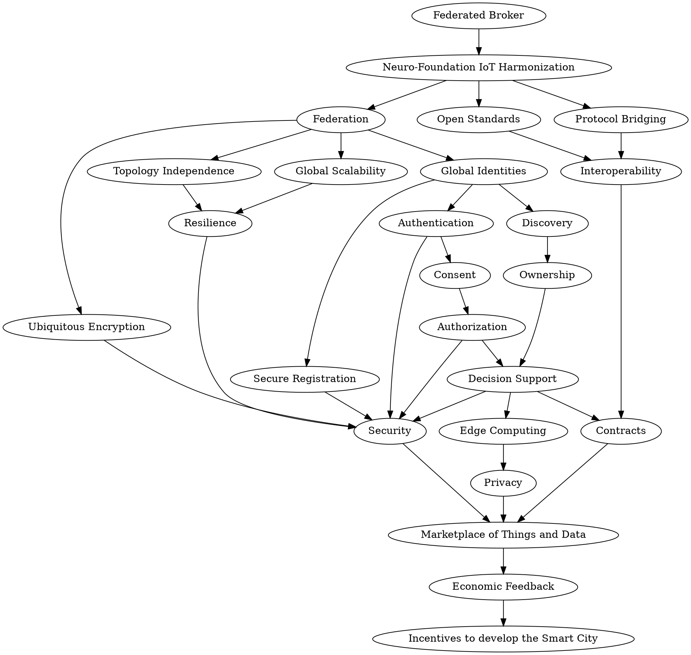

Title: neuro-foundation.io
Description: Main page of neuro-foundation.io
Date: 2024-08-02
Author: Peter Waher
Master: Master.md

=============================================

Introduction
=============================================

Neuro-Foundation presents communication infrastructure for a globally scalable, distributed infrastructure for smart societies, supporting:

* Local governance
* Definition of ownership
* Protection of privacy
* Consent-based communication
* High level of cybersecurity
* Cross-domain interoperability
* Cross-technology interoperability


How does it work?
--------------------

The Neuro-Foundation Infrastructure helps secure the *Smart City* by providing the following set of services:



IoT Harmonization
--------------------

The Federated Broker, or Neuro-Foundation Integration Server is based on the results of the [Neuro-Foundation IoT Harmonization](https://neuro-foundation.io) effort. 
The goal is to create open standards that facilitate the interoperable communication of things across the Internet, in a secure manner. Interfaces and descriptions 
are made available at the [Neuro-Foundation repository](https://github.com/Neuro-Foundation/neuro-foundation.io).

Federation
--------------------

The infrastructure is *federated* by design. This means that you can freely extend the network by setting up your own integration servers on your 
own *domains* using your own *domain names*. Devices connected to any integration server on the Internet can communicate with any device connected 
to any other integration server on the Internet, as long as they are authorized to do so. This is possible, since the integration servers cooperate 
and exchange messages between themselves, in real time, just like mail servers do, but faster. For this reason, Integration Servers are also known 
as *message brokers*. They broker messages between entities on the Internet.

Topology Independence
--------------------

Entities connect outward to their assigned message broker. Never do things need to establish different connections depending on who they communicate 
with. All messages sent and received are passed over the same connection. Never do entities need to accept incoming connections. This allows things 
and users to reside behind firewalls. Since message brokers interconnect and exchange messages, things and users can reside behind different 
firewalls, connect to different message brokers, and still communicate with each other.

Global Scalability
--------------------

The federated nature of the infrastructure also provides a natural way for it to grow organically. It is not necessary to create huge complex data 
centres that host services for everyone at once. Instead, anyone can host their own set of message brokers, without affecting the network performance 
of others needlessly. At the same time, this is done without restricting who entities can communicate with. Message brokers collaborate to form a 
global network of interconnected things.

Resilience
--------------------

Federation is also a great tool for creating resilient networks, as you divide the risks across the network. The failure of a message broker only 
affects a small portion of the entire network, just as a router only affects a small part of the larger interconnected network.

Open Standards
--------------------

Basing the infrastructure on *Open Standards* has several advantages: Infrastructure components become replaceable and exchangeable. It also removes 
the need for the development of bespoke or proprietary back-end software to make entities interconnect and communicate. It becomes possible to create 
Smart City applications without the requirement to develop server software or to rely on server-storage of sensitive sensor data.

Neuro-Foundation IoT Harmonization is based on the [XMPP](https://xmpp.org/) protocol, which is an open standard, standardized by the 
[Internet Engineering Task Force, IETF](http://ietf.org/) in [RFC 6120](https://tools.ietf.org/html/rfc6120), 
[RFC 6121](https://tools.ietf.org/html/rfc6121) and [RFC 6122](https://tools.ietf.org/html/rfc6122). XMPP is federated, open, extensible, secure, 
proven and robust. It is XMPP that defines the basic operation of message brokers. The [XMPP Standards Foundation, XSF](https://xmpp.org/about/xmpp-standards-foundation.html)
publish [XMPP extensions](https://xmpp.org/extensions/) for different purposes. The Neuro-Foundation IoT Harmonization effort bases its work on these 
standards, as well as interfaces published in the [Neuro-Foundation GitHub repository](https://github.com/Neuro-Foundation/neuro-foundation.io).

More information is available in the [IoT Harmonization using XMPP](Papers/IoT%20Harmonization%20using%20XMPP.pdf) paper. A comparison of other
protocols is made in the [Biotic - Executive Summary](Papers/Biotic%20-%20Executive%20Summary.pdf) paper. [XMPP](https://xmpp.org/) provides the
most features, flexibility and capabilities necessary to build a global backbone infrastructure.

Protocol Bridging
--------------------

Neuro-Foundation IoT Harmonization defines interfaces for *concentrators* that collect, or concentrate, a set of devices behind a single 
communication endpoint in the network. This can be used for embedding devices (or nodes) in a single physical device, such as a 
*Programmable Logic Controller* (PLC). It can also be used to bridge protocols in real time or connect large back-end systems to the network. 
Nodes in a concentrator behave just as any other thing connected to the infrastructure, and therefore also benefit from its features such as 
discovery, decision support, ownership, contracts, and so on.

If you are interested in acquiring protocol gateways between XMPP and any other protocol, such as M-Bus, Modbus, Bluetooth, MQTT, LWM2M, etc., 
leave a note in the [feedback form](/Feedback.md).

Interoperability
--------------------

The goal of Neuro-Foundation IoT Harmonization is to provide, as the name suggests, a means to harmonize different IoT-based technologies and allow 
them to integrate and interoperate, even if they are based on different communication patterns and protocols. This is possible through the concept 
of bridging, and because XMPP provides a great support for popular communication patterns. Neuro-Foundation IoT Harmonization allows for 
interoperable communication, not only across topology barriers, but also across technology and protocol barriers.

Global Identities
--------------------

For an entity to be able to connect to a message broker, it needs an account on that broker. The account name, together with the domain name of the 
broker, becomes a *global identity* for the entity. The identity, or *address* takes the form of what looks very much like an e-mail address: 
`account@domain`, also called a *Bare Jabber ID*, or *Bare JID*. Once connected, the message broker provides the entity with a random *resource* 
string. Together with the Bare JID, this forms a *Full JID*, in the form `my.thing@domain/resource`.

For concentrators, the Bare JID points to the concentrator itself. A thing that resides in, or behind, a concentrator, is further identified using 
a *Node ID*, and optionally by a *Source ID* and *Partition* as well. Nodes can reside in *sources*, which may, or may not be partitioned into 
segments. The quadruple (Bare JID, Node ID, Source ID, Partition) is globally unique. Node ID, Source ID and Partition are optional

Authentication
--------------------

Authentication in distributed environments such as a Smart City is typically difficult. Does everyone need to have access to the credentials of 
everyone else that it is to be able to communicate with?

In XMPP, this problem is delegated to the brokers, which are managed locally. This is called *local governance*. One important task they have is to 
authenticate all clients connecting to them. You cannot send messages to others in the network before the message broker has successfully 
authenticated your identity. Brokers also annotate all messages forwarded in the network with the address of the source of the message. This 
identity is very difficult to spoof, as the brokers also mutually authenticate each other and reject messages not annotated with a source address 
corresponding to the domain of the emitting broker. This allows the receivers of messages to estimate the validity of a received message simply 
based on the trust it places on the immediate broker, which is only one.

Simply put: The infrastructure authenticates all participants, and all participants are informed about the authenticated identities of everyone 
sending them messages. This makes it very easy to make good security decisions in a distributed environment such as a *Smart City*.

Consent
--------------------

In order to be able to communicate efficiently with another entity in the network, you need its *Full JID*, not only its *Bare JID*. The *Full JID* 
is transmitted to approved parties when the corresponding entity reports its *presence*. This is done, among other things, when the entity comes 
online or goes offline. The *Bare JID* can be used to request a *presence subscription* from the entity, which will allow the *Full JID* to be known 
if the entity consents to the request. If the corresponding entity does so, its message broker registers this event, and forwards future presence 
information to the party making the request. The entity can withdraw the consent at any time, making sure the corresponding party is no longer 
informed about the Full JID of the entity. When reconnecting, receiving a new resource, the party having lost the presence subscription, will not 
be able to communicate efficiently with the entity any longer.

Authorization
--------------------

XMPP includes several authorization mechanisms that help protect entities in the network:

* Only properly authenticated clients are authorized to send messages to the network.
* Only mutually authenticated brokers can participate in the federated network.
* Brokers can only forward messages originating in their authenticated domain.
* Information Queries require the use of *Full JIDs*, whose reception require mutual consent.

Neuro-Foundation IoT Harmonization adds an authorization layer of [decision support](#decisionSupport) to this list.

Secure Registration
--------------------

To automate the installation and configuration of huge quantities of devices into the network, along the principles of *zero-configuration networking*
for the operator, an automatic registration procedure is available. To prohibit malicious bots from being able to create identities fraudulently, 
requests must be identified using an *API key* and signed using a *private key*. API keys can be limited with regards to the number of accounts that 
can be created using it.

Discovery
--------------------

During *production*, the manufacturer is only aware of the *conceptual identity* of the devices being manufactured. This identity can include 
information about serial number, make and model of device, information about manufacturer, etc., as well as a *secret key*. Typically, the 
manufacturer and the device are unaware of the *network identity* the device will have.

After *installation* and during *configuration*, the device will find its broker, either through pre-configuration, or through information available
in the network, create its *network identity*. The device then *registers* itself with a *Thing Registry* available on the message broker. This
registration contains the conceptual identity of the device, and its new network identity.

The conceptual identity, known at the time of production, is transferred out-of-band to the owner of the device. This can be done using a QR-code
(for instance) on a sticker or sharing a [`iotdisco` URI](https://www.iana.org/assignments/uri-schemes/prov/iotdisco.pdf). The owner sends a
*claim* to the same *Thing Registry*. The registry matches registrations and claims, and if they match, pairs the thing with its owner, and informs
each one about the *network identity* of the other.


Once claimed, the owner can decide if the thing should remain in the registry or not, and if it should be publicly searchable. The thing, as well as 
the owner, can annotate the thing with tags. This makes it easier to find relevant things. As the thing knows its owner, it also knows who is 
responsible for making the correct security decisions. The broker also knows who the owner of each claimed device is. This allows the broker to help 
things make good [security decisions](#decisionSupport).

```uml: Claiming ownership of a device
@startuml
activate Thing

Thing -> Registry : Register(ThingAddr, ConceptualID, Key)
activate Registry
Registry -> Registry : DoRegister(Unclaimed, Private)
Thing <-- Registry : Registered()
deactivate Registry

activate Owner
Registry <- Owner : Claim(OwnerAddr, ConceptualID, Key, Pub/Priv)
activate Registry
Registry -> Registry : DoRegister(Claimed, Pub/Priv)
Registry --> Owner : Claimed(ThingAddr)
Thing <- Registry : Claimed(OwnerAddr, Pub/Priv)
deactivate Registry
deactivate Owner

activate Controller

Registry <- Controller : Search(Tags)
activate Registry
Registry -> Registry : DoSearch(tags)
Registry --> Controller : Result(Matching public things)
deactivate Registry

Controller -> Thing : Action(ControllerAddr)
Thing -> Owner : CanPerform(ControllerAddr)
activate Owner
Owner -> Owner : CanPerform(ControllerAddr)
Thing <-- Owner : Yes/No
deactivate Owner
Thing --> Controller : Response

deactivate Thing
deactivate Controller
@enduml
```

Ownership
--------------------

Once each thing knows the network identity of its owner, it becomes possible to define ownership, not only of the thing, but also of the data it 
generates. Typically, in cloud-based solutions, data ownership is challenging, if not undefined.

Mimicking how ownership of everyday physical objects is defined, or enforced, the infrastructure helps define a method of enforcing ownership of 
information:

* Local processing of information, together with [Ubiquitous Encryption](#ubiquitous Encryption) protects it behind lock and key.
* Thanks to the strong support for [authorization](#authorization), access to information is limited to only trusted parties.
* Access is monitored, especially if data is made available through [contracts](#contracts).
* Ownership of information can be demonstrated through annotations in the [Thing Registry](#discovery).

Ownership of information is enforced by utilising the [decision support](#decisionSupport) provided by the infrastructure, together with 
[edge computing](#edgeComputing) principles, instead of relying on centralized processing in the cloud, except in cases when required or in 
accordance with the wishes of the owner.

Decision Support
--------------------

The infrastructure provides your things with *decision support*, helping them make security decisions in real time. This provisioning capability 
allows owners to control who can communicate with their devices and do what with them. It also reduces the responsibility of the manufacturer, who 
cannot possibly know beforehand for what purpose each device will be used.

When something new happens to a thing, to which it does not know how to react, it can ask the *provisioning service* in the broker what to do. 
Designed on the principles of *data protection by default*, the *provisioning service* will reject the petition if it does not know how to solve it. 
But it knows who its owner is, and therefore also, who should know. An asynchronous message is sent to the owner, which the owner can respond to 
when time is available. Once responded to, the *provisioning service* learns. The next time the thing asks a related question, the 
*provisioning server* knows how to respond. The service has been provisioned in accordance of the will of the owner, and with no impact on the 
infrastructure operator.

```uml: Provisioning
@startuml
Activate Client
Client -> Device : Request readout

Activate Device

Device -> Device : Has answer in cache?
Client <-- Device : Response(Yes/No/Partial)[yes]

Device -> "Provisioning Server" : Can Read?[no]

Activate "Provisioning Server"

"Provisioning Server" -> "Provisioning Server" : Can answer?

Device <-- "Provisioning Server" : Answer(Yes/No/Partial)[yes]
Device <-- "Provisioning Server" : Answer(No)[no]

Client <-- Device : Response(Yes/No/Partial)

Deactivate Device
Deactivate Client

"Provisioning Server" -> Owner : Can Read?[no]
Activate Owner

"Provisioning Server" <-- Owner : Answer(Yes/No/Partial)

Deactivate Owner

"Provisioning Server" -> "Provisioning Server" : Store answer

"Provisioning Server" -> "Device" : Clear Cache
Activate "Device"
Device -> Device : Empty cache
Deactivate "Device"
Deactivate "Provisioning Server"

Activate Client
Client -> Device : Request readout

Activate Device

Device -> Device : Has answer in cache?
Device -> "Provisioning Server" : Can Read?
Activate "Provisioning Server"
Device <- "Provisioning Server" : Answer(Yes/No/Partial)
Deactivate "Provisioning Server"
Client <-- Device : Response(Yes/No/Partial)

Deactivate Device
Deactivate Client
@enduml
```

Using the [discovery](#discovery) and *provisioning* features proposed by the Neuro-Foundation, the entire *life cycle* of the thing is supported. 
From *production*, through *installation*, *configuration*, *production*, *change of ownership* to *decommissioning*.

```uml: Product Lifecycle
@startuml
start

:Production;
note left
**Meta data** is configured 
into thing.
end note

:Installation;
note right
Thing is physically installed
and connected
end note

:Configuration;
note left
**Network identity** is
generated.
end note

while (operative?) is (yes)

:Generate **KEY**;

:Registration;
note right
Registration of **Meta data**
together with **Network identity**
and new **KEY** is made in a 
**Thing Registry**.
end note

:Transfer Meta Data;
note left
**Meta data** and **KEY** is
passed to Owner, for example
using **iotdisco** URI.
end note

:Claim;
note right
Owner presents **Meta data**,
its **Network identity** and
**KEY** to the **Thing Registry**.
Owner gets Network identity
of matching unclaimed thing.
Thing gets network identity 
of owner. Thing is marked as
**owned**. Can be set to either
**public** or **private**-
end note

while (owned?)

fork

if (event requiring
decision support) then (yes)
if (in cache?) then (no)
partition Provisioning {
if (subscribe?) then (yes)
:Can Subscribe?;
else if (read?) then (yes)
:Can Read?;
else if (control?) then (yes)
:Can Control?;
else (no)
endif
}
else (yes)
endif
endif

fork again

if (new meta data?) then (yes)
partition "Thing Registry" {
:Update Registration;
}
endif

endfork

endwhile (no longer owned)

:Disown;
note left
Thing forgets owner.
Public things are hidden.
end note

endwhile (no, decomission)

:Unregister;

stop
@enduml
```

Decision support can further be fully automated, using [contracts](#contracts), in accordance with *zero-configuration networking* principles, and 
still maintaining a high level of security.

Contracts
--------------------

Owners can automate [decision support](#decisionSupport) by uploading digital contracts for their things. These contracts stipulate requirements 
that must be met in order to gain access to their devices, under what conditions access can be given, for how long and how often. Identified third 
parties wanting access to devices can accept their contracts and are automatically granted access in accordance with the contracts. Things report 
usage to the infrastructure, which uses this usage information to monitor compliance with the contract. This usage information is also used to 
create *billing information* or the [Marketplace of Things and Data](#marketplaceOfThingsAndData).

Ubiquitous Encryption
--------------------

*Ubiquitous Encryption* is a policy that requires that all client <==> broker connections (`c2s`), and all broker <==> broker (`s2s`) are encrypted 
and properly authenticated. This is one of many features that provide for added [security](#security). In cases where very sensitive information is 
communicated, *End-to-end* encryption (E2E) and/or *Peer-to-Peer* (P2P) communication can be used.

Security
--------------------

The Neuro-Foundation Integration Server helps you maintain a high level of data protection *by design* and *by default* for your *Smart City* 
applications. It does so by providing:

* [Strong global identities](#globalIdentities) that identify all senders of messages in the network. While anonymous access might protect a whistle 
  blower (or a criminal), strong authenticated identities protect the *information owner*.

* [Authentication](#authentication) of all participants in the network.

* *Authorization* based on [consent](#consent) is required for full access to an entity. This consent can be verified, and as easily withdrawn, as 
  it was given.

* [Federation](#federation) provides for [resilience](#resilience) and [scalability](#scalability). It allows you to divide the risk across domains.

* [Ownership](#ownership) and [decision support](#decisionSupport) provide long-term security for things that are not operated by humans. 

* [Ubiquitous Encryption](#ubiquitousEncryption) helps maintain the confidentiality of the information communicated.

Edge Computing
--------------------

*Edge computing* is the paradigm that information should be processed as close to the edge, or the source, as possible. It is the opposite of 
centralized (or cloud) processing. The Neuro-Foundation Integration Server helps you realize the *Edge Computing* paradigm, by not participating 
actively in the processing of sensor data. The Integration Server only acts as a message broker, and furthermore provides [registry](#discovery) and 
[decision support](#decisionSupport) services for things. Sensor data is never collected by the broker. If an entity wants access to the data, it 
needs to request it from the thing directly, helped by the infrastructure to do so. If an infrastructure component should try to collect such 
information from things integrating with the Integration Server, their corresponding owners would be alerted, and data collection would only be 
possible in instances where owners consent.

Privacy
--------------------

The Neuro-Foundation Integration Server helps applications respect the privacy of any data subjects related to any sensitive information measured by 
devices connected to the broker. This is done on an infrastructure level, in several ways:

* Data protection principles are implemented *by design* and *by default*.
* Access to data can only be achieved through consent from its owner.
* Any consent given can be as easily withdrawn, as it was given.

Marketplace of Things and Data
--------------------

The *law of supply and demand* requires you to limit access to a resource for it to be *valuable*, i.e. having a price above zero. An unlimited 
resource has no price, or a price of zero. While the resource might have non-monetary values, such as emotional, philosophical or spiritual values, 
for it to have a monetary value, access to it must be restricted. This does not automatically mean any restricted resource has a value. But all 
valuable resources are restricted. And so, it is for information too: Only restricted information can be valuable.

For this purpose, the Neuro-Foundation Integration Server provides a *marketplace of things and data*, and helps owners restrict access to their 
things and their data. Owners publish their things in the *Thing Registry* where others can [discover](#discovery) them. Through 
[contracts](#contracts), owners define the conditions required of acquiring access to their things. Accepting these contracts is done using a 
digital signature; a deal is made. The plurality of offerings available in the registry forms a marketplace of things and their data.

Economic Feedback
--------------------

The integration server provides *billing information* to the infrastructure operator, based on signed contracts and reported usage. The operator can 
use this information to bill the parties participating in the network, in accordance with their usage. A part of these earnings is used to reimburse 
the owners whose devices have been used. This creates an *economic feedback*, helping the owners to get a return on their investment.

Incentives to develop the Smart City
--------------------

The original question being solved by the proposed infrastructure is as follows: What incentive does an owner of a thing have for allowing others to 
connect to it and use it in their systems? In the vision of a Smart City, there's ubiquitous access to things and services in all niches of society. 
But what incentives are there for this to occur?

In a traditional IoT system there are few. Allowing third parties access to your things will only put more load on your devices, decreasing the 
performance of your system, while a competitor can publish a similar service as yours without having to invest in hardware. For this reason, most 
IoT solutions are closed systems prohibiting integration with their things directly, permitting access at most through controlled back-end server 
platforms using proprietary APIs. Integrations are therefore limited.

Through the proposed infrastructure, there is a clear economic incentive to allow others access to your things. If you provide the type of device 
for which others are willing to pay to get access to, you might not only get a return on your investment, but also turn a profit. It will become 
profitable in its own right, to provide access to devices and their data and services. The marketplace will provide a platform for competition, 
which will accelerate development of the Smart City.
