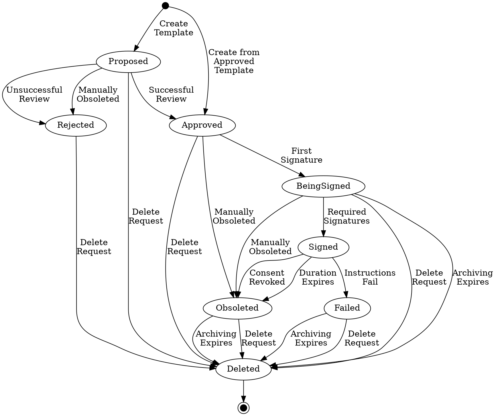

Title: Smart Contracts
Description: Smart Contracts page of neuro-foundation.io
Date: 2024-08-06
Author: Peter Waher
Master: Master.md

=============================================

Smart Contracts
=====================

Users with [legal identities](LegalIdentities.md) can sign smart contracts. Smart contracts 
are machine-readable contracts that are legally binding for the parts that have signed them. 
Smart contracts are divided into two parts: One container, that encapsulates the contract and 
provides state information and signatures. The second part is an XML document, whose semantic 
meaning is defined by the qualified name of the root. By providing XML schemas, the server 
must make sure contracts are well-defined and contain all required information. The server 
attests to the validity of the contents of the contract, its integrity and all signatures. 
Contracts can be used to automate different aspects in a smart city, such as provisioning for 
instance.

| Smart Contracts                                                       ||
| ------------|----------------------------------------------------------|
| Namespace:  | `urn:nfi:iot:leg:sc:1.0`                                 |
| Schema:     | [SmartContracts.xsd](Schemas/SmartContracts.xsd)         |


Motivation and design goal
----------------------------

The method of managing smart contracts, as described here, is designed with the following 
goals in mind:

* Smart Contracts must be both machine readable and human readable.

* The contents and legal integrity of each contract must be assured, and verifiable. The role
of validating the integrity of a smart contract is called an *electronic notary*.

* The contract model must support variable amounts of roles, parts and parameters, a 
completely customizable machine-readable section and the possibility for multiple 
localizations of the human-readable section.

* To allow for automatic use of smart contracts, validated templates must be supported. Such 
templates have the integrity of their contents asserted by the electronic notary but may lack 
parameter values and signatures. Validated templates can be used as the foundation of creating 
new valid smart contracts.

* Contracts are signed using the cryptographic keys defined for the corresponding 
[legal identities](LegalIdentities.md) signing the contract. Parts of contracts may be from 
any domain in the federated network, as long as they have validated 
[legal identities](LegalIdentities.md). The signatures form cryptographic proof that the 
holder of the private key of corresponding to the legal identity, has signed the contract.

* Contents of a contract must be updatable. Once signed by the first part, contract contents 
and parameters become immutable.

* Privacy must be considered. Access to contracts must be restricted to authorized individuals 
only. By default, this is restricted to the parts of the contract, as well as the designated 
staff acting as electronic notaries of the operator (Trust Provider) that hosts the contract.

* Other entities can make petitions to access the personal information available in smart 
contracts. At least one part in the contract must consent before access to the contract can be 
granted, mimicking real-world management of contracts: Each part retains a copy of a contract,
and can share it with others for their purposes. The other parts in a contract cannot deny 
this. But at least one part must consent before access to the smart contract can be granted.

* Contracts are limited in time. After being obsoleted, and after a specified archiving period 
specific to the contract, contracts must be purged from the corresponding domains.

* Contracts can have a variable number of signed attachments associated with it.


Requirements
---------------


Contract structure
-----------------------

A smart contract is a specific type of object managed by a broker. Before going into the different operations that can be made on a smart 
contract, a brief introduction to the contract object, and its XML representation, is made.

```uml:Contract
@startuml
left to right direction

skinparam nodesep 20
skinparam ranksep 50
skinparam groupInheritance 2
skinparam linetype polyline

object contract
contract : id
contract : visibility
contract : canActAsTemplate
contract : duration
contract : archiveReq
contract : archiveOpt
contract : signAfter
contract : signBefore
contract : nonce

object "~#~#any" as any
contract "1" *-- "1" any

object role
contract "1" *-- "*" role
role : name
role : minCount
role : maxCount
role : canRevoke

object description
role "1" *-- "1..*" description 

object parts
contract "1" *-- "0..1" parts

object part
parts "1" *-- "1..*" part
part : legalId
part : role

object open
parts "1" *-- "1" open

object templateOnly
parts "1" *-- "1" templateOnly

role "1" -- "*" part

note "Only one of the parts-related options are used." as N1
part .[norank]. N1
open .[norank]. N1
templateOnly .[norank]. N1

object parameters
contract "1" *-- "0..1" parameters

parameters "1" *-[norank]- "1..*" Parameter
Parameter : name
Parameter : guide
Parameter : exp
Parameter : protection
Parameter : protected

object "description" as description2
Parameter "1" *-- "1..*" description2

object stringParameter
Parameter <|-[norank]- stringParameter
stringParameter : value
stringParameter : regEx
stringParameter : min
stringParameter : minIncluded
stringParameter : max
stringParameter : maxIncluded
stringParameter : minLength
stringParameter : maxLength

object numericalParameter
Parameter <|-[norank]- numericalParameter
numericalParameter : value
numericalParameter : min
numericalParameter : minIncluded
numericalParameter : max
numericalParameter : maxIncluded

object booleanParameter
Parameter <|-[norank]- booleanParameter
booleanParameter : value

object dateParameter
Parameter <|-[norank]- dateParameter
dateParameter : value
dateParameter : min
dateParameter : minIncluded
dateParameter : max
dateParameter : maxIncluded

object dateTimeParameter
Parameter <|-[norank]- dateTimeParameter
dateTimeParameter : value
dateTimeParameter : min
dateTimeParameter : minIncluded
dateTimeParameter : max
dateTimeParameter : maxIncluded

object timeParameter
Parameter <|-[norank]- timeParameter
timeParameter : value
timeParameter : min
timeParameter : minIncluded
timeParameter : max
timeParameter : maxIncluded

object durationParameter
Parameter <|-[norank]- durationParameter
durationParameter : value
durationParameter : min
durationParameter : minIncluded
durationParameter : max
durationParameter : maxIncluded

object geoParameter
Parameter <|-[norank]- geoParameter
geoParameter : value
geoParameter : contractLocation
geoParameter : min
geoParameter : minIncluded
geoParameter : max
geoParameter : maxIncluded
geoParameter : altitude

object calcParameter
Parameter <|-[norank]- calcParameter

object recordSet
Parameter <|-[norank]- recordSet
recordSet : maxRecords
recordSet : minRecords

object roleParameter
Parameter <|-[norank]- roleParameter
roleParameter : role
roleParameter : index
roleParameter : property
roleParameter : required
roleParameter : contentType

object contractReferenceParameter
Parameter <|-[norank]- contractReferenceParameter
contractReferenceParameter : value
contractReferenceParameter : required
contractReferenceParameter : localName
contractReferenceParameter : namespace
contractReferenceParameter : templateId
contractReferenceParameter : provider
contractReferenceParameter : creatorRole

object label
contractReferenceParameter "0" *-[norank]- "*" label

object attachmentParameter
Parameter <|-[norank]- attachmentParameter
attachmentParameter : value
attachmentParameter : required
attachmentParameter : contentType
attachmentParameter : minSize
attachmentParameter : maxSize
attachmentParameter : minWidth
attachmentParameter : maxWidth
attachmentParameter : minHeight
attachmentParameter : maxHeight

object recordDefinition
recordSet "1" *-- "1" recordDefinition

object record
recordSet "1" *-- "0..*" record

recordDefinition "1" *-[norank]- "1..*" Parameter
record "1" *-[norank]- "1..*" Parameter

object humanReadableText
contract "1" *-- "1..*" humanReadableText

object signature
contract "1" *-- "0..*" signature
signature : legalId
signature : bareJid
signature : role
signature : timestamp
signature : BASE64

object attachment
contract "1" *-- "0..*" attachment
attachment : id
attachment : legalId
attachment : contentType
attachment : fileName
attachment : s
attachment : timestamp

object status
contract "1" *-- "0..1" status
status : provider
status : state
status : created
status : updated
status : from
status : to
status : templateId
status : schemaDigest
status : schemaHashFunction

object roleParameters
status "1" *-- "0..1" roleParameters

object parameter
roleParameters "1" *-- "0..*" parameter
parameter : name
parameter : value
parameter : contentType
parameter : legalId
parameter : fileName
parameter : signature
parameter : timestamp
parameter : url
parameter : BASE64

object serverSignature
contract "1" *-- "0..1" serverSignature
serverSignature : timestamp
serverSignature : BASE64

object attachmentRef
contract "1" *-- "0..*" attachmentRef
attachmentRef : attachmentId
attachmentRef : url

attachmentRef "1" .[norank]. "1" attachment

note "Each instance represents a different locale\nof the same human readable text." as N2
description .[norank]. N2
description2 .[norank]. N2
humanReadableText .[norank]. N2

' Invisible layout links for left-to-right direction.
' Lane 1: one dash keeps these subclasses in the same column.

stringParameter -[hidden]> numericalParameter
numericalParameter -[hidden]> booleanParameter
booleanParameter -[hidden]> dateParameter
dateParameter -[hidden]> dateTimeParameter

' Lane 2: one dash keeps these subclasses in the same column.

timeParameter -[hidden]> durationParameter
durationParameter -[hidden]> geoParameter
geoParameter -[hidden]> calcParameter
calcParameter -[hidden]> recordSet

' Lane 3: one dash keeps these subclasses in the same column.

roleParameter -[hidden]> contractReferenceParameter
contractReferenceParameter -[hidden]> label
label -[hidden]> attachmentParameter

' Two dashes establish successive columns.

Parameter -[hidden]-> stringParameter
stringParameter -[hidden]-> timeParameter
timeParameter -[hidden]-> roleParameter

numericalParameter -[hidden]-> durationParameter
booleanParameter -[hidden]-> geoParameter
dateParameter -[hidden]-> calcParameter

durationParameter -[hidden]-> contractReferenceParameter
geoParameter -[hidden]-> attachmentParameter

' Put Parameter in the same main column as the parameters collection.
parameters -[hidden]> Parameter

' Keep the main contract members and Parameter in a common column.

any -[hidden]> role
role -[hidden]> parts
parts -[hidden]> parameters
parameters -[hidden]> Parameter
Parameter -[hidden]> humanReadableText
humanReadableText -[hidden]> signature
signature -[hidden]> attachment
attachment -[hidden]> status
status -[hidden]> serverSignature
serverSignature -[hidden]> attachmentRef
recordDefinition -[hidden]> record

@enduml
```

### General properties

The root element is the `<contract/>` element. It contains general properties related to visibility, template usage and key time-points in the 
lifecycle of the contract:

| Attribute          | Type                 | Use      | Description                                                                                                                                                                                                                                            |
|:-------------------|:---------------------|:---------|--------------------------------------------------------------------------------------------------------------------------------------------------------------------------------------------------------------------------------------------------------|
| `id`               | `xs:string`          | Optional | An identifier assigned to the contract. The identifier is formed as a JID but is not a JID. The domain part corresponds to the domain of the Trust Provider. A client must not include an identifier when it creates a contract on the Trust Provider. |
| `nonce`            | `xs:base64Binary`    | Optional | An optional base64-encoded nonce value that is used when encrypting protected parameter values.                                                                                                                                                        |
| `visibility`       | `ContractVisibility` | Required | What visibility the contract should have.                                                                                                                                                                                                              |
| `canActAsTemplate` | `xs:boolean`         | Required | If the contract can act as a template for future contracts.                                                                                                                                                                                            |
| `duration`         | `xs:duration`        | Required | The duration of the contract. The duration is calculated from the time of the last required signature.                                                                                                                                                 |
| `archiveReq`       | `xs:duration`        | Required | After a legally binding contract expires, this attribute specifies for how long the contract is required to be persisted in the archives before it can be manually deleted.                                                                            |
| `archiveOpt`       | `xs:duration`        | Required | After a legally binding contract expires, and the `archiveReq` period has expired, this attribute specifies an additional duration after which it is automatically deleted.                                                                            |
| `signAfter`        | `xs:dateTime`        | Optional | Signatures will only be accepted after this point in time.[^SignatureAfterBefore]                                                                                                                                                                      |
| `signBefore`       | `xs:dateTime`        | Optional | Signatures will only be accepted until this point in time.[^SignatureAfterBefore]                                                                                                                                                                      |

[^SignatureAfterBefore]: `signAfter` (if provided) must occur before `signBefore` (if provided).

Possible values of the `ContractVisibility` enumeration:

| `ContractVisibility` | Description                                                                                                                            |
|:---------------------|:---------------------------------------------------------------------------------------------------------------------------------------|
| `CreatorAndParts`    | Contract is only accessible to the creator, and any parts in the contract.                                                             |
| `DomainAndParts`     | Contract is accessible to the creator of the contract, any parts in the contract, and any account on the Trust Provider server domain. |
| `Public`             | Contract is accessible by everyone requesting it. It is not searchable.                                                                |
| `PublicSearchable`   | Contract is accessible by everyone requesting it. It is also searchable.                                                               |

Following the opening tag, follows a sequence of child elements with different information and meanings. The following sub-sections describe these
child element, in the order they may appear in the contract representation.

### Machine-readable section

The first child element of the `<contract/>` element, can be any XML from any namespace. The fully qualified name (local name + namespace) is used by the 
reader of the contract to know what this machine-readable portion of the contract means. The namespace can also be used to select an XML Schema for
validation purposes.

One of the tasks during validation of the legal integrity of a newly created smart contract, is to validate that the machine-readable content is valid,
according to the fully qualified name of the top element, as well as make sure the contents correspond to any human-readable text provided in the contract.

### Roles

A contract may contain any number of pre-defined *roles*. A role assigns certain responsibilities to any part of the contract, signing for that role.
A role is assigned a *name*, as well as the smallest and largest amounts of parts signing the contract, for the contract to be valid. Each role is defined
using a `<role/>` element following the machine-readable element. The `<role/>` element contains the following attributes:

| Attribute          | Type                    | Use      | Description                                                                            |
|:-------------------|:------------------------|:---------|----------------------------------------------------------------------------------------|
| `name`             | `NonEmptyString`        | Required | Machine readable name of the role. |
| `minCount`         | `xs:nonNegativeInteger` | Required | Minimum number of signatures required for this role, to make the contract legal.[^A value of zero (0) defines an optional role.] |
| `maxCount`         | `xs:nonNegativeInteger` | Required | Maximum number of signatures allowed for this role. |
| `canRevoke`        | `xs:boolean`            | Optional | If parts having this role, can revoke their signature, once signed. (Default=`false`) |

Each `<role/>` element must have at least one `<description/>` element containing human-readable text containing a short description of the role. The 
languages used for each descriptive text is specified using the `xml:lang` attribute. The requirements placed on parts assigned the role can be described 
later in the human-readable contract text.

**Note**: Revoking a signature can be used as a means to model consent-based agreements. Consent, in a privacy perspective, can typically be 
revoked. Revoking a signature is done, by calling `obsoleteContract`.

### Parts

There are four different types of contract objects, as it relates to parts:

1.	The contract has one or more pre-defined parts. In that case, each part is defined in a `<part/>` element in in sequence inside a `<parts/>` element.
2.	The contract is an open contract. Anyone can sign the contract, given they have a valid [legal identity](LegalIdentities.md).
	In this case, an empty `<open/>` element is presented inside the `<parts/>` element.
3.	The contract is only used as a template and cannot be signed. In this case, an empty `<templateOnly/>` element is presented inside the `<parts/>` element.
4.	The contract reuses the parts defined in its template. In such a case, the contract lacks a `<parts/>` element.

If the contract defines parts, each one is defined in a `<part/>` element, using the following attributes:

| Attribute | Type             | Use      | Description                                                                            |
|:----------|:-----------------|:---------|----------------------------------------------------------------------------------------|
| `legalId` | `NonEmptyString` | Required | Refers to a legal identity representing a part of the contract. |
| `role`    | `NonEmptyString` | Required | Refers to one of the roles defined for the contract. |

### Parameters

When facilitating the generation of new meaningful contracts from templates, contracts can be *parametrized*. When creating new contracts from templates,
new parameter values can be provided, without the need to change the machine-readable or human-readable parts of the contract. If parameters are available
in the contract, they are defined inside a `<parameters/>` element. The type of parameter defined is determined by the local name of the parameter element.
Regardless of type, each parameter can have any number of `<description/>` elements containing localized human-readable text describing the parameter.
The languages used for each descriptive text is specified using the `xml:lang` attribute. When creating contracts from a template, descriptions need not 
to be provided if text is available in the template.

#### Protection Levels

Parameters can have one of three protection levels: Normal, Encrypted or Transient. These are
encoded using the `protection` attribute for each parameters, as follows:

| Level     | Attribute value   | Description                                                                                                                                                                |
|:----------|:------------------|:---------------------------------------------------------------------------------------------------------------------------------------------------------------------------|
| Normal    | Attribute omitted | Parameter value is encoded into the contract.                                                                                                                              |
| Encrypted | `Encrypted`       | The BASE64-encoding of the encrypted parameter value is encoded into the contract.                                                                                         |
| Transient | `Transient`       | BASE64-encoded binary GUID representations are encoded into the contract. The values themselves are delivered outside of the contract to services processing the contract. |

#### Parameter Types

Parameters are classified by the type of value they can contain. The following subsections describe the different parameter types available.
Parameter values are optional for templates and required for contracts.

##### String-valued parameters

String-valued parameters are defined using the `<stringParameter/>` element.

| Attribute     | Type                    | Use      | Description                                                                |
|:--------------|:------------------------|:---------|----------------------------------------------------------------------------|
| `name`        | `NonEmptyString`        | Required | Name of the parameter within the scope of the contract.                    |
| `value`       | `xs:string`             | Optional | The value of the parameter, for normal parameters.                         |
| `protection`  | `ProtectionLevel`       | Optional | Level of confidentiality of the information provided by the parameter.     |
| `protected`   | `xs:base64Binary`       | Optional | Protected value, for protection levels Encrypted or Transient.             |
| `guide`       | `xs:string`             | Optional | A guiding text, that can be displayed to a user if no value is available.  |
| `exp`         | `xs:string`             | Optional | A simple [script expression](/Script.md) validating the parameter.         |
| `regEx`       | `xs:string`             | Optional | Optional regular expression to validate the value of the string parameter. |
| `min`         | `xs:string`             | Optional | Optional minimum value of the parameter.                                   |
| `minIncluded` | `xs:boolean`            | Optional | If the `min` value is part of the valid range or not.                      |
| `max`         | `xs:string`             | Optional | Optional maximum value of the parameter.                                   |
| `maxIncluded` | `xs:boolean`            | Optional | If the `max` value is part of the valid range or not.                      |
| `minLength`   | `xs:nonNegativeInteger` | Optional | Optional minimum lenth of the value of the parameter.                      |
| `maxLength`   | `xs:positiveInteger`    | Optional | Optional maximum lenth of the value of the parameter.                      |

##### Numerical parameters

Numerical parameters are defined using the `<numericalParameter/>` element.

| Attribute     | Type              | Use      | Description                                                                |
|:--------------|:------------------|:---------|----------------------------------------------------------------------------|
| `name`        | `NonEmptyString`  | Required | Name of the parameter within the scope of the contract.                    |
| `value`       | `xs:decimal`      | Optional | The value of the parameter, for normal parameters.                         |
| `protection`  | `ProtectionLevel` | Optional | Level of confidentiality of the information provided by the parameter.     |
| `protected`   | `xs:base64Binary` | Optional | Protected value, for protection levels Encrypted or Transient.             |
| `guide`       | `xs:string`       | Optional | A guiding text, that can be displayed to a user if no value is available.  |
| `exp`         | `xs:string`       | Optional | A simple [script expression](/Script.md) validating the parameter.         |
| `min`         | `xs:decimal`      | Optional | Optional minimum value of the parameter.                                   |
| `minIncluded` | `xs:boolean`      | Optional | If the `min` value is part of the valid range or not.                      |
| `max`         | `xs:decimal`      | Optional | Optional maximum value of the parameter.                                   |
| `maxIncluded` | `xs:boolean`      | Optional | If the `max` value is part of the valid range or not.                      |

##### Boolean parameters

Boolean parameters are defined using the `<booleanParameter/>` element.

| Attribute    | Type              | Use      | Description                                                                |
|:-------------|:------------------|:---------|----------------------------------------------------------------------------|
| `name`       | `NonEmptyString`  | Required | Name of the parameter within the scope of the contract.                    |
| `value`      | `xs:boolean`      | Optional | The value of the parameter, for normal parameters.                         |
| `protection` | `ProtectionLevel` | Optional | Level of confidentiality of the information provided by the parameter.     |
| `protected`  | `xs:base64Binary` | Optional | Protected value, for protection levels Encrypted or Transient.             |
| `guide`      | `xs:string`       | Optional | A guiding text, that can be displayed to a user if no value is available.  |
| `exp`        | `xs:string`       | Optional | A simple [script expression](/Script.md) validating the parameter.         |

##### Date parameters

Date parameters are defined using the `<dateParameter/>` element.

| Attribute     | Type              | Use      | Description                                                                |
|:--------------|:------------------|:---------|----------------------------------------------------------------------------|
| `name`        | `NonEmptyString`  | Required | Name of the parameter within the scope of the contract.                    |
| `value`       | `xs:date`         | Optional | The value of the parameter, for normal parameters.                         |
| `protection`  | `ProtectionLevel` | Optional | Level of confidentiality of the information provided by the parameter.     |
| `protected`   | `xs:base64Binary` | Optional | Protected value, for protection levels Encrypted or Transient.             |
| `guide`       | `xs:string`       | Optional | A guiding text, that can be displayed to a user if no value is available.  |
| `exp`         | `xs:string`       | Optional | A simple [script expression](/Script.md) validating the parameter.         |
| `min`         | `xs:date`         | Optional | Optional minimum value of the parameter.                                   |
| `minIncluded` | `xs:boolean`      | Optional | If the `min` value is part of the valid range or not.                      |
| `max`         | `xs:date`         | Optional | Optional maximum value of the parameter.                                   |
| `maxIncluded` | `xs:boolean`      | Optional | If the `max` value is part of the valid range or not.                      |

##### Date & Time parameters

Date & time parameters are defined using the `<dateTimeParameter/>` element.

| Attribute     | Type              | Use      | Description                                                                |
|:--------------|:------------------|:---------|----------------------------------------------------------------------------|
| `name`        | `NonEmptyString`  | Required | Name of the parameter within the scope of the contract.                    |
| `value`       | `xs:dateTime`     | Optional | The value of the parameter, for normal parameters.                         |
| `protection`  | `ProtectionLevel` | Optional | Level of confidentiality of the information provided by the parameter.     |
| `protected`   | `xs:base64Binary` | Optional | Protected value, for protection levels Encrypted or Transient.             |
| `guide`       | `xs:string`       | Optional | A guiding text, that can be displayed to a user if no value is available.  |
| `exp`         | `xs:string`       | Optional | A simple [script expression](/Script.md) validating the parameter.         |
| `min`         | `xs:dateTime`     | Optional | Optional minimum value of the parameter.                                   |
| `minIncluded` | `xs:boolean`      | Optional | If the `min` value is part of the valid range or not.                      |
| `max`         | `xs:dateTime`     | Optional | Optional maximum value of the parameter.                                   |
| `maxIncluded` | `xs:boolean`      | Optional | If the `max` value is part of the valid range or not.                      |

##### Duration parameters

Duration parameters are defined using the `<durationParameter/>` element.

| Attribute     | Type              | Use      | Description                                                                |
|:--------------|:------------------|:---------|----------------------------------------------------------------------------|
| `name`        | `NonEmptyString`  | Required | Name of the parameter within the scope of the contract.                    |
| `value`       | `xs:duration`     | Optional | The value of the parameter, for normal parameters.                         |
| `protection`  | `ProtectionLevel` | Optional | Level of confidentiality of the information provided by the parameter.     |
| `protected`   | `xs:base64Binary` | Optional | Protected value, for protection levels Encrypted or Transient.             |
| `guide`       | `xs:string`       | Optional | A guiding text, that can be displayed to a user if no value is available.  |
| `exp`         | `xs:string`       | Optional | A simple [script expression](/Script.md) validating the parameter.         |
| `min`         | `xs:duration`     | Optional | Optional minimum value of the parameter.                                   |
| `minIncluded` | `xs:boolean`      | Optional | If the `min` value is part of the valid range or not.                      |
| `max`         | `xs:duration`     | Optional | Optional maximum value of the parameter.                                   |
| `maxIncluded` | `xs:boolean`      | Optional | If the `max` value is part of the valid range or not.                      |

##### Time parameters

Time parameters are defined using the `<timeParameter/>` element.

| Attribute     | Type              | Use      | Description                                                                |
|:--------------|:------------------|:---------|----------------------------------------------------------------------------|
| `name`        | `NonEmptyString`  | Required | Name of the parameter within the scope of the contract.                    |
| `value`       | `xs:time`         | Optional | The value of the parameter, for normal parameters.                         |
| `protection`  | `ProtectionLevel` | Optional | Level of confidentiality of the information provided by the parameter.     |
| `protected`   | `xs:base64Binary` | Optional | Protected value, for protection levels Encrypted or Transient.             |
| `guide`       | `xs:string`       | Optional | A guiding text, that can be displayed to a user if no value is available.  |
| `exp`         | `xs:string`       | Optional | A simple [script expression](/Script.md) validating the parameter.         |
| `min`         | `xs:time`         | Optional | Optional minimum value of the parameter.                                   |
| `minIncluded` | `xs:boolean`      | Optional | If the `min` value is part of the valid range or not.                      |
| `max`         | `xs:time`         | Optional | Optional maximum value of the parameter.                                   |
| `maxIncluded` | `xs:boolean`      | Optional | If the `max` value is part of the valid range or not.                      |

##### Geo-spatial parameters

Geo-spatial parameters are defined using the `<geoParameter/>` element.

| Attribute          | Type              | Use      | Description                                                                |
|:-------------------|:------------------|:---------|----------------------------------------------------------------------------|
| `name`             | `NonEmptyString`  | Required | Name of the parameter within the scope of the contract.                    |
| `value`            | `GeoSpatial`      | Optional | The value of the parameter, for normal parameters.                         |
| `protection`       | `ProtectionLevel` | Optional | Level of confidentiality of the information provided by the parameter.     |
| `protected`        | `xs:base64Binary` | Optional | Protected value, for protection levels Encrypted or Transient.             |
| `contractLocation` | `xs:boolean`      | Optional | If the value of the parameter is the location of the contract.             |
| `guide`            | `xs:string`       | Optional | A guiding text, that can be displayed to a user if no value is available.  |
| `exp`              | `xs:string`       | Optional | A simple [script expression](/Script.md) validating the parameter.         |
| `min`              | `GeoSpatial`      | Optional | Optional minimum value of the parameter.                                   |
| `minIncluded`      | `xs:boolean`      | Optional | If the `min` value is part of the valid range or not.                      |
| `max`              | `GeoSpatial`      | Optional | Optional maximum value of the parameter.                                   |
| `maxIncluded`      | `xs:boolean`      | Optional | If the `max` value is part of the valid range or not.                      |
| `altitude`		 | `AltitudeUse`     | Optional | Defines how to handle altitude in positions.                               |

`GeoSpatial` values can be expressed as two floating-point values as `Latitude,Longitude` or
as three floating-point values as `Latitude,Longitude,Altitude`. `Latitude` and `Longitude`
are expressed in decimal degrees, while `Altitude` is expressed in meters above sea level.
Floating-point values are expressed using `.` as decimal separator, and `-` for negative 
values, and cannot include exponents.

`AltitudeUse` can have the following values:

| `AltitudeUse` | Description                              |
|:--------------|:-----------------------------------------|
| `Required`    | Altitude is required by the parameter.   |
| `Optional`    | Altitude is optional by the parameter.   |
| `Prohibited`  | Altitude is prohibited by the parameter. |

##### Calculation parameters

Calculation parameters are formulas, that calculate a value based on the input of other parameters. They are defined
using the `<calcParameter/>` element. Expressions used to calculate values reference other parameter values by name.
Only non-calculation parameters (anywhere in the contract), or calculation parameters defined before a calculation 
parameter being evaluated, can be referenced however, in order to avoid circular recursion.

| Attribute    | Type              | Use      | Description                                                               |
|:-------------|:------------------|:---------|---------------------------------------------------------------------------|
| `name`       | `NonEmptyString`  | Required | Name of the parameter within the scope of the contract.                   |
| `exp`        | `xs:string`       | Optional | A simple script expression providing the value of the parameter.          |
| `guide`      | `xs:string`       | Optional | A guiding text, that can be displayed to a user if no value is available. |
| `protection` | `ProtectionLevel` | Optional | Level of confidentiality of the information provided by the parameter.    |
| `protected`  | `xs:base64Binary` | Optional | Protected value, for protection levels Encrypted or Transient.            |

##### Role parameters

Role parameters are parameters whose values are taken automatically from Legal Identities at
the time of signature. This minimizes the risk of entering values incorrectly, as weel as
removes a parameter that needs to be entered manually.

| Attribute     | Type                 | Use      | Description                                                                                                        |
|:--------------|:---------------------|:---------|--------------------------------------------------------------------------------------------------------------------|
| `name`        | `NonEmptyString`     | Required | Name of the parameter within the scope of the contract.                                                            |
| `protection`  | `ProtectionLevel`    | Optional | Level of confidentiality of the information provided by the parameter.                                             |
| `protected`   | `xs:base64Binary`    | Optional | Protected value, for protection levels Encrypted or Transient.                                                     |
| `guide`       | `xs:string`          | Optional | A guiding text, that can be displayed to a user if no value is available.                                          |
| `exp`         | `xs:string`          | Optional | A simple [script expression](/Script.md) validating the parameter.                                                 |
| `role`        | `xs:string`          | Required | Name of the role of the signatory.                                                                                 |
| `index`       | `xs:positiveInteger` | Required | Index of signature of the of the signatory for the corresponding role.                                             |
| `property`    | `xs:string`          | Required | Name of the ID property of the signatory.                                                                          |
| `required`    | `xs:boolean`         | Optional | If existance of the signatory and property value is required or not for the contract to be complete.               |
| `contentType` | `xs:string`          | Optional | If the property refers to an attachment, the expected Internet Content-Type (wildcards allowed) of the attachment. |

##### Contract reference parameters

Contract reference parameters are parameters whose values are references to other contracts.
Variables in the referenced contract can be access from the contract by using object-oriented
naming. Contract reference parameters are presented in human-readable text using a special
human-readable label that the contract can define.

| Attribute     | Type                 | Use      | Description                                                                                       |
|:--------------|:---------------------|:---------|---------------------------------------------------------------------------------------------------|
| `name`        | `NonEmptyString`     | Required | Name of the parameter within the scope of the contract.                                           |
| `protection`  | `ProtectionLevel`    | Optional | Level of confidentiality of the information provided by the parameter.                            |
| `protected`   | `xs:base64Binary`    | Optional | Protected value, for protection levels Encrypted or Transient.                                    |
| `guide`       | `xs:string`          | Optional | A guiding text, that can be displayed to a user if no value is available.                         |
| `exp`         | `xs:string`          | Optional | A simple [script expression](/Script.md) validating the parameter.                                |
| `value`       | `xs:string`          | Optional | Contract identifier of reference contract.                                                        |
| `required`    | `xs:boolean`         | Optional | If the reference parameter is required or not.                                                    |
| `localName`   | `xs:string`          | Optional | Restriction on the local name of the machine-readable part of the referenced contract.            |
| `namespace`   | `xs:string`          | Optional | Restriction on the namespace of the machine-readable part of the referenced contract.             |
| `templateId`  | `xs:string`          | Optional | Restriction on the Template ID of the referenced contract.                                        |
| `provider`    | `xs:string`          | Optional | Restriction on the provider of the referenced contract.                                           |
| `creatorRole` | `xs:string`          | Optional | Restriction on the role the creator of the current contract must have in the referenced contract. |

##### Attachment parameters

Attachment reference parameters are parameters that refer to attachments in the same contract.
They make it possible to include the contents of the referenced attachments into both
human-readable content, as well as machine-readable content.

| Attribute     | Type                 | Use      | Description                                                                 |
|:--------------|:---------------------|:---------|-----------------------------------------------------------------------------|
| `name`        | `NonEmptyString`     | Required | Name of the parameter within the scope of the contract.                     |
| `protection`  | `ProtectionLevel`    | Optional | Level of confidentiality of the information provided by the parameter.      |
| `protected`   | `xs:base64Binary`    | Optional | Protected value, for protection levels Encrypted or Transient.              |
| `guide`       | `xs:string`          | Optional | A guiding text, that can be displayed to a user if no value is available.   |
| `exp`         | `xs:string`          | Optional | A simple [script expression](/Script.md) validating the parameter.          |
| `value`       | `xs:string`          | Optional | The file name of the uploaded attachment.                                   |
| `required`    | `xs:boolean`         | Optional | If the attachment is required or not.                                       |
| `contentType` | `xs:string`          | Optional | Restriction on the Content-Type of the attachment. Wildcards are permitted. |
| `minSize`     | `xs:positiveInteger` | Optional | Smallest acceptable size of attachment, in bytes.                           |
| `maxSize`     | `xs:positiveInteger` | Optional | Largest acceptable size of attachment, in bytes.                            |
| `minWidth`    | `xs:positiveInteger` | Optional | Smallest acceptable width of attachment, in pixels, if relevant.            |
| `maxWidth`    | `xs:positiveInteger` | Optional | Largest acceptable width of attachment, in pixels, if relevant.             |
| `minHeight`   | `xs:positiveInteger` | Optional | Smallest acceptable height of attachment, in pixels, if relevant.           |
| `maxHeight`   | `xs:positiveInteger` | Optional | Largest acceptable height of attachment, in pixels, if relevant.            |

##### Recordsets

Recordsets are groups of parameters that can be repeated, creating vectors, or tables of
parameters, accessible both from human-readable and machine-readable content in the contract.
A recordset first contains a record definition (`<recordDefinition/>` element), which contains 
the parameter definitions. This definition is then following by a sequence (possibly empty) 
of records (`<record/>` elements), containing parameter values for the parameters in the 
corresponding definition. 

| Attribute    | Type                    | Use      | Description                                                        |
|:-------------|:------------------------|:---------|--------------------------------------------------------------------|
| `name`       | `NonEmptyString`        | Required | Name of the recordset within the scope of the contract.            |
| `exp`        | `xs:string`             | Optional | A simple [script expression](/Script.md) validating the recordset. |
| `minRecords` | `xs:nonNegativeInteger` | Required | Minimum number of records in the record set.                       |
| `maxRecords` | `xs:positiveInteger`    | Required | Maximum number of records in the record set.                       |

#### Parameter Validation

Parameters can have optional validation rules attached to them. Some apply to only one 
parameter type, others apply to different parameter types. The following subsections lists 
available validation rules that can be applied.

**Note**: A server must not allow the creation of contracts whose parameters break validation 
rules. When creating a contract from a template, it is also important to assure that client 
does not attempt to change types of parameters, and any validation rules defined in the 
template.

##### Range validation

A valid range can be specified using four optional attributes: `min`, `max`, `minIncluded` and
`maxIncluded`. Open ranges can be specified by omitting either `min` or `max`. Ranges include 
the endpoints by default. By excluding them, set the `minIncluded` or `maxIncluded` to `false`
respectively. Comparison is done in accordance with the underlying parameter data type.

Note: Maximum values must not be smaller than minimum values, if both are specified.

##### Size validation

The size of a string parameter value can be controlled by the two optional attributes 
`minLength` and `maxLength`. By omitting both, no size limits are imposed. By omitting one, 
no limit in the corresponding direction exists.

For attachment reference parameters, different minimum and maximum sizes can be specified.
`minSize` and `maxSize` refer to the size of the attachment in bytes, while `minWidth`, 
`maxWidth`, `minHeight` and `maxHeight` refer to the size of the attachment in pixels, if 
relevant.

For recordsets, the number of records can be controlled by the two optional attributes 
`minRecords` and `maxRecords`.

Note: Maximum values must not be smaller than minimum values, if both are specified.

##### Regular Expression validation

String parameters can be validated using regular expressions. Named groups can be used to 
extract parts of the value, and referencing them from [mathematical expression](/Script.md) 
validation rules.

**Note**: Due to lack of standards for regular expressions, evaluation of expressions is done 
mainly on the server side, and is considered implementation specific. A client or a peer that 
understands the syntax of a regular expression, can use it to guide users in user interfaces
during the creation of a contract. But when retrieving a created contract, it is assumed 
servers have already validated parameter values before allowing the contract to be created. 
Still, most regular expression dialects share common elements, which makes common regular 
expressions understandable across clients and technology boundaries.

##### Mathematical Expression validation

Parameters, as a set, can be validated using [mathematical script expressions](/Script.md). 
Such expressions may refer to parameter values using their parameter names, as if they were
variables, and use common arithmetic and comparison operators to impose rules on valid values,
referencing multiple parameters in a single expression. Expressions may also reference 
intrinsic contract properties. The following table lists such contract properties:

| Property   | Type          | Description                                                                                                   |
|:-----------|:--------------|:--------------------------------------------------------------------------------------------------------------|
| `Duration` | `xs:duration` | The duration of the contract .                                                                                |
| `Now`      | `xs:dateTime` | The current local date and time, if not signed, otherwise the local date and time of the first signature.     |
| `NowUtc`   | `xs:dateTime` | The current date and time in UTC, if not signed, otherwise the date and time, in UTC, of the first signature. |

When referencing contract properties in referenced contract, object-oriented naming notation
is used, by first referencing the name of the contract reference parameter, following by a
period (`.`), following by the name of the property in the referenced contract. This
object notation can be nested, if the referenced contract has a contract reference parameter 
itself.

Example: `ContractRef.Parameter`

When referencing recordset parameters, object-oriented naming notation is used to reference
the record definition, while vector notation is used to reference records in the recordset.
Each record then uses object-oriented naming notation to reference the parameters inside each
record.

Example: `Recordset.Parameter` references the definition, while `Recordset[1].Parameter`
references a parameter in a specific record.

**Note**: Evaluation of [mathematical expressions](/Script.md) is done mainly on the server 
side, and is considered implementation specific. A client or a peer that understands the 
syntax of an expression, can use it to guide users in user interfaces during the creation of 
a contract. But when retrieving a created contract, it is assumed servers have already 
validated parameter values before allowing the contract to be created. Still, common operators 
(`+`, `-`, `*`, `/`, `<`, `>`, `=`, `!=` (or `<>`), `<=`, `>=`, `!`) are often understood by 
many expression evaluators, which makes common expressions understandable across clients and 
technology boundaries.

##### Encrypted parameters

Encrypted parameters have their values encrypted and then BASE64-encoded, before being encoded
into the contract. This encryption is done using a shared key, a symmetric algorithm, the
parameter name, the type of parameter (the local name of the parameter element used to encode
the parameter in the contract), the zero-based parameter index (counted from top to bottom in
the contract), the Bare JID of the creator of the contract, a binary contract nonce, and 
a clear text string representation of the value (the string-representation used, if the 
parameter would have been normally encoded into the contract).

The following sequence describes the encryption of a parameter value:

#.  A byte array is formed by concatenating:
    
    KEY | NONCE | LE(INDEX)

    where `LE(INDEX)` is the 4-byte Little Endian encoding of the 32-bit parameter index.

#.  Compute the `SHA-256` hash digest of the concatenated binary string.

#.  Take as the `SuffixLength` the first byte of the hash digest.

#.  If the parameter value to encode is the `null` value, use as value to encrypt a byte
    array of `SuffixLength` zeroes.

#.  If the parameter value to encode is not `null`, create a binary byte array as follows:

    #.  Compute `Prefix` as the index of the first non-zero byte after the `SuffixLength`
        byte in the computed hash digest (first byte has index 1). If all bytes after
        `SuffixLength` are zeroes, set `Prefix` to 1.

    #.  Use as value to encrypt the following concatenated binary string:

        Prefix | UTF8(VALUE) | ZEROES(SuffixLength)

        Where `Prefix` is the single byte `Prefix`, `UTF8(VALUE)` is the UTF-8 encoding
        of the string-representation of the value to encrypt, and `ZEROES(SuffixLength)`
        is an array of `SuffixLength` zeroes.

#.  From the End-to-end encryption symmetric cipher, generate the Initialization Vector `IV`
    by using the Parameter Name as the `id` attribute, the Parameter Type as the `type`
    attribute, the Creator Bare JID as the `from` attribute, the BASE64-encoding of the
    contract nonce value as the `to` attribute, and the Parameter Index as the counter.

#.  Use as Associated Data (if required by the symmetric cipher), the UTF-8 encoding of 
    the Parameter Name.

#.  Encypt the byte array generated earlier with the symmetric cipher, the Key, the
    Initialization Vector `IV` and the Associated Data, using zeros to fill the last buffer, 
    if necessary.

#.  Encode the encypted value in the `protected` attribute of the paramter, instead of the
    normal `value` attribute.
    
The following sequence describes the decryption of an encrypted parameter value:

#.  Generate the Initialization Vector `IV` and Associated Data as described above.

#.  Decrypt the encrypted value using the symmetric cipher selected and the shared secret
    as key.

#.  If the Length of the decrypted byte array is zero, or the first byte is zero, the
    decrypted value is the `null` value.

#.  Remove the first byte, and trailing zero bytes. UTF-8 decode the remaining byte string
    to get the normal text-representation of the parameter value.

##### Transient parameters

Transient parameters are parameters whose values are only available *in transit*, i.e. they 
are not persisted together with the contract. Instead, the values are replaced by 
BASE64-encoded binary GUID representations, encoded into the `protected` attribute instead of
the normal `value` attribute. The actual values are transmitted outside the scope of the 
contract. All signatures are calculated on the BASE64-encoded binary GUID representations, 
not the actual parameter values.

Transient parameter can be used in special circumstances where special care has to be made to 
protect the privacy or confidentiality of the underlying information, but still use smart 
contracts and digital signatures to show that the signatories have agreed on the terms of the 
contract. Examples can include sensitive information such as choices during closed voting 
procedures, credit card details for payments, etc.

**Note**: Transient parameter values must not be persisted or logged by the broker, or by
services processing the values.

When creating a new Contract, containing transient parameters, these are placed in a separate
`<transient>` element, placed as the last child element of the `<createContract>` element.

### Human-readable text

Human-readable text matching the machine-readable contents defined in the first contract 
element is defined in one or more `<humanReadableText/>` elements. If specifying multiple 
elements, the `xml:lang` attribute is used to specify the language used for each element. When 
validating the consistency and legal integrity of the contract, the electronic notary must 
validate that each human-readable section corresponds to the machine-readable contents of the 
contract, and that the content is legal.

Human-readable text, whether it is defined using the `<humanReadableText/>` element, or any 
of the `<description/>` elements, consists of a sequence of one or more *block elements*, 
defined in the following subsections. Human-readable text defined in `<label/>` elements only
consist of *inline elements*, also defined below.

#### Block elements

Block elements define blocks of text, typically ordered vertically in a flowing text.

##### Paragraphs

Paragraphs of human-readable text are defined using `<paragraph/>` elements. Paragraphs take 
a sequence of one or more *inline elements*.

##### Sections

Sections and sub-sections are defined using the `<section/>` element. Each `<section/>` 
element contains a `<header/>` element and a `<body/>` element. The `<header/>` element 
contains one or more *inline elements*, while the `<body/>` element contains one or more 
*block elements*. Nested use of the `<section/>` element creates sub-sections to the current 
section. Any level of nesting is permitted by the representation.

##### Bullet lists

Bullet lists are defined using the `<bulletItems/>` element. Each item in the list is defined 
in a separate `<item/>` element, each one containing either one or more *inline elements* or
one or more *block elements*.

##### Numbered lists

Numbered lists are defined using the `<numberedItems/>` element. Each item in the list is 
defined in a separate `<item/>` element, each one containing either one or more 
*inline elements* or one or more *block elements*.

##### Standalone images

Standalone images (images that are shown by themselves in a separate block) are defined using
the `<imageStandalone/>` element. This element has three required attributes: The `contentType`
attribute contains the Internet Content-Type of the binary image, and the `width` and `height`
attributes contain the image width and height respectively. Image sizes must be a positive
integer, not exceeting 2048. The element contains two child elements: First a `<binary/>` 
element containing the BASE64-encoded binary image, following by a `<caption/>` element 
containing a sequence  of one or more *inline elements*.

##### Horizontal separators

A horizontal separator is introduced by adding an empty `<separator/>` element.

##### Tables

A table is defined using the `<table/>` element. It has no attributes, and contains a sequence
of `<row/>` elements. Each `<row/>` element, which does not have any attributes either, 
consists of a sequence of `<cell/>` elements. Each `<cell/>` element takes three required
attributes: The `alignment` attribute defines horizontal alignment of text in the cell (`Left`,
`Right` or `Center`). The `colSpan` attribute defines the number of columns spanned by the
cell. The Boolean `header` attribute determines if the cell is presented as a header (`true`)
or a normal (`false`) cell. Each `<cell/>` element consists of either zero or more 
*block elements*, or zero or more *inline elements*.

#### Inline elements

Inline elements define portions of human-readable text, typically ordered horizontally in a 
flowing text, with the exception of word-wrapping along any margins.

##### Readable text

Readable text is provided using the `<text/>` element. The actual text is provided between the 
start and ending tag of the element.

##### parameter

A reference to a parameter value is made using the `<parameter/>` element. The element is 
replaced by the value of the parameter being referenced. This removes the need to edit the 
human-readable text, just because parameters vary across contracts. The parameter being 
referenced is defined in the `name` attribute of the element.

##### Bold text

Bold text is specified using the `<bold/>` element. It contains a sequence of one or more 
*inline elements*.

##### Italic text

Italic text is specified using the `<italic/>` element. It contains a sequence of one or more 
*inline elements*.

##### Underlined text

Underlined text is specified using the `<underline/>` element. It contains a sequence of one
or more *inline elements*.

##### Strike-through

Text that is stricken through is specified using the `<strikeThrough/>` element. It contains 
a sequence of one or more *inline elements*.

##### Super-script

Super-script text is specified using the `<super/>` element. It contains a sequence of one or 
more *inline elements*.

##### Sub-script

Sub-script text is specified using the `<sub/>` element. It contains a sequence of one or
more *inline elements*.

##### Line breaks

A line break is inserted in inline text by adding an empty `<lineBreak/>` element.

##### Inline images

Inline images (images that are presented in inline text) are defined using the 
`<imageInline/>` element. This element has three required attributes: The `contentType`
attribute contains the Internet Content-Type of the binary image, and the `width` and `height`
attributes contain the image width and height respectively. Image sizes must be a positive
integer, not exceeting 2048. The element contains two child elements: First a `<binary/>` 
element containing the BASE64-encoded binary image, following by a `<caption/>` element 
containing a sequence  of one or more *inline elements*.

### Signatures

Following the human-readable text, comes signatures made by parts in the contract. Each 
signature is represented by a `<signature/>` element. Signatures are calculated using the 
private key corresponding to the [legal identity](LegalIdentities.md) performing the 
signature. It is calculated on the contract contents according to the following rules:

* Signatures are calculated on the contract element excluding the `id` attribute and the 
`<signature/>`, `<attachment/>`, `<status/>`, `<serverSignature/>` and `<attachmentRef/>` 
elements.
* All text nodes and attribute values are normalized (using Unicode NFC).
* Unnecessary whitespace is removed.
* The SPACE character is the only allowed whitespace.
* `&`, `<`, `>`, `"` and `'` consistently escaped to `&amp;`, `&lt;`, `&gt;`, `&quot;` and 
`&apos;` respectively.
* Empty elements are closed using `/>` (without whitespace).
* XML Attributes are serialized in alphabetical order, using double quotes.
* The `xmlns` attribute of the `<contract/>` element is omitted. The Smart Contract namespace 
used by the client is assumed.[^Versioning] The `xmlns` attribute is then only used when 
needed to define new default namespaces or namespace prefixes.
* The generated content is UTF-8 encoded before being signed.

[^Versioning]: The reasoning behind omitting the namespace declaration of the `<contract/>` 
element, is to allow the protocol version to be increased, without affecting signatures. It 
would also allow clients using different versions of the communication protocol, to agree on
signatures for the contracts object, as long as unrecognized elements and attributes are 
normalized and ordered according to the rules defined.

The signature is BASE64-encoded using the corresponding asymmetric cipher algorithm, and put
as content text in the `<signature/>` element. This element also defines the following 
attributes:

| Attribute   | Type             | Use      | Description                                                    |
|:------------|:-----------------|:---------|----------------------------------------------------------------|
| `legalId`   | `NonEmptyString` | Required | The ID of the legal identity used to generate the signature.   |
| `bareJid`   | `NonEmptyString` | Required | The Bare JID of the client used to generate the signature.     |
| `role`      | `NonEmptyString` | Required | The role the legal identity assumes when signing the contract. |
| `timestamp` | `xs:dateTime`    | Required | When the signature was generated.                              |

### Attachments

After client signatures, comes a sequence of zero or more attachment elements. Each 
`<attachment/>` element represents an attachment that has been uploaded to the contract. 
Attachments are individually signed by clients, and the collection of attachments is 
negotiated and managed by the broker. The attributes for the `<attachment/>` element are:

| Attribute     | Type              | Use      | Description                                           |
|:--------------|:------------------|:---------|-------------------------------------------------------|
| `id`          | `NonEmptyString`  | Required | The identity of the attachment.                       |
| `legalId`     | `NonEmptyString`  | Required | The legal identity of the uploader of the attachment. |
| `contentType` | `NonEmptyString`  | Required | Internet Content-Type of attachment.                  |
| `fileName`    | `NonEmptyString`  | Required | Local Filename of attachment.                         |
| `s`           | `xs:base64Binary` | Required | Signature of attachment, made by the uploader.        |
| `timestamp`   | `xs:dateTime`     | Required | Timestamp of attachment upload.                       |

### Contract Status

The broker (i.e. Trust Provider) hosting the contract, and attesting to the validity, 
consistency and integrity of the contract, adds a `<status/>` element describing the current 
status of the contract object. The status object is created and managed by the Trust Provider.
Authorized clients can always get the latest version of the contract by requesting it from the 
trust provider, given the `id` of the contract. The `<status/>` element contains the following 
attributes:

| Attribute            | Type              | Use      | Description                                                                            |
|:---------------------|:------------------|:---------|----------------------------------------------------------------------------------------|
| `provider`           | `NonEmptyString`  | Required | JID of Trust Provider validating the correctness of the contract. |
| `state`              | `ContractState`   | Required | Contains information about the current statue of the contract. |
| `created`            | `xs:dateTime`     | Required | When the contract was first created. |
| `updated`            | `xs:dateTime`     | Optional | When the contract was last updated. |
| `from`               | `xs:dateTime`     | Optional | From when the contract is legally binding. |
| `to`                 | `xs:dateTime`     | Optional | Until when the contract is legally binding. |
| `templateId`         | `NonEmptyString`  | Optional | Contract ID of template used to create the contract. |
| `schemaDigest`       | `xs:base64Binary` | Optional | If the contents element has been validated using a schema, the hash digest of the schema used, base64 encoded, will be made available here. |
| `schemaHashFunction` | `HashFunction`    | Optional | The Hash function used to compute the Hash Digest. |

Possible states of a contract is defined by the `ContractState` enumeration. Possible values 
are:

| `ContractState` | Description                                                                                                                                                                                                                              |
|:----------------|:-----------------------------------------------------------------------------------------------------------------------------------------------------------------------------------------------------------------------------------------|
| `Proposed`      | The contract has been proposed as a new contract. It needs to be reviewed and approved by the Trust Provider before it can be used as a template or be signed.                                                                           |
| `Rejected`      | The contract has been deemed incomplete, inconsistent, or otherwise faulty. A rejected contract cannot be used as a template or be signed. A rejected contract can be updated by the creator, and thus be put in a Proposed state again. |
| `Approved`      | The contract has been reviewed and approved. It is still not signed, but can act as a template for other contracts.                                                                                                                      |
| `BeingSigned`   | The contract is being signed. Not all required roles have signed however, and the contract is not legally binding.                                                                                                                       |
| `Signed`        | The contract has been signed by all required parties, and is legally binding.                                                                                                                                                            |
| `Failed`        | The contract, once signed, has either manually, or automatically, been deemed failed, by the Trust Provider. This can happen when any of the parties fail to fulfill their obligations as defined by the contract.                       |
| `Obsoleted`     | The contract has been explicitly obsoleted by its owner, or by the Trust Provider.                                                                                                                                                       |
| `Deleted`       | The contract has been explicitly deleted by its owner, or by the Trust Provider.                                                                                                                                                         |

The following figure shows the state transitions of a contract:



Possible values of the `HashFunction` enumeration are:

| `HashFunction` | Description             |
|:---------------|:------------------------|
| `SHA256`       | SHA2-256 Hash function. |
| `SHA384`       | SHA2-384 Hash function. |
| `SHA512`       | SHA2-512 Hash function. |
| `SHA3_256`     | SHA3-256 Hash function. |
| `SHA3_384`     | SHA3-384 Hash function. |
| `SHA3_512`     | SHA3-512 Hash function. |

#### Role Parameter values

The `<status/>` element may also contain role reference parameter values, taken from Legal
Identities used to sign the contract. Such references are shown by the presence of a
`<roleParameters>` element embedded in the `<status/>` element. This element in turn contains
a sequence (possibly empty) of `<parameter/>` values, each one containing a role parameter 
value. If the role reference parameter value is an attachment value, the `<parameter/>`
element will contain the BASE64-encoded content as its content. Following are its attributes:

| Attribute     | Type              | Use      | Description                                                                                                             |
|:--------------|:------------------|:---------|-------------------------------------------------------------------------------------------------------------------------|
| `name`        | `xs:string`       | Required | The name of the role reference parameter.                                                                               |
| `value`       | `xs:string`       | Required | The value of the role reference parameter. If the value is an attachment reference, the value will be the attachment ID.|
| `contentType` | `xs:string`       | Optional | Actual Internet Content Type of binary attachment.                                                                      |
| `legalId`     | `xs:string`       | Optional | Legal ID of uploader of the attachment.                                                                                 |
| `fileName`    | `xs:string`       | Optional | File name of attachment.                                                                                                |
| `signature`   | `xs:base64Binary` | Optional | Binary signature of the attachment, generated by the Legal Identity of the uploader.                                    |
| `timestamp`   | `xs:dateTime`     | Optional | Timestamp of signature.                                                                                                 |
| `url`         | `xs:anyURI`       | Optional | URI of attachment.                                                                                                      |

### Server Attestation

The Trust Provider always attests any changes made to the contract object. This attestation is
made available in a `<serverSignature/>` element at the end, which can be verified by 
clients.[^PublicKey] Server Signatures are calculated using the private key of the Trust 
Provider. It is calculated on the contract contents according to the following rules:

* Signatures are calculated on the contract element excluding the `<serverSignature/>` and
`<attachmentRef/>` elements.
* All text nodes and attribute values are normalized (using Unicode NFC).
* Unnecessary whitespace is removed.
* The SPACE character is the only allowed whitespace.
* `&`, `<`, `>`, `"` and `'` consistently escaped to `&amp;`, `&lt;`, `&gt;`, `&quot;` and 
`&apos;` respectively.
* Empty elements are closed using `/>` (without whitespace).
* XML Attributes are serialized in alphabetical order, using double quotes.
* The `xmlns` attribute of the `<contract/>` element is omitted. The Smart Contract namespace 
used by the client is assumed.[^Versioning] The `xmlns` attribute is then only used when 
needed to define new default namespaces or namespace prefixes.
* The generated content is UTF-8 encoded before being signed.

[^PublicKey]: The public key used to validate a signature of a Trust Provider can be retrieved 
using `<getPublicKey/>` request, as defined in [legal identities](LegalIdentities.md). Server 
keys may change over time. If a signature does not validate, make sure to get the most recent 
public key from the server and check signature again.

The server signature is BASE64-encoded using the corresponding asymmetric cipher algorithm, 
and put as content text in the `<serverSignature/>` element. This element also defines the 
following attributes:

| Attribute   | Type          | Use      | Description                       |
|:------------|:--------------|:---------|-----------------------------------|
| `timestamp` | `xs:dateTime` | Required | When the signature was generated. |

### Attachment references

Following the server signature, comes a sequence of zero or more attachment reference 
elements `<attachmentRef/>`. These refer to the attachments in the contract, but also contain
URLs to access the individual attachments. As these may be time limited and thus vary over
time, they lie outside the scope of the server signature. The attributes for the
`<attachmentRef/>` element are:

| Attribute      | Type        | Use      | Description                             |
|:---------------|:------------|:---------|-----------------------------------------|
| `attachmentId` | `xs:string` | Required | The ID of the attachment referenced to. |
| `url`          | `xs:anyURI` | Required | An URL to download the attachment.      |

**Note**: Attachments must be protected using the `NeuroFoundation.Sign` WWW-authentication 
mechanism to make sure only authorized clients can access the attachment.

Creating a new contract
-----------------------------

To create a new smart contract in the account of the sender, a `<createContract/>` element is 
sent in an `<iq type="set"/>` stanza to the Trust Provider. The expected response in a 
`<contract/>` element with the created contract. There are two options to the client creating 
a new contract:

1. Create a completely new contract.
2. Create a contract based on an existing template.

**Note**: The client creating a contract is required to have a valid legal identity to create 
a contract, even if the contract is not signed. It is the legal identity that is considered 
the creator of the new contract.

### Creating a completely new contract

When creating a completely new contract, the `<createContract/>` element simply includes a 
`<contract/>` element specifying the contract it wishes to create. The Trust Provider 
validates the consistency of the request and makes sure no rules are broken. If passing all 
tests, a new contract object with a new identity is created in the `Proposed` state and 
returned to the client.

**Note**: A contract has to be reviewed and approved by the electronic notary of the Trust 
Provider before the contract can be signed. The review-process is performed out-of-band.

An XML schema must be available on the server defining the structure of the machine-readable 
contents of the contract, based on its qualified name, it will be used to validate the 
contents of the contract. If that validation fails, an error is returned, and the contract
is not created. If validation succeeds, information about this will be made available in the 
state portion of the contract. XML Schemas can either be registered with the Trust Provider 
out-of-band, or downloaded by the Trust Provider automatically, if accessible through the 
namespace URI, if it's using a downloadable URI scheme. The XML Schema must not contain 
any DTD or processing instructions.

Whenever a contract is created on the server, a `<message/>` stanza is sent to the bare 
JIDs of all parties of the contract, including the creator if not signed, containing a 
reference to the created contract in a `<contractCreated/>` element. The element contains
only a `contractId` attribute containing the identity of the contract that has been created.

### Creating a contract based on a template

By referencing a reviewed and approved contract instead of creating an absolutely new one, the 
legal identity can skip the review and approval steps otherwise required when creating a new 
contract. The client must be authorized to access the referenced contract, in order to be able 
to create new contracts based on the referenced one. The referenced contract must also permit 
it being used as a template (having the `canActAsTemplate` attribute set to `true`. The new 
contract will contain the same information available in the template contract, except for 
certain properties that are allowed to be changed:

* Parts of the contract may change.
* Parameter values may be changed.
* Visibility and duration properties can be changed.
* The new contract will receive a new identity.

To create a new contract based on a template, the `<createContract/>` element includes a 
`<template/>` element specifying the referenced template contract, together with the changes 
to make. The following attributes are available for the `<template/>` element:

| Attribute          | Type                 | Use      | Description                                                                            |
|:-------------------|:---------------------|:---------|----------------------------------------------------------------------------------------|
| `id`               | `xs:string`          | Required | The identifier of a contract the legal identity wishes to base the new contract on (i.e. act as template for the new contract). Contract must exist, be well-defined, and be in an `Approved`, `BeingSigned` or `Signed` state to be used. Referencing contracts that are `Proposed`, `Obsolete`, `Rejected` or `Failed` will result in a failure. If the contract resides on another trust provider, the actual trust provider must first get it using `<getContract/>`. If not able to, the operation fails. Contract IDs are case insensitive in searches and references. |
| `nonce`            | `xs:base64Binary`    | Optional | An optional base64-encoded nonce value that is used when encrypting protected parameter values.                                                                                                                                                        |
| `visibility`       | `ContractVisibility` | Required | What visibility the contract should have. |
| `canActAsTemplate` | `xs:boolean`         | Required | If the contract can act as a template for future contracts. |
| `duration`         | `xs:duration`        | Required | The duration of the contract. The duration is calculated from the time of the last required signature. |
| `archiveReq`       | `xs:duration`        | Required | After a legally binding contract expires, this attribute specifies for how long the contract is required to be persisted in the archives before it can be manually deleted. |
| `archiveOpt`       | `xs:duration`        | Required | After a legally binding contract expires, and the `archiveReq` period has expired, this attribute specifies an additional duration after which it is automatically deleted. |
| `signAfter`        | `xs:dateTime`        | Optional | Signatures will only be accepted after this point in time.[^SignatureAfterBefore] |
| `signBefore`       | `xs:dateTime`        | Optional | Signatures will only be accepted until this point in time.[^SignatureAfterBefore] |

If the new contract has modified parts, the `<template/>` element must contain a `<parts/>` 
element containing the parts the new contract is supposed to include. The structure of the 
`<parts/>` element is the same as for the `<contract/>` element. Descriptive texts will be 
copied from the template, if new texts are not provided.

If the new contract has modified parameter values, the `<template/>` element must contain a
`<parameters/>` element containing the new parameter values the new contract is supposed to
use. The structure of the `<parameters/>` element is the same as for the `<contract/>` element
but must not contain parameters not available in the referenced template contract. Parameters 
in the template not referenced in the `<template/>` element are used as-is, and simply copied 
into the new contract. There is therefore no need to copy all parameters, if the new contract 
will be using the same values as the template does.

Whenever a contract is created on the server, a `<message/>` stanza is sent to the bare JIDs 
of all parties of the contract, including the creator if not signed, containing a reference 
to the created contract in a `<contractCreated/>` element. The element contains only a 
`contractId` attribute containing the identity of the contract that has been created.

### Getting created contracts

A client can send a `<getCreatedContracts/>` element in an `<iq type="get"/>` stanza to a 
Trust Provider, to retrieve a list (possibly empty) of contracts created by the legal 
identity of the client on the provider. The expected response element is 
`<contractReferences/>`, if references are to be returned, which contains a sequence of 
`<ref/>` elements, each one containing a reference to a contract in its `id` attribute.
Otherwise, a `<contracts>` element will be returned with a sequence of `<contract>` elements 
containing the actual contracts, or `<ref/>` elements, if the corresponding contracts could
not be retrieved by the broker.

Attributes for request:

| Attribute    | Type                    | Use      | Description                                                         |
|:-------------|:------------------------|:---------|---------------------------------------------------------------------|
| `offset`     | `xs:nonNegativeInteger` | Optional | Result will start with the response at this offset into result set. |
| `maxCount`   | `xs:positiveInteger`    | Optional | Result will be limited to this number of items.                     |
| `references` | `xs:boolean`            | Optional | If references to contracts are to be returned. Default=`true`       |


### Getting a contract

To retrieve a specific contract given its ID, a client sends a `<getContract/>` element in an `<iq type="get"/>` stanza to a Trust Provider. 
The element only contains an `id` attribute, which must be set to the contract identity that the client wishes to get.
The server only returns contracts registered on itself. It also authorizes all request, only returning 
contracts the client is authorized to see. Expected response element is `<contract/>`.

If the client represents a part with a legal identity registered on a Trust Provider ("legal identity host") different from the Trust Provider hosting the 
contract ("contract host"), the contract host must check that the network identity used by the sender of the request, corresponds to any of the legal 
identities used by parts in the contract, before returning contracts limited to its parts to the client. This is done by sending an `<isPart/>` element in 
an `<iq type="get"/>` stanza from the contract host to the legal identity host. The element contains a `bareJid` attribute with the bare network identity
to check. The element also contains one or more `<idRef/>` child elements, each with an `id` attribute containing a legal identity hosted by the legal 
identity host. The expected response is a `<part/>` element, whose value is a `xs:boolean` showing if the Bare JID is related to any of the legal identities
referenced in the request.

**Note**: This request automatically fails if the request is sent by a client.


### Getting a set of contracts

To retrieve a set of contracts given their IDs, a client sends a `<getContracts/>` element in an `<iq type="get"/>` stanza to a Trust Provider. 
The element contains a sequence of `<ref/>` elements, each one with an `id` attribute, which must be set to the contract identity of each contract
that the client wishes to get. The server only returns contracts registered on itself. It also authorizes all request, only returning 
contracts the client is authorized to see. Expected response element is `<contracts/>`. All contracts that are found, and that the client
is authorized to see are returned in `<contract/>` child elements. All others are returned as references, with a `<ref/>` element.

Working with contracts
-------------------------

Once a contract has been created, it can be modified is various ways, by referencing its identity. The following subsections describe different
operations that can be made on contracts. Parts of contracts are always informed about changes made to contracts as they occur.

### Updating a contract

To update an existing contract, the creator sends an `<updateContract/>` element in an 
`<iq type="set"/>` stanza to the Trust Provider. The expected response is a `<contract/>` 
element with the updated contract. The `<updateContract/>` element must include a 
`<contract/>` element specifying the updated contract. The Trust Provider validates the 
consistency of the request and makes sure no rules are broken. The expected response element 
is `<contract/>`, with the updated contract.

**Notes**:

* Only contracts that are `Proposed`, `Rejected`, `Approved` (but without signatures) and 
`Obsoleted` (but without signatures) can be updated.

* If the contract is `Approved`, the contract will be put in a `Proposed` state after the 
update, with one exception: If the parameters validate, and the contract is based on a 
template, and only parameter values have changed within the valid range of each parameter, 
and no other changes have been made to the contract, the contract will remain `Approved`.

* An XML schema must be available on the server defining the structure of the machine-readable
contents of the contract, based on its qualified name, it will be used to validate the 
contents of the contract. If that validation fails, an error is returned, and the contract 
is not updated. If validation succeeds, information about this will be made available in the 
state portion of the contract. XML Schemas can either be registered with the Trust Provider 
out-of-band, or downloaded by the Trust Provider automatically, if accessible through the 
namespace URI, if it's using a downloadable URI scheme. The XML Schema must not contain 
any DTD or processing instructions.

* The contract nonce value will be preserved from the original contract, and cannot therefore
not be updated.

* The contract being updated must not have a status element, or client or server signatures.

### Contract updates

Whenever the state of the contract is changed on the server, a `<message/>` stanza is sent to
the bare JIDs of all parties of the contract, including the creator if not signed, containing 
a reference to the updated contract in a `<contractUpdated/>` element. The element contains 
only a `contractId` attribute containing the identity of the contract that has been updated.
If the contact is deleted, a `<contractDeleted/>` element is sent instead.

**Note**: Only the contract identity is sent, not the contract itself. It is up to each recipient if they are interested in retrieving the latest version of 
the contract or not. Access to the contract is only granted to authorized clients, however.

### Adding attachments

Adding attachments to a Contract in the `Proposed` or `Approved` states can be done by using 
[XEP-0363: HTTP File Upload](https://xmpp.org/extensions/xep-0363.html) in conjunction 
with a sequence of requests to ensure the upload is managed securely, and is attached to the
correct Legal Identity. The following steps are performed:

#. A `<prepare>` element using namespace `urn:nfi:iot:upl:it:1.0` is sent to the HTTP File
Upload component in an `<iq type="set">` stanza, to ensure it manages the upload as an 
*Internal Transfer*. This means the file cannot be retrieved using its GET URL, and that it 
is only used as a means to transfer the uploaded file to the intended recipient. The 
`<prepare>` element takes a `filename` attribute specifying the name of the file to be 
uploaded, a `size` attribute specifying the size of the file in bytes, and a `content-type` 
attribute specifying the Internet Content-Type of the file. The HTTP File Upload component
responds with an empty `<iq type="result">` stanza.

#. Secondly, the client requests to upload the file using HTTP File Upload, using the same 
file name, size and Content-Type as specified in the `<prepare>` element. The HTTP File Upload 
component will return a GET URL and a PUT URL for the file upload. The GET URL cannot be used
except as an identifier in the last step.

#. Thirdly, the client uploads the file using HTTP PUT, to the PUT URL provided in the
previous step.

#. Fourthly, the client sends an `<addAttachment>` element to the Legal Component in an
`<iq type="set">` stanza, with the `contractId` attribute set to the identifier of the of the
Contract to receive the attachment, a `getUrl` attribute containing the GET URL provided by 
the HTTP File Upload component, and a `s` attribute with a BASE64-encoded digital signature 
of the attachment, using the same keys used when signing the original Identity Application. 
The Legal Component responds with an `<iq type="result">` stanza, containing updated 
`<contract>` element with the attachment added, and updated `Updated` property and server 
signature.

Example of a preparation command:

```xml
<iq type='set' id='6' to='upload.example.org'>
   <prepare xmlns="urn:nfi:iot:upl:it:1.0"
            filename="Layout.png" 
            size="123456" 
            content-type="image/png"/>
</iq>
```

With empty reponse from the Broker:

```xml
<iq type='result' 
    id='6' 
    to='client@example.org/032e50a69ad719e1e347661394fb6a45' 
    from='upload.example.org'/>
```

Requesting upload slot for uploading attachment file:

```xml
<iq type='get' id='7' to='upload.example.org'>
   <request xmlns='urn:xmpp:http:upload:0'
            filename='Layout.png'
            size='123456'
            content-type='image/png' />
</iq>
```

Receiving the upload slot from the component.

```xml
<iq type='result'
    from='upload.example.org'
    id='7'
    to='client@example.org/032e50a69ad719e1e347661394fb6a45'>
   <slot xmlns='urn:xmpp:http:upload:0'>
      <put url='https://example.org/Upload/vWnL0N_OTKSdYZwqz71J41hHXhebNErM2lJHPXJUZrk'/>
      <get url='https://example.org/Upload/vWnL0N_OTKSdYZwqz71J41hHXhebNErM2lJHPXJUZrk'/>
   </slot>
</iq>
```

After uploading the file using HTTP PUT to the PUT url provided in the upload slot, the
attachment is added to the identity application:

```xml
<iq id='8' type='set' to='legal.example.org'>
   <addAttachment contractId="ed1632fdf5ce45a8a5d2546e62aeab04@legal.example.org"
                  getUrl="https://example.org/Upload/vWnL0N_OTKSdYZwqz71J41hHXhebNErM2lJHPXJUZrk"
                  s="..."
                  xmlns="urn:nfi:iot:leg:sc:1.0"/>
</iq>
```

The result is the updated contract:

```xml
<iq id='8' 
    type='result' 
    to='client@example.org/032e50a69ad719e1e347661394fb6a45'
    from='legal.example.org'>
   <contract archiveOpt="P1Y"
             archiveReq="P2Y"
             canActAsTemplate="false"
             duration="P5Y"
             id="ed1632fdf5ce45a8a5d2546e62aeab04@legal.example.org"
             visibility="CreatorAndParts"
             xmlns="urn:nfi:iot:leg:sc:1.0">
      ...
   </contract>
</iq>
```

### Getting attachments

To get an attachment, you download it via the URL provided in the corresponding
`<attachmentRef>` element. This element may vary over time, which is why it resides outside
of the scope of the server signature. The URL must be authenticated using the 
`WWW-Authenticate` mechanism `NeuroFoundation.Sign`. The procedure is as follows:

#.  First, a GET is performed without an `Authorization` header.

#.  The server returns an HTTP `Unauthorized` error, with a `WWW-Authenticate` challenge
if the form:
    
    ```
    "NeuroFoundation.Sign realm=\"" | REALM | "\", n=\"" | NONCE | "\""
    ```

    `REALM` is the domain or realm used during authentication, and `NONCE` is a BASE64-encoded
    random number with sufficient entropy.

#.  The client then reattempts the GET operation, this time with an `Authorization` header
of the form:
    
    ```
    "NeuroFoundation.Sign jid=\"" | FULLJID | "\", realm=\"" | REALM | "\", n=\"" | NONCE | "\", s=\"" | SIGNATURE | "\""
    ```

    Where `REALM` and `NONCE` are taken from the request, `FULLJID` is taken from the Full JID
    of the XMPP client making the request, and `s` is the BASE64-encoded signature of the
    binary (BASE64-decoded) `NONCE` value.

#.  The server shall verify the `REALM` and `NONCE` values correspond to values it sent to the
    client. `NONCE` values must expire after one minute, or after first use, using HTTP GET.
    (HTTP HEAD should not expire the `NONCE` value.) The signature must correspond to a
    Legal Identity associated with the Bare JID of the client (taken from the `FULLJID`),
    and must be in the `Approved` state (or `Created` state if requesting one of its own
    attachments). If authentication succeeds, the attachment is returned. If authentication
    fails, a `Forbidden` error is returned.


### Removing attachments

A client can remove an attachment from a Contract in the `Proposed` or `Approved` states. This 
is done by sending a `<removeAttachment>` element with the attachment specified in the 
`attachmentId` attribute, in an `<iq type="set">` stanza to the Legal Component of the Broker.

The Broker validates that the attachment exists, and belongs to a Contract in the `Proposed`
or `Approved` states, belonging to the sender of the request. If the request is valid, the 
attachment is removed from the Contract, and the Contract is updated and returned to the 
caller.

Example:

```xml
<iq id='9' type='set' to='legal.example.org'>
   <removeAttachment attachmentId="3215ec22-a31c-0312-4420-caeebd4b8ff1@legal.example.org"
                     xmlns="urn:nfi:iot:leg:sc:1.0"/>
</iq>
```

The result is the updated identity object:

```xml
<iq id='9' 
    type='result' 
    to='client@example.org/032e50a69ad719e1e347661394fb6a45'
    from='legal.example.org'>
   <contract archiveOpt="P1Y"
             archiveReq="P2Y"
             canActAsTemplate="false"
             duration="P5Y"
             id="ed1632fdf5ce45a8a5d2546e62aeab04@legal.example.org"
             visibility="CreatorAndParts"
             xmlns="urn:nfi:iot:leg:sc:1.0">
      ...
   </contract>
</iq>
```

### Signing a contract

To sign a contract, a client sends a `<signContract/>` element in an `<iq type="set"/>` stanza 
to the Trust Provider hosting the contract that the client wants to sign. The expected 
response element is the `<contract/>` element, containing the updated contract object. The 
signature must be calculated using the algorithm provided above. Attributes of the 
`<signContract/>` element are:

| Attribute          | Type                 | Use      | Description                                                                            |
|:-------------------|:---------------------|:---------|----------------------------------------------------------------------------------------|
| `id`               | `xs:string`          | Required | Identifier of the contract to sign. |
| `role`             | `NonEmptyString`     | Required | The role the legal identity assumes when signing the contract. |
| `transferable`     | `xs:boolean`         | Optional | A transferable signature. Can be transferred to contracts that are based on the current contract. This is done however, only if all parameters and attributes remain the same in the new contract. (Changing any of the attributes or parameters of the contract will break the signature, and the signature will not be transferred to the new contract.) Default value is `false`. |
| `s`                | `xs:base64Binary`    | Required | Digital signature generated by the corresponding asymmetric cipher algorithm used by the legal identity of the client performing the signature. |

When a contract has been successfully signed by a part, the Trust Provider sends notification 
messages to concerned entities. To the creator of the contract, and the parts in the contract,
including the new party that signed the contract, `<message/>` stanzas are sent containing a 
`<contractSigned/>` element notifying the receiver of a new signature.

This notification is also sent between Trust Providers, but then it is sent using 
`<iq type="set">` stanzas. This happens if the smart contract and the legal identity are 
hosted on separate brokers. It is also sent to the broker of the template used to create the 
contract, if different from the broker that hosts the contract, or any of its parts. If the 
Contract contains Contract Reference parameters referring to Contracts on yet other brokers, 
the notification is also sent to those brokers. The response to the notification request may
be an empty response, or a response containing an `<authorizeJid/>` element having a `jid`
attribute containing a Bare JID that should be authorized access to the Contract that was
signed. This permits the Trust Provider receiving the notification to independently download
and validate all parts of the updated contract, including its attachments.

The `<contractSigned/>` element contains the signed and updated Contract, to avoid recipients 
having to request it to get the updated version. It also defines the following attributes:

| Attribute    | Type         | Use      | Description                                                                        |
|:-------------|:-------------|:---------|------------------------------------------------------------------------------------|
| `contractId` | `xs:string`  | Required | The identity of the contract that has received the signature.                      |
| `legalId`    | `xs:string`  | Required | The legal identity that has signed the contract.                                   |
| `role`       | `xs:string`  | Required | The role for which the identity signed the contract.                               |
| `signed`     | `xs:boolean` | Optional | If the signature resulted the contract to become signed. Default value is `false`. |

The `<authorizeJid/>` element defines the following attributes:

| Attribute | Type        | Use      | Description                                      |
|:----------|:------------|:---------|--------------------------------------------------|
| `jid`     | `xs:string` | Required | Bare JID to grant access to the signed Contract. |

### Getting signed contracts

A client can send a `<getSignedContracts/>` element in an `<iq type="get"/>` stanza to its 
Trust Provider, to retrieve a list (possibly empty) of contracts signed by the legal identity 
of the client on the provider. The expected response element is `<contractReferences/>`, if 
references are to be returned, which contains a sequence of `<ref/>` elements, each one 
containing a reference to a contract in its `id` attribute. Otherwise, a `<contracts>` element 
will be returned with a sequence of `<contract>` elements containing the actual contracts, or 
`<ref/>` elements, if the corresponding contracts could not be retrieved by the broker.

Attributes for request:

| Attribute    | Type                    | Use      | Description                                                         |
|:-------------|:------------------------|:---------|---------------------------------------------------------------------|
| `offset`     | `xs:nonNegativeInteger` | Optional | Result will start with the response at this offset into result set. |
| `maxCount`   | `xs:positiveInteger`    | Optional | Result will be limited to this number of items.                     |
| `references` | `xs:boolean`            | Optional | If references to contracts are to be returned. Default=`true`       |

### Obsoleting a contract

To obsolete one of its contracts, a client sends a `<obsoleteContract/>` element in an 
`<iq type="set"/>` stanza to the Trust Provider hosting the contract that the client wants 
to obsolete. The element only contains an `id` attribute, which must be set to the contract 
identity that the client wishes to obsolete. Expected response element is `<contract/>`.

**Notes**: 

* Only the creator of a contract or a part of the contract signed for a role that can be 
revoked may be able to obsolete the contract. For all others, a forbidden error is returned.

* A contract that is legally binding cannot be obsoleted, even by its creator, unless request
comes from an entity that has signed the contract using a role that allows the signature to be 
revoked.

* Attempting to obsolete a contract that is either `Rejected`, `Failed` or `Deleted` (but
still accessible), returns a forbidden error.

* Obsoleting a proposed contract that has not yet been approved, automatically turns it to 
`Rejected`. Other contracts that are to be obsoleted, will be in the `Obsoleted` state.

* `<contractUpdated/>` message notifications are generated when contracts are obsoleted.

### Deleting a contract

To delete one of its contracts, a client sends a `<deleteContract/>` element in an 
`<iq type="set"/>` stanza to the Trust Provider hosting the contract that the client wants 
to delete. The element only contains an `id` attribute, which must be set to the contract 
identity that the client wishes to delete. Expected response element is `<contract/>`.

**Notes**: 

* A contract that is legally binding cannot be deleted.

* A contract cannot be deleted before its required archive duration has expired.

* `<contractDeleted/>` message notifications are generated when contracts are deleted. The
state of the contract in this event sill be `Deleted`. The contract and its attachments must
also be deleted from persistent storage.

### Getting legal identities involved in a contract

A client can get a list of legal identities related to parts in a contract the client has access to. This is done by sending a `<getLegalIdentities/>`
element in an `<iq type="get"/>` stanza to the Trust Provider. The `<getLegalIdentities/>` has the following attributes:

| Attribute          | Type                 | Use      | Description                                                                            |
|:-------------------|:---------------------|:---------|----------------------------------------------------------------------------------------|
| `contractId`       | `xs:string`          | Required | The identity of the contract whose legal identities are requested. |
| `current`          | `xs:boolean`         | Optional | By default, the legal identities returned correspond to the timestamp of their signatures. This allows the cryptographic signatures to be validated. If the current legal identities of the corresponding signatures is desired, this attribute should be set to `true`. If keys have been updated, they cannot be used for validating the corresponding cryptographic signature in the contract. Default value is `false`. |
| `historic`         | `xs:boolean`         | Optional | By default, the legal identities returned correspond to the timestamp of their signatures. This allows the cryptographic signatures to be validated. If this identity is not desired, this attribute should be set to `false`. Default value is `true`. |

The expected response is an `<identities/>` element from the [legal identities](LegalIdentities.md) namespace.

**Notes**:

* Both current and historic cannot both be `false`. Both can be `true`.
* Only clients authorized to view the contract itself, are allowed to view its associated legal identities.
* Request is authorized only if (1) the client has access to smart contract, or (2) sender is the same domain hosting the referenced contract.
* If the request is sent to the Trust Provider on which the contract is hosted, all legal identities are returned, if authorized.
* If the request is sent to a different Trust Provider, only legal identities on that Trust Provider, associated with the contract are returned, 
if the sender is the same as the domain of the referenced contract.

### Getting network identities involved in a contract

A client can get a list of network identities associated with the legal identities that have signed a contract. This is done by sending a 
`<getNetworkIdentities/>` element in an `<iq type="get"/>` stanza to the Trust Provider. The `<getNetworkIdentities/>` has one attribute `contractId`,
which is used to identify the contract.

The expected response is a `<networkIdentities/>` element. It contains a sequence of `<networkIdentity/>` elements, each one relating a network identity
with a corresponding legal identity using the attributes `bareJid` for the network identity, and `legalId` for the legal identity.

**Notes**:

* If the request is sent to the Trust Provider on which the contract is hosted, all network identities are returned, if authorized.
* If the request is sent to a different Trust Provider, only network identities on that Trust Provider, associated with the contract are returned, 
if the sender is the same as the domain of the referenced contract.
* Only clients authorized to view the contract itself, are allowed to view its associated network identities.
* Request is authorized only if (1) the client has access to smart contract, or (2) sender is the same domain hosting the referenced contract.

### Proposing a contract to a new party

Once a contract is created, and made available for signing, the creator can inform parties 
about the contract proposal. This is done by sending a normal message stanza directly to the 
indended parties, containing a `<contractProposal/>` element. The client receiving such a
message, can decide wether they wish to review the contract, and proposed role.

The `<contractProposal/>` element takes the following attributes:

| Attribute    | Type        | Use      | Description                                                  |
|:-------------|:------------|:---------|--------------------------------------------------------------|
| `contractId` | `xs:string` | Required | The identity of the proposed contract.                       |
| `role`       | `xs:string` | Required | The proposed role of the recipient in the proposed contract. |
| `message`    | `xs:string` | Optional | An optional message to present to the recipient.             |

If the Contract contains encrypted parameters, the proposal must contain the shared secret.
This is done by embedding a `<sharedSecret/>` element in the `<contractProposal/>` element.
This `<sharedSecret/>` element contains a `key` attribute with the BASE64-encoded binary
shared secret, and an `algorithm` attribute containing the local name of the symmetric
cipher used, as defined in [End-to-End encryption](E2E.md).

**Note**: Sending the shared secret securely requires the use of End-to-End encryption between
the sender and the receiver of the proposal.

### Failing a contract

A Broker can send a `<failContract/>` element in a `<message/>` stanza to another Broker to
indicate that a Contract the recipient hosts has failed. Only brokers hosting the template of 
the contract referred to, a contract reference pointed to by the contract, or hosting a 
signatory of the contract, is allowed to send this message. The message must be ignored if 
received from another party. If the message is received from a legitimate sender, the
Contract is put in the `Failed` state, and contract update events are sent to relevant
parties.

The `<failContract/>` element takes the following attributes:

| Attribute    | Type        | Use      | Description                                   |
|:-------------|:------------|:---------|-----------------------------------------------|
| `contractId` | `xs:string` | Required | The identity of the contract that has failed. |
| `reason`     | `xs:string` | Required | The reason for failing the contract.          |

Example: A template, or framework agreement, containing machine instructions, is hosted on 
one broker, and a call-off agreement referencing the framework agreement on another broker.
An action is performed, or condition occurs that breaks the framework agreement. The broker
of the framework agreement, hosting the machine-instructions that classifies the call-off
agreement as failed, informs the broker hosting the call-off agreement that the contract has
failed, and the reason why.

Working with schemas
-------------------------

The Trust Provider uses schemas to validate the machine-readable sections of smart contracts, if it can. These schemas can be either downloaded 
automatically, if the namespace corresponds to a URL from which the schema can be downloaded, or they can be uploaded to the Trust provider out-of-band,
by its operator. Clients can access the schemas used by the Trust Provider, if it wants.

### Getting a list of available schemas

A client can get a list of XML Schemas available on the Trust Provider, by sending a 
`<getSchemas/>` element in an `<iq type="get"/>` stanza to it. The expected response is a 
`<schemas/>` element which contains a sequence of `<schemaRef/>` elements. Each `<schemaRef/>`
element references a schema namespace in its `namespace` attribute. The element also contains 
a sequence of at least one `<digest/>` element, each one representing a specific version of 
the schema. The `<digest/>` element specifies the hash function used in a `function` attribute
and contains the base64-encoded digest as a value of the element. The digest is simply 
computed over the binary representation of the corresponding XML schema file.

### Getting a specific schema

To get the contents of a specific schema, the client sends a `<getSchema/>` element in an 
`<iq type="get"/>` stanza to the Trust Provider. The namespace is specified in the `namespace`
attribute of the `<getSchema/>` element. If a specific version of the schema is desired, a 
`<digest/>` child element is added, specifying the version the client is interested in. If 
the `<digest/>` element is omitted, the latest version of the schema is returned. The 
expected response element is `<schema/>`, which contains the binary representation of the 
XML schema file, BASE64 encoded, as its value.


Searching for public contracts
-----------------------------------

Contracts marked as `PublicSearchable` can be searched by clients. To search for public contracts, a `<searchPublicContracts/>` element is sent
in an `<iq type="get"/>` stanza to the Trust Provider. The element contains a set of operator child elements, that must be provided in a given order,
if present. The following table lists operator child-elements, as well as minimum and maximum number of occurrences:

| Child element  | Min | Max       | Description                                                                      |
|:---------------|:---:|:---------:|:---------------------------------------------------------------------------------|
| `<localName/>` | 0   | 1         | Places restrictions on the local name of the contents of public contracts.       |
| `<namespace/>` | 0   | 1         | Places restrictions on the namespace of the contents of public contracts.        |
| `<template/>`  | 0   | 1         | Places restrictions on the identity of the template used to create the contract. |
| `<role/>`      | 0   | unbounded | Places restrictions on the roles used in public contracts.                       |
| `<parameter/>` | 0   | unbounded | Places restrictions on parameters used in public contracts.                      |
| `<created/>`   | 0   | 1         | Places restrictions on when public contracts were created.                       |
| `<updated/>`   | 0   | 1         | Places restrictions on when public contracts were last updated.                  |
| `<from/>`      | 0   | 1         | Places restrictions on when public contracts became legally binding.             |
| `<to/>`        | 0   | 1         | Places restrictions on when public contracts cease to be legally binding.        |
| `<duration/>`  | 0   | 1         | Places restrictions on the duration of public contracts.                         |

Search results can be paginated. Pagination is controlled by attributes on the `<searchPublicContracts/>` element:

| Attribute          | Type                    | Use      | Description                                                                            |
|:-------------------|:------------------------|:---------|----------------------------------------------------------------------------------------|
| `offset`           | `xs:nonNegativeInteger` | Optional | Result will start with the response at this offset into result set. |
| `maxCount`         | `xs:positiveInteger`    | Optional | Result will be limited to this number of items. |

**Note**: Notice that the order of search operator elements is important.

The expected result of a search request is a `<searchResult/>` element. It contains a sequence (possibly empty) of `<ref/>` elements each one referencing
a contract (via its `id` attribute) that matches the search parameters. The `<searchResult/>` element might also contain a `more` attribute, which if
`true` indicates that there are more contracts available matching the search parameters. Use the pagination attributes in the search request to load more
contract references, if needed.

### Searching on local names

To search for local names of the root element of the machine-readable contents of contracts, the `<localName/>` operator element is added to the 
`<searchPublicContracts/>` element. The `<localName/>` element in turn can take either an `<eq/>` or `<like/>` child element. The first returns contracts
whose machine-readable root local name is equal to the string value of the `<eq/>` element. The second returns contracts whose machine-readable root local 
name matches a regular expression available in the value of the `<like/>` element.

### Searching on namespaces

To search for namespaces of the root element of the machine-readable contents of contracts, the `<namespace/>` operator element is added to the 
`<searchPublicContracts/>` element. The `<namespace/>` element in turn can take either an `<eq/>` or `<like/>` child element. The first returns contracts
whose machine-readable root namespace is equal to the string value of the `<eq/>` element. The second returns contracts whose machine-readable root 
namespace matches a regular expression available in the value of the `<like/>` element.

### Searching on template usage

To search for contracts created from specific templates, the `<template/>` operator element is added to the `<searchPublicContracts/>` element. The 
`<template/>` element in turn can take either an `<eq/>` or `<like/>` child element. The first returns contracts who are created based on a template whose
contract ID is equal to the string value of the `<eq/>` element. The second returns contracts who are created based on a template whose contract ID matches 
a regular expression available in the value of the `<like/>` element.

### Searching for roles

To search for contracts containing one or more roles defined, the `<role/>` operator element is added to the `<searchPublicContracts/>` element, one for
each role to search on. If multiple `<role/>` elements are added, contracts containing all specified roles are returned. Each `<role/>` element in turn can 
take either an `<eq/>` or `<like/>` child element. The first matches contracts who have a role definition equal to the string value of the `<eq/>` element.
The second matches contracts who have a role definition matching a regular expression available in the value of the `<like/>` element.

### Searching for parameter values

To search for contracts using contract parameters, the `<parameter/>` operator element is added to the `<searchPublicContracts/>` element, one for
each parameter to search on. If multiple `<parameter/>` elements are added, contracts matching all operators are returned. Each `<parameter/>` element 
defines which parameter it operates on by specifying the parameter name in a `name` attribute. The element can also take a variable number of child 
elements, as follows:

| Child element | Type          | Description                                                                                            |
|:--------------|:--------------|:-------------------------------------------------------------------------------------------------------|
| `<eqStr/>`    | `xs:string`   | Return public contracts defining a named string-valued parameter equal to this value.                  |
| `<neqStr/>`   | `xs:string`   | Return public contracts defining a named string-valued parameter not equal to this value.              |
| `<gtStr/>`    | `xs:string`   | Return public contracts defining a named string-valued parameter greater than this value.              |
| `<gteStr/>`   | `xs:string`   | Return public contracts defining a named string-valued parameter greater than or equal to this value.  |
| `<ltStr/>`    | `xs:string`   | Return public contracts defining a named string-valued parameter lesser than this value.               |
| `<lteStr/>`   | `xs:string`   | Return public contracts defining a named string-valued parameter lesser than or equal to this value.   |
| `<like/>`     | `xs:string`   | Return public contracts defining a named string-valued parameter that matches this regular expression. |
| `<eqNum/>`    | `xs:decimal`  | Return public contracts defining a named numerical parameter equal to this value.                      |
| `<neqNum/>`   | `xs:decimal`  | Return public contracts defining a named numerical parameter not equal to this value.                  |
| `<gtNum/>`    | `xs:decimal`  | Return public contracts defining a named numerical parameter greater than this value.                  |
| `<gteNum/>`   | `xs:decimal`  | Return public contracts defining a named numerical parameter greater than or equal to this value.      |
| `<ltNum/>`    | `xs:decimal`  | Return public contracts defining a named numerical parameter lesser than this value.                   |
| `<lteNum/>`   | `xs:decimal`  | Return public contracts defining a named numerical parameter lesser than or equal to this value.       |
| `<eqB/>`      | `xs:boolean`  | Return public contracts defining a named Boolean parameter equal to this value.                        |
| `<neqB/>`     | `xs:boolean`  | Return public contracts defining a named Boolean parameter not equal to this value.                    |
| `<eqD/>`      | `xs:date`     | Return public contracts defining a named date parameter equal to this value.                           |
| `<neqD/>`     | `xs:date`     | Return public contracts defining a named date parameter not equal to this value.                       |
| `<gtD/>`      | `xs:date`     | Return public contracts defining a named date parameter greater than this value.                       |
| `<gteD/>`     | `xs:date`     | Return public contracts defining a named date parameter greater than or equal to this value.           |
| `<ltD/>`      | `xs:date`     | Return public contracts defining a named date parameter lesser than this value.                        |
| `<lteD/>`     | `xs:date`     | Return public contracts defining a named date parameter lesser than or equal to this value.            |
| `<eqDT/>`     | `xs:dateTime` | Return public contracts defining a named date and time parameter equal to this value.                  |
| `<neqDT/>`    | `xs:dateTime` | Return public contracts defining a named date and time parameter not equal to this value.              |
| `<gtDT/>`     | `xs:dateTime` | Return public contracts defining a named date and time parameter greater than this value.              |
| `<gteDT/>`    | `xs:dateTime` | Return public contracts defining a named date and time parameter greater than or equal to this value.  |
| `<ltDT/>`     | `xs:dateTime` | Return public contracts defining a named date and time parameter lesser than this value.               |
| `<lteDT/>`    | `xs:dateTime` | Return public contracts defining a named date and time parameter lesser than or equal to this value.   |
| `<eqT/>`      | `xs:time`     | Return public contracts defining a named time parameter equal to this value.                           |
| `<neqT/>`     | `xs:time`     | Return public contracts defining a named time parameter not equal to this value.                       |
| `<gtT/>`      | `xs:time`     | Return public contracts defining a named time parameter greater than this value.                       |
| `<gteT/>`     | `xs:time`     | Return public contracts defining a named time parameter greater than or equal to this value.           |
| `<ltT/>`      | `xs:time`     | Return public contracts defining a named time parameter lesser than this value.                        |
| `<lteT/>`     | `xs:time`     | Return public contracts defining a named time parameter lesser than or equal to this value.            |
| `<eqDr/>`     | `xs:duration` | Return public contracts defining a named duration parameter equal to this value.                       |
| `<neqDr/>`    | `xs:duration` | Return public contracts defining a named duration parameter not equal to this value.                   |
| `<gtDr/>`     | `xs:duration` | Return public contracts defining a named duration parameter greater than this value.                   |
| `<gteDr/>`    | `xs:duration` | Return public contracts defining a named duration parameter greater than or equal to this value.       |
| `<ltDr/>`     | `xs:duration` | Return public contracts defining a named duration parameter lesser than this value.                    |
| `<lteDr/>`    | `xs:duration` | Return public contracts defining a named duration parameter lesser than or equal to this value.        |

### Searching on the creation timestamp

To search for contracts based on their creation timestamp, the `<created/>` operator element is added to the `<searchPublicContracts/>` element. The 
`<created/>` element in turn can take either any number of child elements:

| Child element | Type          |  Description                                                                            |
|:--------------|:--------------|:----------------------------------------------------------------------------------------|
| `<eq/>`       | `xs:dateTime` | Return public contracts with a creation timestamp equal to this value.                  |
| `<neq/>`      | `xs:dateTime` | Return public contracts with a creation timestamp not equal to this value.              |
| `<gt/>`       | `xs:dateTime` | Return public contracts with a creation timestamp greater than this value.              |
| `<gte/>`      | `xs:dateTime` | Return public contracts with a creation timestamp greater than or equal to this value.  |
| `<lt/>`       | `xs:dateTime` | Return public contracts with a creation timestamp lesser than this value.               |
| `<lte/>`      | `xs:dateTime` | Return public contracts with a creation timestamp lesser than or equal to this value.   |

### Searching on the update timestamp

To search for contracts based on their latest update timestamp, the `<updated/>` operator element is added to the `<searchPublicContracts/>` element. The 
`<updated/>` element in turn can take either any number of child elements:

| Child element | Type          | Description                                                                             |
|:--------------|:--------------|:----------------------------------------------------------------------------------------|
| `<eq/>`       | `xs:dateTime` | Return public contracts with an updated timestamp equal to this value.                  |
| `<neq/>`      | `xs:dateTime` | Return public contracts with an updated timestamp not equal to this value.              |
| `<gt/>`       | `xs:dateTime` | Return public contracts with an updated timestamp greater than this value.              |
| `<gte/>`      | `xs:dateTime` | Return public contracts with an updated timestamp greater than or equal to this value.  |
| `<lt/>`       | `xs:dateTime` | Return public contracts with an updated timestamp lesser than this value.               |
| `<lte/>`      | `xs:dateTime` | Return public contracts with an updated timestamp lesser than or equal to this value.   |

### Searching on the from timestamp

To search for contracts based on when they become or became legally binding, the `<from/>` operator element is added to the `<searchPublicContracts/>` 
element. The `<from/>` element in turn can take either any number of child elements:

| Child element | Type          | Description                                                                             |
|:--------------|:--------------|:----------------------------------------------------------------------------------------|
| `<eq/>`       | `xs:dateTime` | Return public contracts defining a from timestamp equal to this value.                  |
| `<neq/>`      | `xs:dateTime` | Return public contracts defining a from timestamp not equal to this value.              |
| `<gt/>`       | `xs:dateTime` | Return public contracts defining a from timestamp greater than this value.              |
| `<gte/>`      | `xs:dateTime` | Return public contracts defining a from timestamp greater than or equal to this value.  |
| `<lt/>`       | `xs:dateTime` | Return public contracts defining a from timestamp lesser than this value.               |
| `<lte/>`      | `xs:dateTime` | Return public contracts defining a from timestamp lesser than or equal to this value.   |

### Searching on the to timestamp

To search for contracts based on when they expire, the `<to/>` operator element is added to the `<searchPublicContracts/>` element. The `<to/>` element 
in turn can take either any number of child elements:

| Child element | Type          | Description                                                                             |
|:--------------|:--------------|:----------------------------------------------------------------------------------------|
| `<eq/>`       | `xs:dateTime` | Return public contracts defining a to timestamp equal to this value.                  |
| `<neq/>`      | `xs:dateTime` | Return public contracts defining a to timestamp not equal to this value.              |
| `<gt/>`       | `xs:dateTime` | Return public contracts defining a to timestamp greater than this value.              |
| `<gte/>`      | `xs:dateTime` | Return public contracts defining a to timestamp greater than or equal to this value.  |
| `<lt/>`       | `xs:dateTime` | Return public contracts defining a to timestamp lesser than this value.               |
| `<lte/>`      | `xs:dateTime` | Return public contracts defining a to timestamp lesser than or equal to this value.   |

### Searching on duration

To search for contracts based on their duration, the `<duration/>` operator element is added to the `<searchPublicContracts/>` element. The `<duration/>` 
element in turn can take either any number of child elements:

| Child element | Type          | Description                                                                   |
|:--------------|:--------------|:------------------------------------------------------------------------------|
| `<eq/>`       | `xs:duration` | Return public contracts with a duration equal to this value.                  |
| `<neq/>`      | `xs:duration` | Return public contracts with a duration not equal to this value.              |
| `<gt/>`       | `xs:duration` | Return public contracts with a duration greater than this value.              |
| `<gte/>`      | `xs:duration` | Return public contracts with a duration greater than or equal to this value.  |
| `<lt/>`       | `xs:duration` | Return public contracts with a duration lesser than this value.               |
| `<lte/>`      | `xs:duration` | Return public contracts with a duration lesser than or equal to this value.   |

Petitioning access to a smart contract
-----------------------------------------

An Entity A, with a Legal Identity, can petition the parties (with for Entity A unknown Legal 
Identities B[1], ..., B[n]) for a Contract C, using only the identifier of the Contract, and 
without knowing the network address of the Entities B[i]. The procedure constsists of four 
messages, two performed using `iq` stanzas, and two using `message` stanzas:

```uml
@startuml
participant "Entity A" as EntityA
participant "Legal Component A" as LegalComponentA
participant "Legal Component B" as LegalComponentB
participant "Entity B<sub>1</sub>" as EntityB1
participant "Entity B<sub>n</sub>" as EntityBn

activate EntityA
activate EntityB1
activate EntityBn
activate LegalComponentA
activate LegalComponentB

activate EntityA
EntityA -> LegalComponentB : petitionContract(C.Id,pid,n,s,purpose)
activate LegalComponentB

LegalComponentB -> LegalComponentA : validateSignature(A,s,for)
activate LegalComponentA
LegalComponentA -> LegalComponentB : identity(A)
deactivate LegalComponentA

LegalComponentB --> EntityA

LegalComponentB -> EntityB1 : petitionContractMsg(C.Id,A,pid,from,pupose)
activate EntityB1

LegalComponentB -> EntityBn : petitionContractMsg(C.Id,A,pid,from,pupose)
deactivate LegalComponentB

activate EntityBn

EntityB1 -> EntityB1 : view and decide (yes)
EntityBn -> EntityBn : view and decide (ignore)
deactivate EntityBn

EntityB1 -> LegalComponentB : petitionContractResponse(C.Id,pid,jid,[B])
activate LegalComponentB
LegalComponentB --> EntityB1
deactivate EntityB1

LegalComponentB -> EntityA : petitionContractResponseMsg(C,pid,[B])
deactivate LegalComponentB

EntityA -> EntityA : process
deactivate EntityA
@enduml
```

#.  Entity A sends a `<petitionContract>` stanza to Legal Component B (taken from the domain
    part of the identifier of the Contract) in an `<iq type="set">` stanza. The element 
    must contain a petition identifier in `pid`, a purpose string to display to Entities 
    B[1], ..., B[n], in `purpose`, the identifier of the Contract in `id`, a random string 
    in `nonce` and the BASE64-encoded digital signature of the request in `s`. The Legal 
    Component returns an empty `<iq type="result">` stanza to acknowledge receipt, if request 
    is correctly formed.
    
    The signature is calculated on the UTF-8 encoding of the following string concatenation:
    
    ```
    pid | ":" | id | ":" | purpose | ":" | nonce | ":" | LOWER(BAREJID)
    ```
    
    where `LOWER(BAREJID)` represents the Bare JID of the sender, in lower case.

#.  Legal Component B (which hosts the petitioned contract) validates the signature with 
    Legal Component A, to ensure Entity A has access to its private keys. This validation also 
    provides access to the Legal Identity of Entity A. If the signature is valid, Legal 
    Component B also authorizes access to the Legal Identity of Entity A, to the Bare JIDs 
    corresponding to the Entities B[i], specified using `<for>` elements in the 
    `<validateSignature>` request.

#.  The Legal Component B sends a `<petitionContractMsg>` element in a `<message>` stanza to
    all Entities B[i] that have signed the contract. It retains the `pid`, `purpose` and `id` 
    attributes from the first request, and adds a `from` attribute containing the Bare JID of 
    the client making the petition, and an optional `clientEp` attribute, containing the 
    remote endpoint of the client, if available. The `<petitionContractMsg>` also contains an 
    `<identity>` element, representing the Legal Identity of the Requestor making the request.

#.  All Entities B[i] review the request, in their own time. Each entity must ignore the 
    request if it is received from someone other than its own Trust Provider. Each Entity B[i]
    can ignore the request for any other reason as well. If Entity B[i] chooses to return a 
    response, it does so by sending a `<petitionContractResponse>` element in an 
    `<iq type="set">` stanza back to Legal Component B. The `<petitionContractResponse>` 
    element retains the `pid` and `id` attributes of the message, and adds a `jid` attribute 
    containing the Bare JID of the Requestor, and an optional Boolean `response` attribute, 
    declaring if the petition should be accepted (`true`) or rejected (`false`). If a 
    `response` attribute is not provided, it is assumed to be `false`. The Legal Component 
    checks all attributes, and that the sender is a part in the petitioned Contract.

#.  Legal Component B sends a `<petitionContractResponseMsg>` in a `<message>` stanza back
    to the Requestor, informing the Requestor of the decision made by Entity B[i]. The
    `<petitionContractResponseMsg>` element retains the `pid` and `response` attributes
    (explicitly including `response="false"` if not provided in the response from Entity 
    B[i]\). The element also contains a `from` attribute, containing the Bare JID of
    Entity B[i], and an optional `clientEp` attribute, containing the remote endpoint of 
    the client, if available and the response is positive. If Entity B[i] gave consent to 
    share the Contract, the `<petitionContractResponseMsg>` element also contains the 
    requested Contract using its `<contract>` object representation.
    
    Note: A Contract may have multiple parts. This means multiple Entities B[i] will receive
    the peitition, and respond individually. This means Entity A may receive multiple 
    responses to the petition. Some of these may be negative, others positive. Authorization
    to the Contract is granted if one of the parties approves the petition. A client should
    retain the petition active in memory until a positive response is received, or until a
    suitable time has passed when the petition can be assumed to have been expired.

### Adding server-specific context to petitions

Legal Component B is free to add server-specific and context-specific information to the
petition. This is done by adding at most one context-specific element as the last child
element to the `<petitionContractMsg>` message. It must likewise be forwarded in the
`<petitionContractResponse>` element, and the `<petitionContractResponseMsg>` element.
Entities do not need to understand or parse this context-sensitive element, but it can be
used by Trust Providers or application-specific application to do tasks connected to the
petition. The context element must have a different namespace.

### Example

Following is an example of a Contract petition:

```xml
<iq id='10' type='set' to='legal.example.org'>
   <petitionContract pid="--fgeB9nXL2X_P7bdyNZt1B303CRMAQiwARbpOvQ-L8"
                     purpose="For demonstration purposes."
                     id="ed1632fdf5ce45a8a5d2546e62aeab04@legal.example.org"
                     nonce="v2r5_KHfateYTi_oQQKFeO7zVD7fsSHQDaUeabVfrYA"
                     s="Xj2RiFA283-SoIy_G..."
                     xmlns="urn:nfi:iot:leg:sc:1.0"/>
</iq>
```

Legal Component acknowledges petition with an empty response:

```xml
<iq id='10' type='result' from='legal.example.org'
    to='client@example.org/032e50a69ad719e1e347661394fb6a45'/>
```

Legal Component forwards the petition to the second client (as one of the parts of the 
contract; similar messages are sent to the other parts as well):

```xml
<message id='11' to='client2@example.org/fOKp6kmp06quBeY9_V0rKQC0i'>
   <petitionContractMsg pid="--fgeB9nXL2X_P7bdyNZt1B303CRMAQiwARbpOvQ-L8"
                        purpose="For demonstration purposes."
                        id="ed1632fdf5ce45a8a5d2546e62aeab04@legal.example.org"
                        from="client@example.org/032e50a69ad719e1e347661394fb6a45"
                        clientEp="1.2.3.4"
                        xmlns="urn:nfi:iot:leg:sc:1.0">
      <identity id="2c595b91-2497-4f49-a6a9-055360c01039@legal.example.org" xmlns="urn:nfi:iot:leg:id:1.0">
         <clientPublicKey>
            <ed448 pub="XXSelFWISKeUi..." xmlns="urn:nfi:iot:e2e:1.0"/>
         </clientPublicKey>
         <property name="FIRST" value="John"/>
         <property name="LAST" value="Smith"/>
         <property name="PNR" value="234567890-1"/>
         <property name="ADDR" value="Street 2A"/>
         <property name="ZIP" value="23456"/>
         <property name="CITY" value="Metropolis"/>
         <clientSignature>nTXnxsEXdTt...</clientSignature>
         <status created="2019-05-01T13:12:45Z" 
                 from="2019-05-01Z" 
                 provider="legal.example.org" 
                 state="Approved" 
                 to="2021-05-01Z" 
                 updated="2019-05-01T13:12:46Z"/>
         <serverSignature>...</serverSignature>
      </identity>
   </petitionContractMsg>
</message>
```

The second client responds affirmative to the petition:

```xml
<iq id='12' type='set' to='legal.example.org'>
   <petitionContractResponse pid="--fgeB9nXL2X_P7bdyNZt1B303CRMAQiwARbpOvQ-L8"
                             id="ed1632fdf5ce45a8a5d2546e62aeab04@legal.example.org"
                             jid="client@example.org"
                             response="true"
                             from="client2@example.org"
                             xmlns="urn:nfi:iot:leg:sc:1.0"/>
</iq>
```

The Legal Component acknowledges the petition response with an empty response:

```xml
<iq id='12' type='result' from='legal.example.org'
    to='client2@example.org/fOKp6kmp06quBeY9_V0rKQC0i'/>
```

It then forwards the response, together with the contract, to the original Requestor:

```xml
<message id='13'
         to='client@example.org/032e50a69ad719e1e347661394fb6a45'
         from='legal.example.org'>
   <petitionContractResponseMsg pid="--fgeB9nXL2X_P7bdyNZt1B303CRMAQiwARbpOvQ-L8"
                                response="true"
                                xmlns="urn:nfi:iot:leg:sc:1.0">
      <contract archiveOpt="P1Y"
                archiveReq="P2Y"
                canActAsTemplate="false"
                duration="P5Y"
                id="ed1632fdf5ce45a8a5d2546e62aeab04@legal.example.org"
                visibility="CreatorAndParts">
         ...
      </contract>
   </petitionContractResponseMsg>
</message>
```

Authorizing access to a smart contract
-----------------------------------------

A client can authorize access to one of its Contracts to a remote Entity, by sending a
`<authorizeAccess>` element in a n`<iq type="set">` stanza to its Legal Component. The
Contract identifier is set in the `id` attribute and the remote Entity is identified by
the value in the `remoteId` attribute (it can be a Bare JID or a Legal Identity identifier).
An optional third attribute `auth` (which is by default `true`) can be used to control if
authorization is granted (if `true`) or revoked (if `false`). The Legal Component responds
with an error if the Contract is not found, or the caller does not intrinsically have
access rights to the Contract, or is not hosted by the Legal Component, otherwise it 
acknowledges the request with an empty `<iq type="result">` stanza response. Authorization 
should only be granted for a limited time (for example, one hour).

Example request:

```xml
<iq id='14' type='set' to='legal.example.org'>
   <authorizeAccess id="ed1632fdf5ce45a8a5d2546e62aeab04@legal.example.org"
                    remoteId="2c595b91-2497-4f49-a6a9-055360c01039@legal.example.org"
                    auth="true"
                    xmlns="urn:nfi:iot:leg:sc:1.0"/>
</iq>
```

Legal Component responds:

```xml
<iq id='14' type='result' from='legal.example.org' 
    to='client@example.org/032e50a69ad719e1e347661394fb6a45'/>
```

Examples
-----------

Following is an example of a TLS-based security report, encoded as a verifiable Smart Contract. The security report can be distributed as a simple Contract ID,
interested parties can download it, and verify that the signatures from the manufacturer and the security authority are valid. If you trust the authority, you can
trust the validity and integrity of the report, as long as signatures are valid.

```xml
<contract xmlns="urn:nfi:iot:leg:sc:1.0"
          archiveOpt="P1Y"
          archiveReq="P2Y"
          canActAsTemplate="false"
          duration="P5Y"
          id="ed1632fdf5ce45a8a5d2546e62aeab04@legal.example.org"
          visibility="Public">
  <nd id="Device" xmlns="urn:nfi:iot:sd:1.0">
    <ts v="2019-07-19T10:19:23Z">
      <s n="Overall Rating" v="B" m="true"/>
      <q n="Certificate" v="100" u="%" m="true"/>
      <q n="Protocol Support" v="95" u="%" m="true"/>
      <q n="Key Exchange" v="90" u="%" m="true"/>
      <q n="Cipher Strength" v="90" u="%"/>
      <s n="X.509, Subject" v="*.neuro-foundation.org" s="true"/>
      <!-- More X.509 fields -->
      <b n="SSL 2" v="false" s="true"/>
      <b n="SSL 3" v="false" s="true"/>
      <b n="TLS 1.0" v="false" s="true"/>
      <b n="TLS 1.1" v="true" s="true"/>
      <b n="TLS 1.2" v="true" s="true"/>
      <b n="TLS 1.3" v="false" s="true"/>
      <b n="TLS 1.3" v="false" s="true"/>
      <!-- More Protocol fields -->
      <b n="TLS_ECDHE_RSA_WITH_AES_128_GCM_SHA256" v="true" s="true"/>
      <!-- More Cipher fields -->
      <b n="DROWN" v="true" s="false"/>
      <!-- More fields related to protocol details / vulnerabilities -->
    </ts>
  </nd>
  <role name="Manufacturer" minCount="1" maxCount="1">
    <description xml:lang="en">
      <paragraph>
        <text>This role represents the manufacturer owner of the device which is referred to.</text>
      </paragraph>
    </description>
  </role>
  <role name="Authority" minCount="1" maxCount="1">
    <description xml:lang="en">
      <paragraph>
        <text>This role represents the certification authority validating the security declaration specified in this document.</text>
      </paragraph>
    </description>
  </role>
  <parts>
    <part role="Manufacturer" legalId="9d308bf2d2004bff924049fb6c039484@legal.example.org"/>
    <part role="Authority" legalId="a6b8d8318e7540d4b38e5491222e1305@legal.example.org"/>
  </parts>
  <parameters>
    <stringParameter name="Overall Rating" value="B">
      <description>
        <paragraph>
          <text>The overall rating of server-side TLS capabilities, A=best, F=lowest.</text>
        </paragraph>
      </description>
    </stringParameter>
    <numericalParameter name="Certificate" value="100">
      <description>
        <paragraph>
          <text>Summary rating of certificate capabilities, in percent.</text>
        </paragraph>
      </description>
    </numericalParameter>
    <numericalParameter name="Protocol Support" value="95">
      <description>
        <paragraph>
          <text>Summary rating of protocol support capabilities, in percent.</text>
        </paragraph>
      </description>
    </numericalParameter>
    <numericalParameter name="Key Exchange" value="90">
      <description>
        <paragraph>
          <text>Summary rating of key exchange capabilities, in percent.</text>
        </paragraph>
      </description>
    </numericalParameter>
    <numericalParameter name="Cipher Strength" value="90">
      <description>
        <paragraph>
          <text>Summary rating of cipher strength capabilities, in percent.</text>
        </paragraph>
      </description>
    </numericalParameter>
  </parameters>
  <humanReadableText xml:lang="en">
    <section>
      <header>
        <text>SSL Report</text>
      </header>
      <body>
        <paragraph>
          <text>This contract contains information about a server-side TLS capabilities evaluation.</text>
        </paragraph>
        <section>
          <header>
            <text>Summary</text>
          </header>
          <body>
            <paragraph>
              <text>Overall rating: </text>
              <parameter name="Overall Rating"/>
            </paragraph>
            <paragraph>
              <text>Certificate: </text>
              <parameter name="Certificate"/>
              <text> %</text>
            </paragraph>
            <paragraph>
              <text>Protocol Support: </text>
              <parameter name="Protocol Support"/>
              <text> %</text>
            </paragraph>
            <paragraph>
              <text>Key Exchange: </text>
              <parameter name="Key Exchange"/>
              <text> %</text>
            </paragraph>
            <paragraph>
              <text>Cipher Strength: </text>
              <parameter name="Key Exchange"/>
              <text> %</text>
            </paragraph>
          </body>
        </section>
      </body>
    </section>
  </humanReadableText>
  <signature bareJid="manufacturer@example.org"
             legalId="9d308bf2d2004bff924049fb6c039484@legal.example.org"
             role="Manufacturer"
             timestamp="2019-07-19T11:19:54Z"
             s="SGwfX9UpcCk4GmAa6u0DgimojoMeQB5bkbM2PlX9xak="/>
  <signature bareJid="authority@example.org"
             legalId="a6b8d8318e7540d4b38e5491222e1305@legal.example.org"
             role="Authority"
             timestamp="2019-07-19T11:21:43Z"
             s="aLZB8rcWqVLVPjc0oQvUOwLKHFSd35jWHbIGQ6PVwf8="/>
  <status created="2019-07-19T10:19:23Z" 
          from="2019-07-19T11:21:43Z"
          to="2024-07-19T11:21:43Z"
          provider="provisioning.example.org" 
          schemaDigest="tPN8gzgusTSM56q9Se6uUyptnqFT9bTIACShZt+4xY0="
          schemaHashFunction="SHA256" 
          state="Signed" 
          templateId="9aadcc318c104d848ec5215264f5bf68@legal.example.org"/>
  <serverSignature timestamp="2019-07-19T11:21:43Z"
                   s="swAqEaR9uDaZLxv/5xAvucj5OFX3+3vU1+pbP4jgUwY/IbPFYH7SHD+U/33WHaepMI9VKf61ASk="/>
</contract>
```